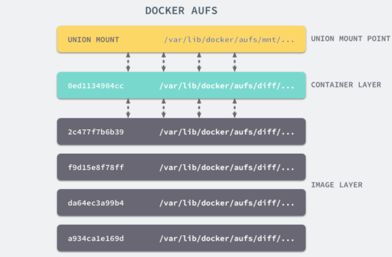
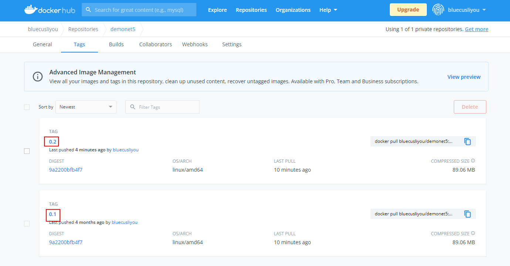
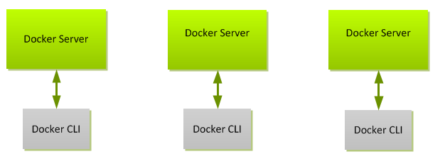

# 运维--Docker详解

## [零、文章目录](https://blog.csdn.net/liyou123456789/article/details/119715435)

## 一、Docker基础

### 1、Docker简介

Docker 是一个开源的应用容器引擎，基于Go 语言并遵从 Apache2.0 协议开源。

让开发者可以打包他们的应用以及依赖包到一个可移植的镜像中，然后发布到任何流行的操作系统的机器上，也可以实现虚拟化。容器是**完全使用沙箱机制，相互隔离，性能开销极低**。

Docker 从 17.03 版本之后分为 CE（Community Edition: 社区版） 和 EE（Enterprise Edition: 企业版），我们用社区版就可以了。

### 2、Docker起源

#### （1）Docker历史

2010年，几个搞IT的年轻人，在美国旧金山成立了一家名叫“dotCloud”的公司。这家公司主要提供基于PaaS的云计算技术服务。具体来说，是和LXC有关的容器技术。后来，dotCloud公司将自己的容器技术进行了简化和标准化，并命名为Docker。

Docker技术诞生之后，并没有引起行业的关注。而dotCloud公司，作为一家小型创业企业，在激烈的竞争之下，也步履维艰。正当他们快要坚持不下去的时候，脑子里蹦出了“开源”的想法。

2013年3月，dotCloud公司的创始人之一，Docker之父，28岁的Solomon Hykes正式决定，将Docker项目开源。

不开则已，一开惊人。越来越多的IT工程师发现了Docker的优点，然后蜂拥而至，加入Docker开源社区。Docker的人气迅速攀升，速度之快，令人瞠目结舌。

开源当月，Docker 0.1版本发布。此后的每一个月，Docker都会发布一个版本。到2014年6月9日，Docker 1.0版本正式发布。

此时的Docker，已经成为行业里人气最火爆的开源技术，没有之一。甚至像Google、微软、Amazon、VMware这样的巨头，都对它青睐有加，表示将全力支持。

Docker火了之后，dotCloud公司干脆把公司名字也改成了Docker Inc.。

#### （2）容器技术演进

> 物理机

软件开发最大的麻烦事之一，就是环境配置。用户必须保证两件事：操作系统的设置，各种库和组件的安装。只有它们都正确，软件才能运行。换一台机器，就要重来一次，费时费力。

> 虚拟机

虚拟机（virtual machine）就是带环境安装的一种解决方案。它可以在一种操作系统里面运行另一种操作系统，应用程序对此毫无感知，而对于底层系统来说，虚拟机就是一个普通文件，不需要了就删掉，对其他部分毫无影响。

但是，这个方案有几个缺点：

- 资源占用多
- 冗余步骤多
- 启动慢

> Linux 容器

由于虚拟机存在这些缺点，Linux 发展出了另一种虚拟化技术：Linux 容器（Linux Containers，缩写为 LXC）。

**Linux 容器不是模拟一个完整的操作系统，而是对进程进行隔离。**或者说，在正常进程的外面套了一个保护层。对于容器里面的进程来说，它接触到的各种资源都是虚拟的，从而实现与底层系统的隔离。

由于容器是进程级别的，相比虚拟机有很多优势：

- 启动快

- 资源占用少
- 体积小

> Docker 

基于 Linux 内核的 Cgroup，Namespace，以及Union FS 等技术，对进程进行封装隔离，属于操作系统层面的虚拟化技术，由于隔离的进程独立于宿主和其它的隔离的进程，因此也称其为容器。

最初实现是基于 LXC，从 0.7 以后开始去除 LXC，转而使用自行开发的 Libcontainer，从1.11 开始，则进一步演进为使用 runC 和 Containerd。 

Docker在容器的基础上，进行了进一步的封装，从文件系统、网络互联到进程隔离等等，极大的简化了容器的创建和维护，使得 Docker 技术比虚拟机技术更为轻便、快捷。是目前最流行的 Linux 容器解决方案。

> Docker和Vm比较

- Docker有着比虚拟机更少的抽象层。
- Docker利用的是宿主机的内核，而不需要Guest OS。  


由于Docker不需要Hypervisor实现硬件资源虚拟化，运行在docker容器上的程序直接使用的都是实际物理机的硬件资源。因此在CPU、内存利用率上docker有明显优势。 

当新建一个 容器时，docker不需要和虚拟机一样重新加载一个操作系统内核。当新建一个虚拟机时，虚拟机软件需要加载GuestOS，整个新建过程是分钟级别的。而docker由于直接利用宿主机的操作系统，省略了这个复杂的过程，因此新建一个docker容器只需要几秒钟。


### 3、Docker架构

在安装好并启动了Docker之后，我们可以使用在命令行中使用docker命令操作docker，比如我们使用如下命令打印docker的版本信息。

```bash
[root@bluecusliyou ~]# docker version
Client: Docker Engine - Community
 Version:           20.10.7
 API version:       1.41
 Go version:        go1.13.15
 Git commit:        f0df350
 Built:             Wed Jun  2 11:56:24 2021
 OS/Arch:           linux/amd64
 Context:           default
 Experimental:      true

Server: Docker Engine - Community
 Engine:
  Version:          20.10.7
  API version:      1.41 (minimum version 1.12)
  Go version:       go1.13.15
  Git commit:       b0f5bc3
  Built:            Wed Jun  2 11:54:48 2021
  OS/Arch:          linux/amd64
  Experimental:     false
 containerd:
  Version:          1.4.8
  GitCommit:        7eba5930496d9bbe375fdf71603e610ad737d2b2
 runc:
  Version:          1.0.0
  GitCommit:        v1.0.0-0-g84113ee
 docker-init:
  Version:          0.19.0
  GitCommit:        de40ad0
```

从上面的图中，我们看到打出了两个部分的信息：Client和Server。

Docker采用 C/S架构 Docker daemon 作为服务端接受来自客户的请求，并处理这些请求（创建、运行、分发容器）。 客户端和服务端既可以运行在一个机器上，也可通过 socket 或者RESTful API 来进行通信。


当使用 Docker 命令行工具执行命令时，Docker 客户端会将其转换为合适的 API 格式，并发送到正确的 API 端点。

一旦 daemon 接收到创建新容器的命令，它就会向 containerd 发出调用。daemon 使用一种 CRUD 风格的 API，通过 gRPC 与 containerd 进行通信。

虽然名叫 containerd，但是它并不负责创建容器，而是指挥 runc 去做。containerd 将 Docker 镜像转换为 OCI bundle，并让 runc 基于此创建一个新的容器。

然后，runc 与操作系统内核接口进行通信，基于所有必要的工具（Namespace、CGroup等）来创建容器。容器进程作为 runc 的子进程启动，启动完毕后，runc 将会退出。

一旦容器进程的父进程 runc 退出，相关联的 containerd-shim 进程就会成为容器的父进程。当 daemon 重启的时候，容器不会终止，并且可以将容器的退出状态反馈给 daemon。

### 4、Docker典型场景

- 使应用的打包与部署自动化
- 创建轻量、私密的PAAS环境
- 实现自动化测试和持续的集成/部署
- 部署与扩展webapp、数据库和后台服务

由于其基于LXC的轻量级虚拟化的特点，docker相比KVM之类最明显的特点就是启动快，资源占用小。因此对于构建隔离的标准化的运行环境，轻量级的PaaS，构建自动化测试和持续集成环境，以及一切可以横向扩展的应用(尤其是需要快速启停来应对峰谷的web应用)。

### 5、Docker的局限

Docker并不是全能的，设计之初也不是KVM之类虚拟化手段的替代品，简单总结几点：

- Docker是基于Linux 64bit的，无法在32bit的linux/Windows/unix环境下使用
- LXC是基于cgroup等linux kernel功能的，因此container的guest系统只能是linux base的
- 隔离性相比KVM之类的虚拟化方案还是有些欠缺，所有container公用一部分的运行库
- 网络管理相对简单，主要是基于namespace隔离
- cgroup的cpu和cpuset提供的cpu功能相比KVM的等虚拟化方案相比难以度量(所以dotcloud主要是按内存收费)
- Docker对disk的管理比较有限
- container随着用户进程的停止而销毁，container中的log等用户数据不便收集

### 6、Docker核心概念

#### （1）镜像(Image)

Docker镜像是一个特殊的文件系统，提供容器运行时所需的程序、库、资源、配置等文件，另外还包含了一些为运行时准备的一些配置参数（如匿名卷、环境变量、用户等）。

镜像是一个静态的概念，不包含任何动态数据，其内容在构建之后也不会被改变。

#### （2）容器(Container)

镜像与容器的关系，就是面向对象编程中类与对象的关系，我们定好每一个类，然后使用类创建对象，对应到Docker的使用上，则是构建好每一个镜像，然后使用镜像创建我们需要的容器。

#### （3）仓库(Repository)

仓库是一个集中存储和分发镜像的服务。Docker Registry包含很多个仓库，每个仓库对应多个标签，不同标签对应一个软件的不同版本。仓库分为公开仓库（Public）和私有仓库（Private）两种形式。

最大的公开仓库是Docker Hub，是Docker提供用于存储和分布镜像的官方Docker Registry，也是默认的Registry，其网址为[https://hub.docker.com](https://hub.docker.com)。用于让我们集中存储和分发镜像。

Docker Hub有很多官方或其他开发提供的高质量镜像供我们使用，如果要将我们自己构建的镜像上传到Docker Hub上，我们需要在Docker Hub上注册一个账号，然后把自己在本地构建的镜像发送到Docker Hub的仓库中。

## 二、Docker实现原理

Docker核心解决的问题是利用LXC来实现类似VM的功能，从而利用更加节省的硬件资源提供给用户更多的计算资源。同VM的方式不同, LXC其并不是一套硬件虚拟化方法，而是一个操作系统级虚拟化方法，其解决的主要是以下4个问题:

- 隔离性 - 每个用户实例之间相互隔离, 互不影响。 硬件虚拟化方法给出的方法是VM, LXC给出的方法是container，更细一点是kernel namespace
- 可配额/可度量 - 每个用户实例可以按需提供其计算资源，所使用的资源可以被计量。硬件虚拟化方法因为虚拟了CPU, memory可以方便实现, LXC则主要是利用cgroups来控制资源
- 移动性 - 用户的实例可以很方便地复制、移动和重建。硬件虚拟化方法提供snapshot和image来实现，docker(主要)利用AUFS实现
- 安全性 - 这个话题比较大，这里强调是host主机的角度尽量保护container。硬件虚拟化的方法因为虚拟化的水平比较高，用户进程都是在KVM等虚拟机容器中翻译运行的, 然而对于LXC, 用户的进程是lxc-start进程的子进程, 只是在Kernel的namespace中隔离的, 因此需要一些kernel的patch来保证用户的运行环境不会受到来自host主机的恶意入侵, dotcloud(主要是)利用kernel grsec patch解决的.

### 1、Namespace

在服务器上启动了多个服务，这些服务其实会相互影响的，每一个服务都能看到其他服务的进程，也可以访问宿主机器上的任意文件，这不是我们要的效果，我们更希望运行在同一台机器上的不同服务能做到**完全隔离**，就像运行在多台不同的机器上一样。

Linux的命名空间 (namespaces) 可以为我们提供用于隔离进程树、网络接口、挂载点以及进程间通信等资源的方法。

#### （1）Linux的Namespace实现的隔离性种类

Linux的Namespace实现的隔离性种类有六种，进程、网络、IPC、文件系统、UTS和用户。


```bash
#查看宿主机进程
[root@bluecusliyou ~]# ps -ef
UID          PID    PPID  C STIME TTY          TIME CMD
root           1       0  0 Nov03 ?        00:00:43 /usr/lib/systemd/systemd --switched-root --system --deserialize 18
root           2       0  0 Nov03 ?        00:00:01 [kthreadd]
root           3       2  0 Nov03 ?        00:00:00 [rcu_gp]
root           4       2  0 Nov03 ?        00:00:00 [rcu_par_gp]
root           6       2  0 Nov03 ?        00:00:00 [kworker/0:0H-kblockd]
root           8       2  0 Nov03 ?        00:00:00 [mm_percpu_wq]
root           9       2  0 Nov03 ?        00:00:02 [ksoftirqd/0]
root          10       2  0 Nov03 ?        00:08:50 [rcu_sched]
root          11       2  0 Nov03 ?        00:00:00 [migration/0]
root          12       2  0 Nov03 ?        00:00:00 [watchdog/0]
root          13       2  0 Nov03 ?        00:00:00 [cpuhp/0]
root          14       2  0 Nov03 ?        00:00:00 [cpuhp/1]
root          15       2  0 Nov03 ?        00:00:02 [watchdog/1]
root          16       2  0 Nov03 ?        00:00:00 [migration/1]
root          17       2  0 Nov03 ?        00:00:01 [ksoftirqd/1]
root          19       2  0 Nov03 ?        00:00:00 [kworker/1:0H-kblockd]
root          21       2  0 Nov03 ?        00:00:00 [kdevtmpfs]
root          22       2  0 Nov03 ?        00:00:00 [netns]
root          23       2  0 Nov03 ?        00:00:00 [kauditd]
root          26       2  0 Nov03 ?        00:00:01 [khungtaskd]
root          27       2  0 Nov03 ?        00:00:00 [oom_reaper]
root          28       2  0 Nov03 ?        00:00:00 [writeback]
root          29       2  0 Nov03 ?        00:00:00 [kcompactd0]
...
[root@bluecusliyou ~]# docker run -id --name centos centos
a6ed40c1d9a47c47cb611e4c5233a3cb6ee6b0671ed47f706acac69e8ae279e5
[root@bluecusliyou ~]# docker exec -it centos /bin/bash
#进入容器内部查看进程核宿主机中的进程完全不同
[root@a6ed40c1d9a4 /]# ps -ef
UID          PID    PPID  C STIME TTY          TIME CMD
root           1       0  0 14:10 ?        00:00:00 /bin/bash
root           7       0  2 14:10 pts/0    00:00:00 /bin/bash
root          21       7  0 14:10 pts/0    00:00:00 ps -ef
#容器的网络配置
[root@a6ed40c1d9a4 /]# ip addr
1: lo: <LOOPBACK,UP,LOWER_UP> mtu 65536 qdisc noqueue state UNKNOWN group default qlen 1000
    link/loopback 00:00:00:00:00:00 brd 00:00:00:00:00:00
    inet 127.0.0.1/8 scope host lo
       valid_lft forever preferred_lft forever
98: eth0@if99: <BROADCAST,MULTICAST,UP,LOWER_UP> mtu 1500 qdisc noqueue state UP group default 
    link/ether 02:42:ac:11:00:04 brd ff:ff:ff:ff:ff:ff link-netnsid 0
    inet 172.17.0.4/16 brd 172.17.255.255 scope global eth0
       valid_lft forever preferred_lft forever
[root@a6ed40c1d9a4 /]# exit
exit
#宿主机的网络配置和容器也是不同的
[root@bluecusliyou ~]# ip addr
1: lo: <LOOPBACK,UP,LOWER_UP> mtu 65536 qdisc noqueue state UNKNOWN group default qlen 1000
    link/loopback 00:00:00:00:00:00 brd 00:00:00:00:00:00
    inet 127.0.0.1/8 scope host lo
       valid_lft forever preferred_lft forever
    inet6 ::1/128 scope host 
       valid_lft forever preferred_lft forever
2: eth0: <BROADCAST,MULTICAST,UP,LOWER_UP> mtu 1500 qdisc fq_codel state UP group default qlen 1000
    link/ether 00:16:3e:16:fa:95 brd ff:ff:ff:ff:ff:ff
    inet 172.27.45.106/20 brd 172.27.47.255 scope global dynamic noprefixroute eth0
       valid_lft 311881481sec preferred_lft 311881481sec
    inet6 fe80::216:3eff:fe16:fa95/64 scope link 
       valid_lft forever preferred_lft forever
3: docker0: <BROADCAST,MULTICAST,UP,LOWER_UP> mtu 1500 qdisc noqueue state UP group default 
    link/ether 02:42:3f:30:cc:94 brd ff:ff:ff:ff:ff:ff
    inet 172.17.0.1/16 brd 172.17.255.255 scope global docker0
       valid_lft forever preferred_lft forever
    inet6 fe80::42:3fff:fe30:cc94/64 scope link 
       valid_lft forever preferred_lft forever
89: vethf0fc6b7@if88: <BROADCAST,MULTICAST,UP,LOWER_UP> mtu 1500 qdisc noqueue master docker0 state UP group default 
    link/ether 02:31:61:b2:ab:a9 brd ff:ff:ff:ff:ff:ff link-netnsid 0
    inet6 fe80::31:61ff:feb2:aba9/64 scope link 
       valid_lft forever preferred_lft forever
91: veth3f74a7c@if90: <BROADCAST,MULTICAST,UP,LOWER_UP> mtu 1500 qdisc noqueue master docker0 state UP group default 
    link/ether b6:07:90:98:e7:2b brd ff:ff:ff:ff:ff:ff link-netnsid 1
    inet6 fe80::b407:90ff:fe98:e72b/64 scope link 
       valid_lft forever preferred_lft forever
99: vetheac652b@if98: <BROADCAST,MULTICAST,UP,LOWER_UP> mtu 1500 qdisc noqueue master docker0 state UP group default 
    link/ether ea:2c:12:b2:10:9e brd ff:ff:ff:ff:ff:ff link-netnsid 2
    inet6 fe80::e82c:12ff:feb2:109e/64 scope link 
       valid_lft forever preferred_lft forever
```

#### （2）Linux对Namespace操作方法

> clone 

在创建新进程的系统调用时，可以通过 flags 参数指定需要新建的 Namespace 类型： 

// CLONE_NEWCGROUP / CLONE_NEWIPC / CLONE_NEWNET / CLONE_NEWNS /  

CLONE_NEWPID / CLONE_NEWUSER / CLONE_NEWUTS 

int clone(int (*fn)(void *), void *child_stack, int flags, void *arg) 

> setns 

该系统调用可以让调用进程加入某个已经存在的 Namespace 中： 

Int setns(int fd, int nstype) 

> unshare 

该系统调用可以将调用进程移动到新的 Namespace 下： 

int unshare(int flags)

#### （3）Linux查看Namespace详情

> 查看当前系统的 namespace, lsns –t <type>

```bash
[root@bluecusliyou ~]# lsns --help

用法：
 lsns [选项] [<名字空间>]

列出系统名字空间。

选项：
 -J, --json              使用 JSON 输出格式
 -l, --list             使用列表格式的输出
 -n, --noheadings       不打印标题
 -o, --output <list>    定义使用哪个输出列
 -p, --task <pid>       打印进程名字空间
 -r, --raw              使用原生输出格式
 -u, --notruncate       不截断列中的文本
 -W, --nowrap           don't use multi-line representation
 -t, --type <name>      名字空间类型(mnt, net, ipc, user, pid, uts, cgroup)

 -h, --help             display this help
 -V, --version          display version

Available output columns:
          NS  名字空间标识符 (inode 号)
        TYPE  名字空间类型
        PATH  名字空间路径
      NPROCS  名字空间中的进程数
         PID  名字空间中的最低 PID
        PPID  PID 的 PPID
     COMMAND  PID 的命令行
         UID  PID 的 UID
        USER  PID 的用户名
     NETNSID  namespace ID as used by network subsystem
        NSFS  nsfs mountpoint (usually used network subsystem)

更多信息请参阅 lsns(8)。
```

```bash
[root@bluecusliyou ~]# lsns -t net
        NS TYPE NPROCS    PID USER                NETNSID NSFS                           COMMAND
4026531992 net     144      1 root             unassigned                                /usr/lib/systemd/systemd --switched-root --system --d
4026532213 net       1 410909 root                      0 /run/docker/netns/19329d57fcce registry serve /etc/docker/registry/config.yml
4026532277 net       3 412423 root                      1 /run/docker/netns/97128257fd5f nginx: master process nginx -g daemon off;
4026532340 net       1 421570 root                      2 /run/docker/netns/3c60b0f07a27 /bin/bash
4026532403 net       3 575754 root                      3 /run/docker/netns/078f2fed28b7 nginx: master process nginx -g daemon off;
4026532466 net       3 500181 root                      4 /run/docker/netns/f882defbe17c nginx: master process nginx -g daemon off;
4026532529 net       3 604357 root                      5 /run/docker/netns/ac535e6e6ac7 nginx: master process nginx -g daemon off;
4026532592 net       3 500432 root                      6 /run/docker/netns/d062596a0683 nginx: master process nginx -g daemon off;
4026532655 net       1 500553 systemd-coredump          7 /run/docker/netns/4974570b8838 mysqld --lower_case_table_names=1
4026532718 net       2 500655 root                      8 /run/docker/netns/6925c6c54984 /opt/mssql/bin/sqlservr
```

> 查看某进程的namespace ，ls -la /proc/<pid>/ns/

```bash
[root@bluecusliyou ~]# ls -la /proc/500514/ns/
总用量 0
dr-x--x--x 2 root root 0 12月 14 22:46 .
dr-xr-xr-x 9 root root 0 12月 14 15:26 ..
lrwxrwxrwx 1 root root 0 12月 14 22:46 cgroup -> 'cgroup:[4026531835]'
lrwxrwxrwx 1 root root 0 12月 14 22:46 ipc -> 'ipc:[4026531839]'
lrwxrwxrwx 1 root root 0 12月 14 22:46 mnt -> 'mnt:[4026531840]'
lrwxrwxrwx 1 root root 0 12月 14 22:46 net -> 'net:[4026531992]'
lrwxrwxrwx 1 root root 0 12月 14 22:46 pid -> 'pid:[4026531836]'
lrwxrwxrwx 1 root root 0 12月 15 07:47 pid_for_children -> 'pid:[4026531836]'
lrwxrwxrwx 1 root root 0 12月 14 22:46 user -> 'user:[4026531837]'
lrwxrwxrwx 1 root root 0 12月 14 22:46 uts -> 'uts:[4026531838]'
```

> 进入某namespace运行命令，nsenter -t <pid> -n ip addr

```bash
[root@bluecusliyou ~]# nsenter --help

用法：
 nsenter [选项] [<程序> [<参数>...]]

以其他程序的名字空间运行某个程序。

选项：
 -a, --all              enter all namespaces
 -t, --target <pid>     要获取名字空间的目标进程
 -m, --mount[=<文件>]   进入 mount 名字空间
 -u, --uts[=<文件>]     进入 UTS 名字空间(主机名等)
 -i, --ipc[=<文件>]     进入 System V IPC 名字空间
 -n, --net[=<文件>]     进入网络名字空间
 -p, --pid[=<文件>]     进入 pid 名字空间
 -C, --cgroup[=<文件>]  进入 cgroup 名字空间
 -U, --user[=<文件>]    进入用户名字空间
 -S, --setuid <uid>     设置进入空间中的 uid
 -G, --setgid <gid>     设置进入名字空间中的 gid
     --preserve-credentials 不干涉 uid 或 gid
 -r, --root[=<目录>]     设置根目录
 -w, --wd[=<dir>]       设置工作目录
 -F, --no-fork          执行 <程序> 前不 fork
 -Z, --follow-context  根据 --target PID 设置 SELinux 环境

 -h, --help             display this help
 -V, --version          display version

更多信息请参阅 nsenter(1)。
```

```bash
#进入容器查看进程ID
[root@bluecusliyou ~]# docker inspect centos |grep -i pid
            "Pid": 421570,
            "PidMode": "",
            "PidsLimit": null,
#根据进程ID进入namespace查看网络信息
[root@bluecusliyou ~]# nsenter -t 421570 -n ip addr
1: lo: <LOOPBACK,UP,LOWER_UP> mtu 65536 qdisc noqueue state UNKNOWN group default qlen 1000
    link/loopback 00:00:00:00:00:00 brd 00:00:00:00:00:00
    inet 127.0.0.1/8 scope host lo
       valid_lft forever preferred_lft forever
98: eth0@if99: <BROADCAST,MULTICAST,UP,LOWER_UP> mtu 1500 qdisc noqueue state UP group default 
    link/ether 02:42:ac:11:00:04 brd ff:ff:ff:ff:ff:ff link-netnsid 0
    inet 172.17.0.4/16 brd 172.17.255.255 scope global eth0
       valid_lft forever preferred_lft forever
#直接进入容器查看网络信息是一样的
[root@bluecusliyou ~]# docker exec -it centos /bin/bash
[root@a6ed40c1d9a4 /]# ip addr
1: lo: <LOOPBACK,UP,LOWER_UP> mtu 65536 qdisc noqueue state UNKNOWN group default qlen 1000
    link/loopback 00:00:00:00:00:00 brd 00:00:00:00:00:00
    inet 127.0.0.1/8 scope host lo
       valid_lft forever preferred_lft forever
98: eth0@if99: <BROADCAST,MULTICAST,UP,LOWER_UP> mtu 1500 qdisc noqueue state UP group default 
    link/ether 02:42:ac:11:00:04 brd ff:ff:ff:ff:ff:ff link-netnsid 0
    inet 172.17.0.4/16 brd 172.17.255.255 scope global eth0
       valid_lft forever preferred_lft forever
```

### 2、Cgroups

Linux的命名空间 (namespaces) 可以为我们提供的用于分离进程树、网络接口、挂载点以及进程间通信等资源的方法。但是并不能够为我们提供物理资源上的隔离。

在同一台机器上运行的多个容器会共同占用宿主机器的物理资源，其中某个容器正在执行 CPU 密集型的任务，就会影响其他容器中任务的性能与执行效率，导致多个容器相互影响并且抢占资源。

 Control Groups（简称 CGroups）就是能够隔离宿主机器上的物理资源，例如 CPU、内存、磁盘 I/O 和网络带宽。

#### （1）对资源的配额和度量


cgroups 实现了对资源的配额和度量。

- blkio：这个子系统设置限制每个块设备的输入输出控制。例如:磁盘，光盘以及 USB 等等；
- cpu：这个子系统使用调度程序为 cgroup 任务提供 CPU 的访问；
- cpuacct：产生 cgroup 任务的 CPU 资源报告；
- cpuset：如果是多核心的CPU，这个子系统会为 cgroup 任务分配单独的 CPU 和内存；
- devices：允许或拒绝 cgroup 任务对设备的访问；
- freezer：暂停和恢复 cgroup 任务；
- memory：设置每个 cgroup 的内存限制以及产生内存资源报告；
- net_cls：标记每个网络包以供 cgroup 方便使用；
- ns：名称空间子系统；
- pid: 进程标识子系统。

```bash
[root@bluecusliyou ~]# cd /sys/fs/cgroup/
[root@bluecusliyou cgroup]# ll
总用量 0
dr-xr-xr-x 6 root root  0 11月  3 23:57 blkio
lrwxrwxrwx 1 root root 11 11月  3 23:57 cpu -> cpu,cpuacct
lrwxrwxrwx 1 root root 11 11月  3 23:57 cpuacct -> cpu,cpuacct
dr-xr-xr-x 8 root root  0 11月  3 23:57 cpu,cpuacct
dr-xr-xr-x 3 root root  0 11月  3 23:57 cpuset
dr-xr-xr-x 6 root root  0 11月  3 23:57 devices
dr-xr-xr-x 3 root root  0 11月  3 23:57 freezer
dr-xr-xr-x 3 root root  0 11月  3 23:57 hugetlb
dr-xr-xr-x 7 root root  0 11月  3 23:57 memory
lrwxrwxrwx 1 root root 16 11月  3 23:57 net_cls -> net_cls,net_prio
dr-xr-xr-x 3 root root  0 11月  3 23:57 net_cls,net_prio
lrwxrwxrwx 1 root root 16 11月  3 23:57 net_prio -> net_cls,net_prio
dr-xr-xr-x 3 root root  0 11月  3 23:57 perf_event
dr-xr-xr-x 6 root root  0 11月  3 23:57 pids
dr-xr-xr-x 2 root root  0 11月  3 23:57 rdma
dr-xr-xr-x 6 root root  0 11月  3 23:57 systemd
```

#### （2）CPU 子系统

- cpu.shares：可出让的能获得 CPU 使用时间的相对值。
- cpu.cfs_period_us：cfs_period_us 用来配置时间周期长度，单位为 us（微秒）。
- cpu.cfs_quota_us：cfs_quota_us 用来配置当前 Cgroup 在 cfs_period_us 时间内最多能使用的 CPU
- 时间数，单位为 us（微秒）。
- cpu.stat ：Cgroup 内的进程使用的 CPU 时间统计。
- nr_periods ：经过 cpu.cfs_period_us 的时间周期数量。
- nr_throttled ：在经过的周期内，有多少次因为进程在指定的时间周期内用光了配额时间而受到限制。
- throttled_time ：Cgroup 中的进程被限制使用 CPU 的总用时，单位是 ns（纳秒）。

```bash
[root@bluecusliyou cgroup]# cd cpu
[root@bluecusliyou cpu]# ll
总用量 0
drwxr-xr-x   2 root root 0 11月  3 15:59 aegis
drwxr-xr-x   2 root root 0 12月  8 06:28 assist
-rw-r--r--   1 root root 0 11月  3 15:58 cgroup.clone_children
-rw-r--r--   1 root root 0 11月  7 15:52 cgroup.procs
-r--r--r--   1 root root 0 11月  3 15:58 cgroup.sane_behavior
-r--r--r--   1 root root 0 11月  3 15:58 cpuacct.stat
-rw-r--r--   1 root root 0 11月  3 15:58 cpuacct.usage
-r--r--r--   1 root root 0 11月  3 15:58 cpuacct.usage_all
-r--r--r--   1 root root 0 11月  3 15:58 cpuacct.usage_percpu
-r--r--r--   1 root root 0 11月  3 15:58 cpuacct.usage_percpu_sys
-r--r--r--   1 root root 0 11月  3 15:58 cpuacct.usage_percpu_user
-r--r--r--   1 root root 0 11月  3 15:58 cpuacct.usage_sys
-r--r--r--   1 root root 0 11月  3 15:58 cpuacct.usage_user
-rw-r--r--   1 root root 0 11月  3 15:58 cpu.cfs_period_us
-rw-r--r--   1 root root 0 11月  3 15:58 cpu.cfs_quota_us
-rw-r--r--   1 root root 0 11月  3 15:58 cpu.rt_period_us
-rw-r--r--   1 root root 0 11月  3 15:58 cpu.rt_runtime_us
-rw-r--r--   1 root root 0 11月  3 15:58 cpu.shares
-r--r--r--   1 root root 0 11月  3 15:58 cpu.stat
drwxr-xr-x  20 root root 0 11月  7 15:35 docker
drwxr-xr-x   2 root root 0 11月  7 15:33 init.scope
-rw-r--r--   1 root root 0 11月  3 15:58 notify_on_release
-rw-r--r--   1 root root 0 11月  3 15:58 release_agent
drwxr-xr-x 108 root root 0 11月  7 15:33 system.slice
-rw-r--r--   1 root root 0 11月  3 15:58 tasks
drwxr-xr-x   2 root root 0 11月  7 15:33 user.slice
```

> 创建一个cpu子系统cpudemo，所有的文件都会自动创建完成

```bash
[root@bluecusliyou cpu]# mkdir cpudemo
[root@bluecusliyou cpu]# cd cpudemo/
[root@bluecusliyou cpudemo]# ls
cgroup.clone_children  cpuacct.usage         cpuacct.usage_percpu_sys   cpuacct.usage_user  cpu.rt_period_us   cpu.stat
cgroup.procs           cpuacct.usage_all     cpuacct.usage_percpu_user  cpu.cfs_period_us   cpu.rt_runtime_us  notify_on_release
cpuacct.stat           cpuacct.usage_percpu  cpuacct.usage_sys          cpu.cfs_quota_us    cpu.shares         tasks
#运行一个高能耗的程序
[root@bluecusliyou net6.0]# cd /home/testcgroup/ConsoleAppTest
[root@bluecusliyou ConsoleAppTest]# dotnet run
#查看系统进程，随便找一个CPU负载较高的进程
    PID USER      PR  NI    VIRT    RES    SHR S  %CPU  %MEM     TIME+ COMMAND                                                                 
2369262 root      20   0 4552716   1.2g    708 S 200.0  34.4   1:17.75 ConsoleAppTest                                                          
     60 root      20   0       0      0      0 S   4.7   0.0   0:05.73 kswapd0                                                                 
 314777 root      10 -10  232592  73116      0 R   1.8   2.0 402:57.57 AliYunDun                                                               
 500975 root      20   0 9543680 792780      0 S   1.2  21.6  22:46.31 sqlservr                                                                
1947143 10000     20   0  968628  40192      0 S   1.0   1.1   0:17.89 harbor_core                                                             
1947122 10000     20   0  962900  15664      0 S   0.8   0.4   0:33.55 harbor_jobservi                                                         
    465 root       0 -20       0      0      0 I   0.6   0.0   0:08.55 kworker/1:1H-kblockd #告诉cgroup要控制的是哪个进程
[root@bluecusliyou cpudemo]# echo 2369262 > cgroup.procs
#控制CPU的占比就是控制  cpu.cfs_quota_us占cpu.cfs_period_us的比例
[root@bluecusliyou cpudemo]# cat cpu.cfs_period_us
100000
#-1 就是不做控制
[root@bluecusliyou cpudemo]# cat cpu.cfs_quota_us
-1
#10000/100000就是最高控制在10%
[root@bluecusliyou cpudemo]# echo 10000 > cpu.cfs_quota_us
    PID USER      PR  NI    VIRT    RES    SHR S  %CPU  %MEM     TIME+ COMMAND                                                                 
2369262 root      20   0 4552716   1.2g    708 S 10.0  34.4   1:17.75 ConsoleAppTest                                                          
     60 root      20   0       0      0      0 S   4.7   0.0   0:05.73 kswapd0                                                                 
 314777 root      10 -10  232592  73116      0 R   1.8   2.0 402:57.57 AliYunDun                                                               
 500975 root      20   0 9543680 792780      0 S   1.2  21.6  22:46.31 sqlservr                                                                
1947143 10000     20   0  968628  40192      0 S   1.0   1.1   0:17.89 harbor_core                                                             
1947122 10000     20   0  962900  15664      0 S   0.8   0.4   0:33.55 harbor_jobservi                                                         
    465 root       0 -20       0      0      0 I   0.6   0.0   0:08.55 kworker/1:1H-kblockd
```

### 3、文件系统

Linux 的命名空间和控制组分别解决了不同资源隔离的问题，前者解决了进程、网络以及文件系统的隔离，后者实现了 CPU、内存等资源的隔离，但是在 Docker 中还有另一个非常重要的问题需要解决，也就是镜像的存储和分发问题。

#### （1）UnionFs 

UnionFS （联合文件系统）其实是一种为 Linux 操作系统设计的用于把多个文件系统联合到同一个挂载点的文件系统服务。而 AUFS 即 Advanced UnionFS 其实就是 UnionFS 的升级版，它能够提供更优秀的性能和效率。

Docker 支持了不同的存储驱动，包括 `aufs`、`devicemapper`、`overlay2`、`zfs` 和 `vfs` 等等，在最新的 Docker 中，`overlay2` 取代了 `aufs` 成为了推荐的存储驱动，但是在没有 `overlay2` 驱动的机器上仍然会使用 `aufs` 作为 Docker 的默认驱动。


```bash
[root@bluecusliyou ~]# docker info | grep Storage
 Storage Driver: overlay2
```

OverlayFS 也是一种与 AUFS 类似的联合文件系统，同样属于文件级的存储驱动，包含了最初的Overlay 和更新更稳定的 overlay2。Overlay 只有两层：upper 层和 Lower 层。Lower 层代表镜像层，upper 层代表容器可写层。


```bash
#创建4个文件夹
[root@bluecusliyou OverlayFS]# mkdir upper lower merged work
#lower文件夹写入两个文件in_lower.txt  in_both.txt
#upper文件夹写入两个文件in_upper.txt  in_both.txt
#两个文件夹有同名的文件in_both.txt
[root@bluecusliyou OverlayFS]# echo "from lower" > lower/in_lower.txt
[root@bluecusliyou OverlayFS]# echo "from lower" > lower/in_both.txt
[root@bluecusliyou OverlayFS]# echo "from upper" > upper/in_upper.txt
[root@bluecusliyou OverlayFS]# echo "from upper" > upper/in_both.txt
[root@bluecusliyou OverlayFS]# sudo mount -t overlay overlay -o 
#挂载两个文件夹文件到合并文件夹
[root@bluecusliyou OverlayFS]# sudo mount -t overlay overlay -o lowerdir=`pwd`/lower,upperdir=`pwd`/upper,workdir=`pwd`/work `pwd`/merged
[root@bluecusliyou OverlayFS]# cd merged
#最终的文件是三个，同名的文件是下层的被上层的覆盖了
[root@bluecusliyou merged]# ls
in_both.txt  in_lower.txt  in_upper.txt
[root@bluecusliyou merged]# cat in_both.txt
from upper
```

#### （2）容器和镜像是什么

镜像其实本质就是一个文件，镜像是一种轻量级、可执行的独立软件包，用来打包软件运行环境和基于运行环境开发的软件，他包含运行某个软件所需的所有内容，包括**代码、运行时库、环境变量和配置文件**。

我们首先需要理解 Docker 是如何构建并且存储镜像的，也需要明白 Docker 的镜像是如何被每一个容器所使用的；Docker 中的每一个镜像都是由一系列只读的层组成的，Dockerfile 中的每一个命令都会在已有的只读层上创建一个新的层。如下有一个DockerFile文件。

```dockerfile
FROM ubuntu:15.04
COPY . /app
RUN make /app
CMD python /app/app.py
```

上述的 Dockerfile 文件会构建一个拥有四层 layer 的镜像。当镜像被 `docker run` 命令创建时就会在镜像的最上层添加一个可写的层，也就是容器层，所有对于运行时容器的修改其实都是对这个容器读写层的修改。


容器的本质也是一个文件，容器和镜像的区别就在于，所有的镜像都是只读的，而每一个容器其实等于镜像加上一个可读写的层，也就是同一个镜像可以对应多个容器。


在 Docker 中，所有镜像层和容器层的内容都存储在 `/var/lib/docker/aufs/diff/` 目录中，而 `/var/lib/docker/aufs/layers/` 中存储着镜像层的元数据，每一个文件都保存着镜像层的元数据，最后的 `/var/lib/docker/aufs/mnt/` 包含镜像或者容器层的挂载点，最终会被 Docker 通过联合的方式进行组装。



#### （3）Docker镜像加载原理

每一个镜像层都是建立在另一个镜像层之上的，同时所有的镜像层都是只读的，只有每个容器最顶层的容器层才可以被用户直接读写，所有的容器都建立在一些底层服务（Kernel）上，包括命名空间、控制组、rootfs 等等。


> 正常安装的CentOS都是好几个G，为什么Docker的Centos镜像才200M？

```bash
[root@bluecusliyou home]# docker images centos
REPOSITORY   TAG       IMAGE ID       CREATED        SIZE
centos       latest    5d0da3dc9764   2 months ago   231MB
```

典型的 Linux 文件系统组成包含`Bootfs（boot file system） `和`rootfs （root file system）`  


boots(boot file system）主要包含 bootloader和 Kernel，bootloader主要是引导加 kernel，Linux刚启动时会加bootfs文件系统，当boot加载完成之后整个内核就都在内存中了，此时内存的使用权已由 bootfs转交给内核，此时系统也会卸载bootfs。

rootfs（root file system)，在 bootfs之上。包含的就是典型 Linux系统中的/dev，/proc，/bin，/etc等标准目录和文件。 rootfs就是各种不同的操作系统发行版，比如 Ubuntu，Centos等等。 

对于一个精简的OS，rootfs可以很小，只需要包合最基本的命令，工具和程序库就可以了，因为底层直接用宿主机的kernel，自己只需要提供rootfs就可以了。不同的linux发行版本bootfs基本是一致的， rootfs会有差別，因此不同的发行版可以公用bootfs。所以镜像可以很小。

> 为什么启动一个容器只需要秒级，而启动一个系统是分钟级？

当启动一个 容器时，docker可以直接利用宿主机的操作系统kernel，省略了加载完整系统kernel这个复杂的过程，因此启动一个docker容器只需要几秒钟。

> 镜像为什么要分层

我们可以去下载一个镜像，注意观察下载的日志输出，可以看到是一层层的在下载 。 采用这种分层的结构，最大的好处，就是可以资源共享，节省磁盘空间，内存空间，加快下载速度，这种文件的组装方式提供了非常大的灵活性。

比如有多个镜像都从相同的Base镜像构建而来，那么宿主机只需在磁盘上保留一份base镜像，下载镜像的时候可以不用重复下载，同时内存中也只需要加载一份base镜像，这样就可以为所有的容器服务了，而且镜像的每一层都可以被共享。

```bash
[root@bluecusliyou ~]# docker pull redis
Using default tag: latest
latest: Pulling from library/redis
eff15d958d66: Pull complete 
1aca8391092b: Pull complete 
06e460b3ba1b: Pull complete 
def49df025c0: Pull complete 
646c72a19e83: Pull complete 
db2c789841df: Pull complete 
Digest: sha256:619af14d3a95c30759a1978da1b2ce375504f1af70ff9eea2a8e35febc45d747
Status: Downloaded newer image for redis:latest
docker.io/library/redis:latest
```

查看镜像分层的方式可以通过**docker image inspect** 命令

```bash
[root@bluecusliyou ~]# docker image inspect redis
[
    {
        ...
            "Layers": [
                "sha256:e1bbcf243d0e7387fbfe5116a485426f90d3ddeb0b1738dca4e3502b6743b325",
                "sha256:58e6a16139eebebf7f6f0cb15f9cb3c2a4553a062d2cbfd1a782925452ead433",
                "sha256:503a5c57d9786921c992b7b2216ae58f69dcf433eedb28719ddea3606b42ce26",
                "sha256:277199a0027e044f64ef3719a6d7c3842e99319d6e0261c3a5190249e55646cf",
                "sha256:d0d567a1257963b9655dfceaddc76203c8544fbf6c8672b372561a3c8a3143d4",
                "sha256:a7115aa098139866d7073846e4321bafb8d5ca0d0f907a3c9625f877311bee7c"
            ]
        }
        ...
    }
]
```

### 4、网络实现

Docker网络的实现主要是依赖Linux网络有关的技术，这些技术有网络命名空间（Network Namespace）、Veth设备对、网桥、ipatables和路由。

（1）网络命名空间，实现网络隔离。

（2）Veth设备对，实现不同网络命名空间之间的通信。

（3）网桥，实现不同网络之间通信。

（4）ipatables，实现对数据包进行过滤和转发。

（5）路由，决定数据包到底发送到哪里。

## 三、Docker安装

### 1、官方地址

docker官网：[https://www.docker.com/](https://www.docker.com/)

文档：[https://docs.docker.com/](https://docs.docker.com/)

仓库：[https://hub.docker.com/](https://hub.docker.com/)

### 2、各系统安装Docker

Docker 是一个开源的商业产品，有两个版本：社区版（Community Edition，缩写为 CE）和企业版（Enterprise Edition，缩写为 EE）。企业版包含了一些收费服务，个人开发者一般用不到。下面的介绍都针对社区版。

Docker CE 的安装请参考官方文档。

> - [Mac](https://docs.docker.com/docker-for-mac/install/)
> - [Windows](https://docs.docker.com/docker-for-windows/install/)
> - [Ubuntu](https://docs.docker.com/install/linux/docker-ce/ubuntu/)
> - [Debian](https://docs.docker.com/install/linux/docker-ce/debian/)
> - [CentOS](https://docs.docker.com/install/linux/docker-ce/centos/)
> - [Fedora](https://docs.docker.com/install/linux/docker-ce/fedora/)
> - [其他 Linux 发行版](https://docs.docker.com/install/linux/docker-ce/binaries/)

### 3、CentOS安装Docker

####  （1）系统要求

Linux要求内核3.0以上

```bash
[root@bluecusliyou ~]# uname -r
4.18.0-193.28.1.el8_2.x86_64
```

#### （2）安装

```bash
#1.卸载旧版本 
sudo yum remove docker \
                  docker-client \
                  docker-client-latest \
                  docker-common \
                  docker-latest \
                  docker-latest-logrotate \
                  docker-logrotate \
                  docker-engine

#2.需要的安装包 
sudo yum install -y yum-utils

#3.设置镜像的仓库 
sudo yum-config-manager \
    --add-repo \
    https://download.docker.com/linux/centos/docker-ce.repo 
#默认是从国外的，不推荐，国内访问可能会失败
#推荐使用国内的，速度快
sudo yum-config-manager \
    --add-repo \
    http://mirrors.aliyun.com/docker-ce/linux/centos/docker-ce.repo

#4.更新yum软件包索引 
sudo yum makecache

#5.安装docker相关的 docker-ce 社区版 而ee是企业版 
sudo yum install docker-ce docker-ce-cli containerd.io 

#6.启动Docker服务，设置开机启动
sudo systemctl start docker
sudo systemctl enable docker

#7.查看是否安装成功 
docker version
docker info

#8.测试运行
docker run hello-world

#9.查看一下下载的镜像
docker images

#10.查看一下容器
docker ps -a

#11.卸载docker
#卸载依赖 
yum remove docker-ce docker-ce-cli containerd.io 
# 删除资源 
# /var/lib/docker 是docker的默认工作路径！
rm -rf /var/lib/docker 
```

#### （3）配置镜像加速


```bash
sudo mkdir -p /etc/docker
sudo tee /etc/docker/daemon.json <<-'EOF'
{
  "registry-mirrors": ["https://valiy9re.mirror.aliyuncs.com"]
}
EOF
sudo systemctl daemon-reload
sudo systemctl restart docker
```

## 四、Docker常用命令

### 1、命令汇总

官方命令说明：[https://docs.docker.com/engine/reference/commandline/docker/](https://docs.docker.com/engine/reference/commandline/docker/)


```bash
docker version            #显示docker的版本信息
docker info               #显示docker的系统信息，包括镜像和容器的数量
docker --help             #帮助命令
docker 命令 --help         #帮助命令
```

```bash
[root@bluecusliyou ~]# docker --help

Usage:  docker [OPTIONS] COMMAND

A self-sufficient runtime for containers

Options:
      --config string      Location of client config files (default "/root/.docker")
  -c, --context string     Name of the context to use to connect to the daemon (overrides
                           DOCKER_HOST env var and default context set with "docker context use")
  -D, --debug              Enable debug mode
  -H, --host list          Daemon socket(s) to connect to
  -l, --log-level string   Set the logging level ("debug"|"info"|"warn"|"error"|"fatal")
                           (default "info")
      --tls                Use TLS; implied by --tlsverify
      --tlscacert string   Trust certs signed only by this CA (default "/root/.docker/ca.pem")
      --tlscert string     Path to TLS certificate file (default "/root/.docker/cert.pem")
      --tlskey string      Path to TLS key file (default "/root/.docker/key.pem")
      --tlsverify          Use TLS and verify the remote
  -v, --version            Print version information and quit

Management Commands:
  app*        Docker App (Docker Inc., v0.9.1-beta3)
  builder     Manage builds
  buildx*     Build with BuildKit (Docker Inc., v0.5.1-docker)
  config      Manage Docker configs
  container   Manage containers
  context     Manage contexts
  image       Manage images
  manifest    Manage Docker image manifests and manifest lists
  network     Manage networks
  node        Manage Swarm nodes
  plugin      Manage plugins
  scan*       Docker Scan (Docker Inc., v0.8.0)
  secret      Manage Docker secrets
  service     Manage services
  stack       Manage Docker stacks
  swarm       Manage Swarm
  system      Manage Docker
  trust       Manage trust on Docker images
  volume      Manage volumes

Commands:
  attach      Attach local standard input, output, and error streams to a running container
  build       Build an image from a Dockerfile
  commit      Create a new image from a container's changes
  cp          Copy files/folders between a container and the local filesystem
  create      Create a new container
  diff        Inspect changes to files or directories on a container's filesystem
  events      Get real time events from the server
  exec        Run a command in a running container
  export      Export a container's filesystem as a tar archive
  history     Show the history of an image
  images      List images
  import      Import the contents from a tarball to create a filesystem image
  info        Display system-wide information
  inspect     Return low-level information on Docker objects
  kill        Kill one or more running containers
  load        Load an image from a tar archive or STDIN
  login       Log in to a Docker registry
  logout      Log out from a Docker registry
  logs        Fetch the logs of a container
  pause       Pause all processes within one or more containers
  port        List port mappings or a specific mapping for the container
  ps          List containers
  pull        Pull an image or a repository from a registry
  push        Push an image or a repository to a registry
  rename      Rename a container
  restart     Restart one or more containers
  rm          Remove one or more containers
  rmi         Remove one or more images
  run         Run a command in a new container
  save        Save one or more images to a tar archive (streamed to STDOUT by default)
  search      Search the Docker Hub for images
  start       Start one or more stopped containers
  stats       Display a live stream of container(s) resource usage statistics
  stop        Stop one or more running containers
  tag         Create a tag TARGET_IMAGE that refers to SOURCE_IMAGE
  top         Display the running processes of a container
  unpause     Unpause all processes within one or more containers
  update      Update configuration of one or more containers
  version     Show the Docker version information
  wait        Block until one or more containers stop, then print their exit codes

Run 'docker COMMAND --help' for more information on a command.
```

### 2、镜像命令

```bash
docker search imageName         			#搜索镜像
docker pull imageName           			#下载镜像
docker pull imageName:tag					#下载指定版本号的镜像
docker images                   			#查看所有本地镜像
docker images –aq               			#查看所有本地镜像ID
docker images imageName                 	#查看具体镜像
docker image inspect imageName              #查看具体镜像详情
docker rmi -f imageid                       #删除指定的镜像
docker rmi -f imageidA imageidB imageidC    #删除指定多个镜像
docker rmi -f $(docker images -aq)          #删除全部的镜像
```

#### （1）docker images(查看所有本地镜像)

```bash
[root@bluecusliyou ~]# docker images --help

Usage:  docker images [OPTIONS] [REPOSITORY[:TAG]]

List images

Options:
  -a, --all             Show all images (default hides intermediate images)
      --digests         Show digests
  -f, --filter filter   Filter output based on conditions provided
      --format string   Pretty-print images using a Go template
      --no-trunc        Don't truncate output
  -q, --quiet           Only show image IDs
```

```bash
# 显示所有本地镜像
[root@bluecusliyou ~]# docker images
REPOSITORY                       TAG           IMAGE ID       CREATED        SIZE
mysql                            latest        2fe463762680   2 months ago   514MB
mcr.microsoft.com/mssql/server   2019-latest   56beb1db7406   4 months ago   1.54GB
bluecusliyou/demonet5            0.1           3bce3c20524c   4 months ago   233MB
#列说明
#REPOSITORY # 镜像的仓库源 
#TAG # 镜像的标签 
#IMAGE ID # 镜像的id 
#CREATED # 镜像的创建时间
#SIZE # 镜像的大小
# 显示所有镜像ID
[root@bluecusliyou ~]# docker images -aq
2fe463762680
56beb1db7406
3bce3c20524c
#显示具体镜像信息
[root@bluecusliyou ~]# docker images mysql
REPOSITORY   TAG       IMAGE ID       CREATED        SIZE
mysql        latest    2fe463762680   2 months ago   514MB
```

#### （2）docker search(查找镜像)

| 名称，简写        | 默认 | 描述                         |
| ----------------- | ---- | ---------------------------- |
| `--filter` , `-f` |      | 根据提供的条件过滤输出       |
| `--format`        |      | 使用 Go 模板进行漂亮打印搜索 |
| `--limit`         | `25` | 最大搜索结果数               |
| `--no-trunc`      |      | 不要截断输出                 |

```bash
# 显示前5条匹配项镜像
[root@bluecusliyou ~]# docker search --limit 5 mysql
NAME                              DESCRIPTION                                     STARS     OFFICIAL   AUTOMATED
mysql                             MySQL is a widely used, open-source relation…   11753     [OK]       
mysql/mysql-server                Optimized MySQL Server Docker images. Create…   878                  [OK]
mysql/mysql-cluster               Experimental MySQL Cluster Docker images. Cr…   89                   
schickling/mysql-backup-s3        Backup MySQL to S3 (supports periodic backup…   31                   [OK]
ansibleplaybookbundle/mysql-apb   An APB which deploys RHSCL MySQL                3                    [OK]
#搜索STARS > 800 以上的镜像
[root@bluecusliyou ~]# docker search --filter=STARS=800 mysql
NAME                 DESCRIPTION                                     STARS     OFFICIAL   AUTOMATED
mysql                MySQL is a widely used, open-source relation…   11753     [OK]       
mariadb              MariaDB Server is a high performing open sou…   4482      [OK]       
mysql/mysql-server   Optimized MySQL Server Docker images. Create…   878                  [OK]
```

#### （3）docker pull(下载镜像)

| 名称，简写                | 描述                                                         |
| ------------------------- | ------------------------------------------------------------ |
| `--all-tags` , `-a`       | 下载存储库中的所有标记镜像                                   |
| `--disable-content-trust` | 跳过镜像验证                                                 |
| `--platform`              | [**API 1.32+**](https://docs.docker.com/engine/api/v1.32/) 如果服务器支持多平台，则设置平台 |
| `--quiet` , `-q`          | 抑制详细输出                                                 |

```bash
#下载镜像 docker pull 镜像名[:tag]
#如果不写tag，默认就是latest
[root@bluecusliyou ~]# docker pull redis
Using default tag: latest
latest: Pulling from library/redis
#分层下载： docker image 的核心 联合文件系统
eff15d958d66: Pull complete 
1aca8391092b: Pull complete 
06e460b3ba1b: Pull complete 
def49df025c0: Pull complete 
646c72a19e83: Pull complete 
db2c789841df: Pull complete 
# 签名 防伪
Digest: sha256:619af14d3a95c30759a1978da1b2ce375504f1af70ff9eea2a8e35febc45d747
Status: Downloaded newer image for redis:latest
#真实地址  docker pull redis等价于  docker pull docker.io/library/redis:latest
docker.io/library/redis:latest
#下载镜像 带版本号
[root@bluecusliyou ~]# docker pull redis:6
6: Pulling from library/redis
Digest: sha256:619af14d3a95c30759a1978da1b2ce375504f1af70ff9eea2a8e35febc45d747
Status: Downloaded newer image for redis:6
docker.io/library/redis:6
```

#### （4）docker rmi(删除镜像)

| 名称，简写       | 描述         |
| ---------------- | ------------ |
| `--force `, `-f` | 强制删除镜像 |

```bash
#删除具体镜像
[root@bluecusliyou ~]# docker rmi redis
Untagged: redis:latest
#删除多个镜像，删除也是分层删除
[root@bluecusliyou ~]# docker rmi redis:6 nginx mysql:5.7
Untagged: redis:6
Untagged: redis@sha256:619af14d3a95c30759a1978da1b2ce375504f1af70ff9eea2a8e35febc45d747
Deleted: sha256:40c68ed3a4d246b2dd6e59d1b05513accbd2070efb746ec16848adc1b8e07fd4
Deleted: sha256:bec90bc59829e7adb36eec2a2341c7d39454152b8264e5f74988e6c165a2f6a2
Deleted: sha256:c881a068a82210f7964146ebc83e88889224831178f4b8a89ddb0fba91fe96cd
Deleted: sha256:8e9a414cbe1dc316cfa02c0ee912b9c0af0e086accda4e2f340a10c4870a5b35
Deleted: sha256:37d8a78bebeb894e21a8c3bd9041bd4fb600e77154fbb58491d57ef6e70584d5
Deleted: sha256:e8755b67e77af585d946a6078463f45313ec0f385bebdb5bbebadaafbe3b4a2c
Untagged: nginx:latest
Untagged: nginx@sha256:097c3a0913d7e3a5b01b6c685a60c03632fc7a2b50bc8e35bcaa3691d788226e
Deleted: sha256:ea335eea17ab984571cd4a3bcf90a0413773b559c75ef4cda07d0ce952b00291
Deleted: sha256:cc284e9b1cbed75793782165a07a0c2139d8ec0116d1d562c0e2e504ed586238
Deleted: sha256:6207e091bef7f1c94a109cb455ba163d53d7c2c641de65e71d3a0f33c0ebd8ae
Deleted: sha256:97a18ff8c6973f64d763f004cad932319a1428e0502c0ec3e671e78b2f14256b
Deleted: sha256:319130834f01416a2e8f9a4f2b2fa082c702ac21f16e0e2a206e23d53a0a3bae
Deleted: sha256:1bc375f72973dc110c9629a694bc7476bf878d244287c0214e6436afd6a9d1b0
Deleted: sha256:e1bbcf243d0e7387fbfe5116a485426f90d3ddeb0b1738dca4e3502b6743b325
Untagged: mysql:5.7
Untagged: mysql@sha256:7a3a7b7a29e6fbff433c339fc52245435fa2c308586481f2f92ab1df239d6a29
Deleted: sha256:8b43c6af2ad08d95cdcb415d245446909a6cbc1875604c48c4325972e5b00442
Deleted: sha256:aad43f4d2f66438acd2d156216cd544a728851238714975c38d9a690f68afc57
Deleted: sha256:7b9addbc002c1e828aee7ec5c2679b04a591b6fa2b96002701ddee9d4ed54395
Deleted: sha256:b00f8e4e6ce8920fb563615503f232799ab380b338c3f2cbb5e86a2d762a6e80
Deleted: sha256:8fbabb17fd7b46a59cc15301741bf73a527b862f59cc6e84fae15b4dd5c425c0
Deleted: sha256:87030c256d8077b4d969e5819f5da01ed08f29e115eaec61b58b3f3134175e1e
Deleted: sha256:b1694d0bb0b1be63e940478b93aa34f46e18f8371539ccee3b5d580cbf576812
Deleted: sha256:f323fd0baccb89f82a5711fa6291f3b4c977b85c3bbba59b1080205b498133b1
Deleted: sha256:47a2799e90faa9d9aaaa4b63457390dcbf5b26ce67f0926821c50b982d741e32
Deleted: sha256:156f55d34ef3e567ef39380f8d86f7c946927a099a43205de8721e60bfef526e
Deleted: sha256:bb282bb84eb90a6040504a46f462ebe55cb9623df13219fc39f434a53ccd1687
Deleted: sha256:77b323d4ec74aad770337f99a60e862a64ccc53f4775b5f4945df0e606f78b90
```

#### （5）docker image inspect(查看镜像详情)

```bash
[root@bluecusliyou ~]# docker image inspect nginx
[
    {
        ...
            "Image": "sha256:2fb4060b053a39040c51ff7eadd30325de2c76650fc50aa42839070e16e8bdcb",
            "Volumes": null,
            "WorkingDir": "",
            "Entrypoint": [
                "/docker-entrypoint.sh"
            ],
            "OnBuild": null,
            "Labels": {
                "maintainer": "NGINX Docker Maintainers <docker-maint@nginx.com>"
            },
            "StopSignal": "SIGQUIT"
        },
        "DockerVersion": "20.10.7",
        "Author": "",
        ...
    }
]
```

#### （6）docker history(查看镜像的创建历史)

```bash
[root@bluecusliyou ~]# docker history --help

Usage:  docker history [OPTIONS] IMAGE

Show the history of an image

Options:
      --format string   Pretty-print images using a Go template
  -H, --human           Print sizes and dates in human readable format (default true)
      --no-trunc        Don't truncate output
  -q, --quiet           Only show image IDs
```

```bash
[root@bluecusliyou ~]# docker history nginx
IMAGE          CREATED       CREATED BY                                      SIZE      COMMENT
ea335eea17ab   2 weeks ago   /bin/sh -c #(nop)  CMD ["nginx" "-g" "daemon…   0B        
<missing>      2 weeks ago   /bin/sh -c #(nop)  STOPSIGNAL SIGQUIT           0B        
<missing>      2 weeks ago   /bin/sh -c #(nop)  EXPOSE 80                    0B        
<missing>      2 weeks ago   /bin/sh -c #(nop)  ENTRYPOINT ["/docker-entr…   0B        
<missing>      2 weeks ago   /bin/sh -c #(nop) COPY file:09a214a3e07c919a…   4.61kB    
<missing>      2 weeks ago   /bin/sh -c #(nop) COPY file:0fd5fca330dcd6a7…   1.04kB    
<missing>      2 weeks ago   /bin/sh -c #(nop) COPY file:0b866ff3fc1ef5b0…   1.96kB    
<missing>      2 weeks ago   /bin/sh -c #(nop) COPY file:65504f71f5855ca0…   1.2kB     
<missing>      2 weeks ago   /bin/sh -c set -x     && addgroup --system -…   61.1MB    
<missing>      2 weeks ago   /bin/sh -c #(nop)  ENV PKG_RELEASE=1~bullseye   0B        
<missing>      2 weeks ago   /bin/sh -c #(nop)  ENV NJS_VERSION=0.7.0        0B        
<missing>      2 weeks ago   /bin/sh -c #(nop)  ENV NGINX_VERSION=1.21.4     0B        
<missing>      2 weeks ago   /bin/sh -c #(nop)  LABEL maintainer=NGINX Do…   0B        
<missing>      2 weeks ago   /bin/sh -c #(nop)  CMD ["bash"]                 0B        
<missing>      2 weeks ago   /bin/sh -c #(nop) ADD file:a2405ebb9892d98be…   80.4MB
```

#### （7）docker save(导出镜像)

```bash
[root@bluecusliyou image-save]# docker save --help

Usage:  docker save [OPTIONS] IMAGE [IMAGE...]

Save one or more images to a tar archive (streamed to STDOUT by default)

Options:
  -o, --output string   Write to a file, instead of STDOUT
```

```bash
[root@bluecusliyou image-save]# docker save nginx:latest -o test.tar
[root@bluecusliyou image-save]# ls
test.tar
```

#### （8）docker load(导入镜像)

```bash
[root@bluecusliyou image-save]# docker load --help

Usage:  docker load [OPTIONS]

Load an image from a tar archive or STDIN

Options:
  -i, --input string   Read from tar archive file, instead of STDIN
  -q, --quiet          Suppress the load output
```

```bash
[root@bluecusliyou image-save]# docker rmi -f nginx
Untagged: nginx:latest
Untagged: nginx@sha256:9522864dd661dcadfd9958f9e0de192a1fdda2c162a35668ab6ac42b465f0603
[root@bluecusliyou image-save]# docker load -i test.tar
Loaded image: nginx:latest
[root@bluecusliyou image-save]# docker images
REPOSITORY                        TAG       IMAGE ID       CREATED        SIZE
nginx                             <none>    605c77e624dd   2 days ago     141MB
webapptest                        0.1       1c02f8c29e8a   8 days ago     217MB
<none>                            <none>    55c4cd5cbd12   8 days ago     745MB
<none>                            <none>    88d32e01f945   8 days ago     461MB
<none>                            <none>    d70570475eb8   8 days ago     461MB
mycentos                          0.1       d624390ac077   8 days ago     323MB
entrypoint-test                   0.1       86bb562cb0c1   10 days ago    231MB
cmd-test                          0.1       fb5f1364201a   10 days ago    231MB
mcr.microsoft.com/dotnet/sdk      6.0       e86d68dca8c7   11 days ago    716MB
mcr.microsoft.com/dotnet/aspnet   6.0       8d32e18b77a4   11 days ago    208MB
busybox                           latest    ffe9d497c324   3 weeks ago    1.24MB
```

#### （9）docker build(构建镜像)

```bash
# 构建镜像命令，文件在当前目录下且文件名是Dockerfile可以不写-f指定
# 最后的 . 代表本次执行的上下文路径是当前路径，是指 docker 在构建镜像，有时候想要使用到本机的文件（比如复制），docker build 命令得知这个路径后，会将路径下的所有内容打包。
# 上下文路径下不要放无用的文件，因为会一起打包发送给 docker 引擎，如果文件过多会造成过程缓慢。
docker build -f dockerfile文件路径 -t 镜像名:[tag] .
```

```bash
[root@bluecusliyou image-save]# docker build --help

Usage:  docker build [OPTIONS] PATH | URL | -

Build an image from a Dockerfile

Options:
      --add-host list           Add a custom host-to-IP mapping (host:ip)
      --build-arg list          Set build-time variables
      --cache-from strings      Images to consider as cache sources
      --cgroup-parent string    Optional parent cgroup for the container
      --compress                Compress the build context using gzip
      --cpu-period int          Limit the CPU CFS (Completely Fair Scheduler) period
      --cpu-quota int           Limit the CPU CFS (Completely Fair Scheduler) quota
  -c, --cpu-shares int          CPU shares (relative weight)
      --cpuset-cpus string      CPUs in which to allow execution (0-3, 0,1)
      --cpuset-mems string      MEMs in which to allow execution (0-3, 0,1)
      --disable-content-trust   Skip image verification (default true)
  -f, --file string             Name of the Dockerfile (Default is 'PATH/Dockerfile')
      --force-rm                Always remove intermediate containers
      --iidfile string          Write the image ID to the file
      --isolation string        Container isolation technology
      --label list              Set metadata for an image
  -m, --memory bytes            Memory limit
      --memory-swap bytes       Swap limit equal to memory plus swap: '-1' to enable unlimited swap
      --network string          Set the networking mode for the RUN instructions during build (default "default")
      --no-cache                Do not use cache when building the image
      --pull                    Always attempt to pull a newer version of the image
  -q, --quiet                   Suppress the build output and print image ID on success
      --rm                      Remove intermediate containers after a successful build (default true)
      --security-opt strings    Security options
      --shm-size bytes          Size of /dev/shm
  -t, --tag list                Name and optionally a tag in the 'name:tag' format
      --target string           Set the target build stage to build.
      --ulimit ulimit           Ulimit options (default [])
```

```bash
[root@bluecusliyou dockerfile-centos]# docker build -f dockerfile-centos -t mycentos:0.1 .
Sending build context to Docker daemon  2.048kB
Step 1/8 : FROM centos
 ---> 5d0da3dc9764
Step 2/8 : MAINTAINER bluecusliyou<591071179@qq.com>
 ---> Using cache
 ---> 2b7855d87917
Step 3/8 : ENV MYPATH /usr/local
 ---> Using cache
 ---> 6c813a2eede5
Step 4/8 : WORKDIR $MYPATH
 ---> Using cache
 ---> a335c187d850
Step 5/8 : RUN yum -y install vim
 ---> Running in c20b66a82ffa
...
Step 6/8 : RUN yum -y install net-tools
 ---> Running in 8a857366fcea
...
Step 7/8 : EXPOSE 80
 ---> Running in 51f042953638
Removing intermediate container 51f042953638
 ---> dd2c2b455a85
Step 8/8 : CMD /bin/bash
 ---> Running in 0c796a08481f
Removing intermediate container 0c796a08481f
 ---> d624390ac077
Successfully built d624390ac077
Successfully tagged mycentos:0.1
```

#### （2）docker tag(给镜像打标签)

```bash
[root@bluecusliyou ~]# docker tag --help

Usage:  docker tag SOURCE_IMAGE[:TAG] TARGET_IMAGE[:TAG]

Create a tag TARGET_IMAGE that refers to SOURCE_IMAGE
```

### 3、容器命令

```bash
docker run 各种参数  imageName                    #新建容器并启动
docker ps                                        #列出所有运行的容器
docker ps -a                                     #列出所有容器
docker rm containerId或containerName              #删除指定容器
docker rm -f containerId或containerName           #强制删除启动的容器
docker rm -f $(docker ps -aq)                     #强制删除所有容器
exit                                              #退出容器
docker start containerId或containerName           #启动容器
docker restart containerId或containerName         #重启容器
docker stop containerId或containerName            #停止当前正在运行的容器
docker kill containerId或containerName            #强制停止当前容器
docker inspect  containerName                     #查看容器信息
docker exec -it containerId /bin/bash             #进入容器内部
docker logs containerId或containerName            #查看容器日志
docker top containerId或containerName             #查看容器中进程信息
docker cp 容器id：容器内路径 目的地主机路径            #从容器中拷贝文件到主机
#docker commit 提交容器成为一个新的副本
docker commit -m="提交的描述信息" -a="作者" 容器id 目标镜像名:[TAG]
```

#### （1）docker run(新建容器并启动)

| 名称，简写 | 描述                                                         |
| ---------- | ------------------------------------------------------------ |
| `--name`   | 指定容器名字用来区分容器，--name="Name"或者 --name "Name"    |
| `-i`       | 保持容器运行。通常与 -t  或 -d同时使用                       |
| `-t`       | 为容器重新分配一个伪输入终端，通常与 -i 同时使用，**容器创建后自动进入容器中，退出容器后，容器自动关闭**。 |
| `-d`       | 以守护（后台）模式运行容器。创建一个容器在后台运行，需要使用docker exec 进入容器。退出后，容器不会关闭。-it 创建的容器一般称为交互式容器，-id 创建的容器一般称为守护式容器。 |
| `-P(大写)` | 随机指定端口                                                 |

```bash
#以交互式创建容器，容器创建后自动进入容器中，退出容器后，容器自动关闭。
docker run -it --name=xxx imageName
#以守护时创建容器，并且制定使用镜像的版本为7， i可以省略
docker run -id --name xxx imageName:7
#以守护时创建容器，并做端口映射，linux端口5001，容器端口为80
docker run --name xxx -id -p 5001:80 imageName
```

```bash
#新建容器并启动并进入容器
[root@bluecusliyou ~]# docker run -it centos /bin/bash
Unable to find image 'centos:latest' locally
latest: Pulling from library/centos
a1d0c7532777: Pull complete 
Digest: sha256:a27fd8080b517143cbbbab9dfb7c8571c40d67d534bbdee55bd6c473f432b177
Status: Downloaded newer image for centos:latest
#容器内查看
[root@5d894bd1a47f /]# ls
bin  dev  etc  home  lib  lib64  lost+found  media  mnt  opt  proc  root  run  sbin  srv  sys  tmp  usr  var
#退出容器并停止
[root@5d894bd1a47f /]# exit
exit
#运行容器，指定端口
[root@bluecusliyou ~]# docker run -id --name nginx01 -p 3344:80 nginx
74b25e451bc8d48054837b405102c1fdc754bbd6c5b78e6c653123ae8a4a6ece
#访问端口成功
[root@bluecusliyou ~]# curl localhost:3344
<!DOCTYPE html>
<html>
<head>
<title>Welcome to nginx!</title>
<style>
html { color-scheme: light dark; }
body { width: 35em; margin: 0 auto;
font-family: Tahoma, Verdana, Arial, sans-serif; }
</style>
</head>
<body>
<h1>Welcome to nginx!</h1>
<p>If you see this page, the nginx web server is successfully installed and
working. Further configuration is required.</p>

<p>For online documentation and support please refer to
<a href="http://nginx.org/">nginx.org</a>.<br/>
Commercial support is available at
<a href="http://nginx.com/">nginx.com</a>.</p>

<p><em>Thank you for using nginx.</em></p>
</body>
</html>
```

docker run执行流程：


端口暴露示意图：


> 限制CPU

`docker run`命令和 CPU 限制相关的所有选项如下：

| 选项                  | 描述                                                    |
| --------------------- | ------------------------------------------------------- |
| `--cpuset-cpus=""`    | 允许使用的 CPU 集，值可以为 0-3,0,1                     |
| `-c`,`--cpu-shares=0` | CPU 共享权值（相对权重）                                |
| `cpu-period=0`        | 限制 CPU CFS 的周期，范围从 100ms~1s，即[1000, 1000000] |
| `--cpu-quota=0`       | 限制 CPU CFS 配额，必须不小于1ms，即 >= 1000            |
| `--cpuset-mems=""`    | 允许在上执行的内存节点（MEMs），只对 NUMA 系统有效      |

- `--cpuset-cpus`用于设置容器可以使用的 vCPU 核。

- `-c`,`--cpu-shares`CPU 资源的相对限制。

默认情况下，所有的容器得到同等比例的 CPU 周期。在有多个容器竞争 CPU 时我们可以设置每个容器能使用的 CPU 时间比例。这个比例叫作共享权值，通过`-c`或`--cpu-shares`设置。Docker 默认每个容器的权值为 1024。不设置或将其设置为 0，都将使用这个默认值。系统会根据每个容器的共享权值和所有容器共享权值和比例来给容器分配 CPU 时间。

- `--cpu-period`和`--cpu-quata`CPU 资源的绝对限制

我们可以设置每个容器进程的调度周期，以及在这个周期内各个容器**最多**能使用多少 CPU 时间。使用`--cpu-period`即可设置调度周期，使用`--cpu-quota`即可设置在每个周期内容器能使用的 CPU 时间。两者配合使用。

CFS 周期的有效范围是 1ms~1s，对应的`--cpu-period`的数值范围是 1000~1000000。而容器的 CPU 配额必须不小于 1ms，即`--cpu-quota`的值必须 >= 1000。可以看出这两个选项的单位都是 us。

```bash
#将CFS调度的周期设为50000，将容器在每个周期内的CPU配额设置为25000，表示该容器每50ms可以得到50%的CPU运行时间。
docker run -it --cpu-period=50000 --cpu-quota=25000 ubuntu:16.04 /bin/bash
```

> 限制内存

执行`docker run`命令时能使用的和内存限制相关的所有选项如下。

| 选项                   | 描述                                                         |
| ---------------------- | ------------------------------------------------------------ |
| `-m`,`--memory`        | 内存限制，格式是数字加单位，单位可以为 b,k,m,g。最小为 4M    |
| `--memory-swap`        | 内存+交换分区大小总限制。格式同上。必须必`-m`设置的大        |
| `--memory-reservation` | 内存的软性限制。格式同上                                     |
| `--oom-kill-disable`   | 是否阻止 OOM killer 杀死容器，默认没设置                     |
| `--oom-score-adj`      | 容器被 OOM killer 杀死的优先级，范围是[-1000, 1000]，默认为 0 |
| `--memory-swappiness`  | 用于设置容器的虚拟内存控制行为。值为 0~100 之间的整数        |
| `--kernel-memory`      | 核心内存限制。格式同上，最小为 4M                            |

- 不设置

如果不设置`-m,--memory`和`--memory-swap`，容器默认可以用完宿主机的所有内存和 swap 分区。不过注意，如果容器占用宿主机的所有内存和 swap 分区超过一段时间后，会被宿主机系统杀死（如果没有设置`--00m-kill-disable=true`的话）。

- 设置`-m,--memory`，不设置`--memory-swap`

给`-m`或`--memory`设置一个不小于 4M 的值，假设为 a，不设置`--memory-swap`，或将`--memory-swap`设置为 0。这种情况下，容器能使用的内存大小为 a，能使用的交换分区大小也为 a。因为 Docker 默认容器交换分区的大小和内存相同。如果在容器中运行一个一直不停申请内存的程序，你会观察到该程序最终能占用内存大小为 2a。

比如`$ docker run -m 1G ubuntu:16.04`，该容器能使用的内存大小为 1G，能使用的 swap 分区大小也为 1G。容器内的进程能申请到的总内存大小为 2G。

- 设置`-m,--memory=a`，`--memory-swap=b`，且b > a

给`-m`设置一个参数 a，给`--memory-swap`设置一个参数 b。a 时容器能使用的内存大小，b是容器能使用的 内存大小 + swap 分区大小。所以 b 必须大于 a。b -a 即为容器能使用的 swap 分区大小。

比如`$ docker run -m 1G --memory-swap 3G ubuntu:16.04`，该容器能使用的内存大小为 1G，能使用的 swap 分区大小为 2G。容器内的进程能申请到的总内存大小为 3G。

- 设置`-m,--memory=a`，`--memory-swap=-1`

给`-m`参数设置一个正常值，而给`--memory-swap`设置成 -1。这种情况表示限制容器能使用的内存大小为 a，而不限制容器能使用的 swap 分区大小。时候，容器内进程能申请到的内存大小为 a + 宿主机的 swap 大小。

- Memory reservation 是一种软性机制

它不保证任何时刻容器使用的内存不会超过`--memory-reservation`限定的值，它只是确保容器不会长时间占用超过`--memory-reservation`限制的内存大小。

```bash
#如果容器使用了大于 200M 但小于 500M 内存时，下次系统的内存回收会尝试将容器的内存锁紧到 200M 以下。
docker run -it -m 500M --memory-reservation 200M ubuntu:16.04 /bin/bash
```

#### （2）docker ps(列出所有运行的容器)

```bash
[root@bluecusliyou ~]# docker ps --help

Usage:  docker ps [OPTIONS]

List containers

Options:
  -a, --all             Show all containers (default shows just running)
  -f, --filter filter   Filter output based on conditions provided
      --format string   Pretty-print containers using a Go template
  -n, --last int        Show n last created containers (includes all states) (default -1)
  -l, --latest          Show the latest created container (includes all states)
      --no-trunc        Don't truncate output
  -q, --quiet           Only display container IDs
  -s, --size            Display total file sizes
```

```bash
#显示所有运行容器
[root@bluecusliyou ~]# docker ps
CONTAINER ID   IMAGE                                        COMMAND                  CREATED       STATUS       PORTS                                                  NAMES
7ca5d4e48ef9   mysql:latest                                 "docker-entrypoint.s…"   7 weeks ago   Up 3 weeks   0.0.0.0:3306->3306/tcp, :::3306->3306/tcp, 33060/tcp   mysqlserver
d57589593db8   mcr.microsoft.com/mssql/server:2019-latest   "/opt/mssql/bin/perm…"   7 weeks ago   Up 3 weeks   0.0.0.0:1433->1433/tcp, :::1433->1433/tcp              mssql
3dffd55fb626   bluecusliyou/demonet5:0.1                    "dotnet DemoNet5Mvc.…"   8 weeks ago   Up 3 weeks   0.0.0.0:80->80/tcp, :::80->80/tcp, 443/tcp             recursing_nobel
#显示正在运行的容器包括历史容器
[root@bluecusliyou ~]# docker ps -a
CONTAINER ID   IMAGE                                        COMMAND                  CREATED        STATUS                    PORTS                                                  NAMES
5d894bd1a47f   centos                                       "/bin/bash"              14 hours ago   Exited (0) 14 hours ago                                                          tender_perlman
e3c86f3b61cb   7b8db4329c1c                                 "/assets/wrapper"        13 days ago    Created                                                                          gitlab
7ca5d4e48ef9   mysql:latest                                 "docker-entrypoint.s…"   7 weeks ago    Up 3 weeks                0.0.0.0:3306->3306/tcp, :::3306->3306/tcp, 33060/tcp   mysqlserver
d57589593db8   mcr.microsoft.com/mssql/server:2019-latest   "/opt/mssql/bin/perm…"   7 weeks ago    Up 3 weeks                0.0.0.0:1433->1433/tcp, :::1433->1433/tcp              mssql
3dffd55fb626   bluecusliyou/demonet5:0.1                    "dotnet DemoNet5Mvc.…"   8 weeks ago    Up 3 weeks                0.0.0.0:80->80/tcp, :::80->80/tcp, 443/tcp             recursing_nobel
#显示正在运行的容器包括历史容器ID
[root@bluecusliyou ~]# docker ps -aq
5d894bd1a47f
e3c86f3b61cb
7ca5d4e48ef9
d57589593db8
3dffd55fb626
```

#### （3）exit(退出容器)

```bash
exit               #直接容器体质并退出
Ctrl + P + Q       # 容器不停止退出
```

#### （4）docker rm(删除容器)

```bash
#删除指定容器
[root@bluecusliyou ~]# docker rm -f nginx01
nginx01
#删除指定多个容器
[root@bluecusliyou ~]# docker rm -f nginx02 redis01 redis02
nginx02
redis01
redis02
```

#### （5）docker stop start restart kill(启停容器)

```bash
#停止容器
[root@bluecusliyou ~]# docker stop nginx01
nginx01
#启动容器
[root@bluecusliyou ~]# docker start nginx01
nginx01
#重启容器
[root@bluecusliyou ~]# docker restart nginx01
nginx01
#暂停容器中所有的进程
[root@bluecusliyou ~]# docker pause nginx01
#恢复容器中所有的进程
[root@bluecusliyou ~]# docker unpause nginx01
#强制停止容器
[root@bluecusliyou ~]# docker kill nginx01
nginx01
```

#### （6）docker exec(进入容器内部)

```bash
[root@bluecusliyou ~]# docker exec -it nginx01 /bin/bash
root@74b25e451bc8:/# 
```

#### （7）docker inspect(查看容器信息)

```bash
[root@bluecusliyou ~]# docker inspect nginx01
[
    {
        "Id": "74b25e451bc8d48054837b405102c1fdc754bbd6c5b78e6c653123ae8a4a6ece",
        "Created": "2021-12-01T05:51:48.11691223Z",
        "Path": "/docker-entrypoint.sh",
        "Args": [
            "nginx",
            "-g",
            "daemon off;"
        ],
        "State": {
            "Status": "running",
            "Running": true,
            "Paused": false,
            "Restarting": false,
            "OOMKilled": false,
            "Dead": false,
            "Pid": 309861,
            "ExitCode": 0,
            "Error": "",
            "StartedAt": "2021-12-01T05:51:48.693772776Z",
            "FinishedAt": "0001-01-01T00:00:00Z"
        },
        "Image": "sha256:ea335eea17ab984571cd4a3bcf90a0413773b559c75ef4cda07d0ce952b00291",
        "ResolvConfPath": "/var/lib/docker/containers/74b25e451bc8d48054837b405102c1fdc754bbd6c5b78e6c653123ae8a4a6ece/resolv.conf",
        "HostnamePath": "/var/lib/docker/containers/74b25e451bc8d48054837b405102c1fdc754bbd6c5b78e6c653123ae8a4a6ece/hostname",
        "HostsPath": "/var/lib/docker/containers/74b25e451bc8d48054837b405102c1fdc754bbd6c5b78e6c653123ae8a4a6ece/hosts",
        "LogPath": "/var/lib/docker/containers/74b25e451bc8d48054837b405102c1fdc754bbd6c5b78e6c653123ae8a4a6ece/74b25e451bc8d48054837b405102c1fdc754bbd6c5b78e6c653123ae8a4a6ece-json.log",
        "Name": "/nginx01",
        "RestartCount": 0,
        "Driver": "overlay2",
        "Platform": "linux",
        "MountLabel": "",
        "ProcessLabel": "",
        "AppArmorProfile": "",
        "ExecIDs": null,
    }
    ...
]
```

#### （8）docker logs(查看容器日志)

| 名称，简写            | 描述                                                         |
| --------------------- | ------------------------------------------------------------ |
| `--details`           | 显示更多的信息                                               |
| `--follow` , `-f`     | 跟踪日志输出                                                 |
| `--since`             | 显示自时间戳（例如 2013-01-02T13:23:37Z）或相关（例如 42m 为 42 分钟）以来的日志 |
| `--tail` , `-n`       | 从日志末尾显示的行数，默认all                                |
| `--timestamps` , `-t` | 显示时间戳                                                   |
| `--until`             | [**API 1.35+**](https://docs.docker.com/engine/api/v1.35/) 在时间戳（例如 2013-01-02T13:23:37Z）或相关（例如 42m 为 42 分钟）之前显示日志 |

```bash
#查看最近20分钟内的所有日志
[root@bluecusliyou ~]# docker logs --since 20m nginx01
/docker-entrypoint.sh: /docker-entrypoint.d/ is not empty, will attempt to perform configuration
/docker-entrypoint.sh: Looking for shell scripts in /docker-entrypoint.d/
/docker-entrypoint.sh: Launching /docker-entrypoint.d/10-listen-on-ipv6-by-default.sh
10-listen-on-ipv6-by-default.sh: info: Getting the checksum of /etc/nginx/conf.d/default.conf
10-listen-on-ipv6-by-default.sh: info: Enabled listen on IPv6 in /etc/nginx/conf.d/default.conf
/docker-entrypoint.sh: Launching /docker-entrypoint.d/20-envsubst-on-templates.sh
/docker-entrypoint.sh: Launching /docker-entrypoint.d/30-tune-worker-processes.sh
/docker-entrypoint.sh: Configuration complete; ready for start up
2021/12/01 06:37:35 [notice] 1#1: using the "epoll" event method
...
#查看最近20分钟内最近10条日志
[root@bluecusliyou ~]# docker logs --since 20m --tail 10 nginx01
/docker-entrypoint.sh: Launching /docker-entrypoint.d/30-tune-worker-processes.sh
/docker-entrypoint.sh: Configuration complete; ready for start up
2021/12/01 06:40:31 [notice] 1#1: using the "epoll" event method
2021/12/01 06:40:31 [notice] 1#1: nginx/1.21.4
2021/12/01 06:40:31 [notice] 1#1: built by gcc 10.2.1 20210110 (Debian 10.2.1-6) 
2021/12/01 06:40:31 [notice] 1#1: OS: Linux 4.18.0-193.28.1.el8_2.x86_64
2021/12/01 06:40:31 [notice] 1#1: getrlimit(RLIMIT_NOFILE): 1048576:1048576
2021/12/01 06:40:31 [notice] 1#1: start worker processes
2021/12/01 06:40:31 [notice] 1#1: start worker process 24
2021/12/01 06:40:31 [notice] 1#1: start worker process 25
#查看最近20分钟内最近10条日志，并实时监控后续日志
[root@bluecusliyou ~]# docker logs -f --since 20m --tail 10 nginx01
/docker-entrypoint.sh: Launching /docker-entrypoint.d/30-tune-worker-processes.sh
/docker-entrypoint.sh: Configuration complete; ready for start up
2021/12/01 06:40:31 [notice] 1#1: using the "epoll" event method
2021/12/01 06:40:31 [notice] 1#1: nginx/1.21.4
2021/12/01 06:40:31 [notice] 1#1: built by gcc 10.2.1 20210110 (Debian 10.2.1-6) 
2021/12/01 06:40:31 [notice] 1#1: OS: Linux 4.18.0-193.28.1.el8_2.x86_64
2021/12/01 06:40:31 [notice] 1#1: getrlimit(RLIMIT_NOFILE): 1048576:1048576
2021/12/01 06:40:31 [notice] 1#1: start worker processes
2021/12/01 06:40:31 [notice] 1#1: start worker process 24
2021/12/01 06:40:31 [notice] 1#1: start worker process 25
#查询某个时间段内的日志
[root@bluecusliyou ~]# docker logs --since='2021-11-30' --until='2021-12-02' nginx01
/docker-entrypoint.sh: /docker-entrypoint.d/ is not empty, will attempt to perform configuration
/docker-entrypoint.sh: Looking for shell scripts in /docker-entrypoint.d/
/docker-entrypoint.sh: Launching /docker-entrypoint.d/10-listen-on-ipv6-by-default.sh
10-listen-on-ipv6-by-default.sh: info: Getting the checksum of /etc/nginx/conf.d/default.conf
10-listen-on-ipv6-by-default.sh: info: Enabled listen on IPv6 in /etc/nginx/conf.d/default.conf
/docker-entrypoint.sh: Launching /docker-entrypoint.d/20-envsubst-on-templates.sh
/docker-entrypoint.sh: Launching /docker-entrypoint.d/30-tune-worker-processes.sh
/docker-entrypoint.sh: Configuration complete; ready for start up
2021/12/01 06:37:35 [notice] 1#1: using the "epoll" event method
2021/12/01 06:37:35 [notice] 1#1: nginx/1.21.4
2021/12/01 06:37:35 [notice] 1#1: built by gcc 10.2.1 20210110 (Debian 10.2.1-6) 
2021/12/01 06:37:35 [notice] 1#1: OS: Linux 4.18.0-193.28.1.el8_2.x86_64
...
```

#### （9）docker top(查看容器中进程信息)

```bash
[root@bluecusliyou ~]# docker top nginx01
UID                 PID                 PPID                C                   STIME               TTY                 TIME                CMD
root                311462              311443              0                   14:40               ?                   00:00:00            nginx: master process nginx -g daemon off;
101                 311510              311462              0                   14:40               ?                   00:00:00            nginx: worker process
101                 311511              311462              0                   14:40               ?                   00:00:00            nginx: worker process
```

#### （10）docker cp(容器中拷贝到主机)

```bash
#docker cp 容器id：容器内路径	目的地主机路径
[root@bluecusliyou ~]# docker cp nginx01:/home/testfile /home/
[root@bluecusliyou ~]# cd /home/
[root@bluecusliyou home]# ll
total 4
drwxrwxrwx 2 1003 liyou4   62 Nov 23 14:48 liyou4
-rw-r--r-- 1 root root      0 Dec  1 15:08 testfile
-rwxrw---x 1 root liyou4    0 Nov 23 22:37 testfile1
-rwxrwxrwx 1 root root   1333 Nov 23 19:40 test.log
```

#### （11）docker commit(提交容器成镜像)

```bash
#docker commit 提交容器成为一个新的镜像副本
docker commit -m="提交的描述信息" -a="作者" 容器id 目标镜像名:[TAG]
```

```bash
#下载运行nginx容器
[root@bluecusliyou ~]# docker run -id --name=nginx01 -p 8563:80 nginx
Unable to find image 'nginx:latest' locally
latest: Pulling from library/nginx
eff15d958d66: Already exists 
1e5351450a59: Pull complete 
2df63e6ce2be: Pull complete 
9171c7ae368c: Pull complete 
020f975acd28: Pull complete 
266f639b35ad: Pull complete 
Digest: sha256:097c3a0913d7e3a5b01b6c685a60c03632fc7a2b50bc8e35bcaa3691d788226e
Status: Downloaded newer image for nginx:latest
3f2e9bc64792f468864557c14702636340cd47b2b8385164d4530f1f9efaf40d
#查看运行的容器
[root@bluecusliyou ~]# docker ps -a
CONTAINER ID   IMAGE                                        COMMAND                  CREATED         STA
3f2e9bc64792   nginx                                        "/docker-entrypoint.…"   3 minutes ago   Up 
e3c86f3b61cb   7b8db4329c1c                                 "/assets/wrapper"        2 weeks ago     Cre
7ca5d4e48ef9   mysql:latest                                 "docker-entrypoint.s…"   7 weeks ago     Up 
d57589593db8   mcr.microsoft.com/mssql/server:2019-latest   "/opt/mssql/bin/perm…"   8 weeks ago     Up 
3dffd55fb626   bluecusliyou/demonet5:0.1                    "dotnet DemoNet5Mvc.…"   8 weeks ago     Up 
#访问nginx
[root@bluecusliyou ~]# curl localhost:8563
<!DOCTYPE html>
<html>
<head>
<title>Welcome to nginx!</title>
<style>
html { color-scheme: light dark; }
body { width: 35em; margin: 0 auto;
font-family: Tahoma, Verdana, Arial, sans-serif; }
</style>
</head>
<body>
<h1>Welcome to nginx!</h1>
<p>If you see this page, the nginx web server is successfully installed and
working. Further configuration is required.</p>

<p>For online documentation and support please refer to
<a href="http://nginx.org/">nginx.org</a>.<br/>
Commercial support is available at
<a href="http://nginx.com/">nginx.com</a>.</p>

<p><em>Thank you for using nginx.</em></p>
</body>
</html>
#进入容器，添加静态页面test.html
[root@bluecusliyou ~]# docker exec -it nginx01 /bin/bash
root@3f2e9bc64792:/# cd usr/share/nginx/html
root@3f2e9bc64792:/usr/share/nginx/html# ls
50x.html  index.html
root@3f2e9bc64792:/usr/share/nginx/html# echo 'hello docker image commit'>> test.html
root@3f2e9bc64792:/usr/share/nginx/html# ls
50x.html  index.html  test.html
#退出容器
root@3f2e9bc64792:/usr/share/nginx/html# exit
exit
#访问test.html成功
[root@bluecusliyou ~]# curl localhost:8563/test.html
hello docker image commit
#提交容器成一个新的镜像副本
[root@bluecusliyou ~]# docker commit -m "nginx mod" -a bluecusliyou nginx01 mynginx 
sha256:5de5ccd7edd1bb0ef593755aa8116c3eb8af4ab90c44cbae28e88b223ad98b06
#查看镜像已经生成
[root@bluecusliyou ~]# docker images
REPOSITORY                       TAG           IMAGE ID       CREATED         SIZE
mynginx                          latest        5de5ccd7edd1   9 seconds ago   141MB
redis                            latest        40c68ed3a4d2   2 weeks ago     113MB
nginx                            latest        ea335eea17ab   2 weeks ago     141MB
mysql                            latest        2fe463762680   2 months ago    514MB
centos                           latest        5d0da3dc9764   2 months ago    231MB
mcr.microsoft.com/mssql/server   2019-latest   56beb1db7406   4 months ago    1.54GB
bluecusliyou/demonet5            0.1           3bce3c20524c   4 months ago    233MB
#运行新镜像的容器，端口更换8564
[root@bluecusliyou ~]# docker run -id --name mynginx01 -p 8564:80 mynginx
04f08d0ea9a2b0b0f24f31fb951f539767500aed5496008639d92857c092a76a
#访问test.html成功
[root@bluecusliyou ~]# curl localhost:8564/test.html
hello docker image commit
```

### 4、仓库命令

#### （1）docker login（登录仓库）

只有dockerhub的主机名[SERVER]是可以省略的，其他私有仓库的域名或者IP必须写上，登录信息可以在文件中查看/root/.docker/config.json，私有仓库登录之后才能上传拉取，共有仓库，不登录也可以上传拉取。

```bash
[root@bluecusliyou ~]# docker login --help

Usage:  docker login [OPTIONS] [SERVER]

Log in to a Docker registry.
If no server is specified, the default is defined by the daemon.

Options:
  -p, --password string   Password
      --password-stdin    Take the password from stdin
  -u, --username string   Username
```

```bash
[root@bluecusliyou ~]# docker login
Login with your Docker ID to push and pull images from Docker Hub. If you don't have a Docker ID, head over to https://hub.docker.com to create one.
Username: bluecusliyou
Password: 
WARNING! Your password will be stored unencrypted in /root/.docker/config.json.
Configure a credential helper to remove this warning. See
https://docs.docker.com/engine/reference/commandline/login/#credentials-store

Login Succeeded

[root@bluecusliyou ~]# cat /root/.docker/config.json
{
        "auths": {
                "https://index.docker.io/v1/": {
                        "auth": "Ymx1ZWN1c2xpeW91OmxpeW91QGRvY2tlckBxNTkuY29t"
                }
        }
}
```

#### （2）docker logout(登出仓库)

```bash
[root@blueculiyou ~]# docker logout --help

Usage:  docker logout [SERVER]

Log out from a Docker registry.
If no server is specified, the default is defined by the daemon.
```

```bash
[root@bluecusliyou ~]# docker logout
Removing login credentials for https://index.docker.io/v1/
```

#### （3）docker pull(拉取镜像)

```bash
[root@bluecusliyou ~]# docker pull --help

Usage:  docker pull [OPTIONS] NAME[:TAG|@DIGEST]

Pull an image or a repository from a registry

Options:
  -a, --all-tags                Download all tagged images in the repository
      --disable-content-trust   Skip image verification (default true)
      --platform string         Set platform if server is multi-platform capable
  -q, --quiet                   Suppress verbose output
```

```bash
[root@bluecusliyou ~]# docker pull bluecusliyou/demonet5:0.1
0.1: Pulling from bluecusliyou/demonet5
33847f680f63: Pulling fs layer 
d6365b3570ba: Download complete 
f44097ee8bfd: Pulling fs layer 
eb300617f13a: Waiting 
cfb966bdcda1: Waiting 
53a9659145eb: Waiting 
b434faf45d5b: Waiting 
0.1: Pulling from bluecusliyou/demonet5
33847f680f63: Pull complete 
d6365b3570ba: Pull complete 
f44097ee8bfd: Pull complete 
eb300617f13a: Pull complete 
cfb966bdcda1: Pull complete 
53a9659145eb: Pull complete 
b434faf45d5b: Pull complete 
Digest: sha256:9a2200bfb4f762ce79eeaa3156fabb9724005efabc78bf321c1001de110ea70e
Status: Downloaded newer image for bluecusliyou/demonet5:0.1
docker.io/bluecusliyou/demonet5:0.1
```

#### （4）docker push(上传镜像到仓库)

```bash
[root@bluecusliyou ~]# docker push --help

Usage:  docker push [OPTIONS] NAME[:TAG]

Push an image or a repository to a registry

Options:
  -a, --all-tags                Push all tagged images in the repository
      --disable-content-trust   Skip image signing (default true)
  -q, --quiet                   Suppress verbose output
```

```bash
[root@bluecusliyou ~]# docker push bluecusliyou/demonet5:0.2
The push refers to repository [docker.io/bluecusliyou/demonet5]
22d2fb7b9dbd: Layer already exists 
e572b1212da9: Layer already exists 
971da11eb099: Layer already exists 
24321fe445f7: Layer already exists 
ce4856c27fe6: Layer already exists 
59fa6c56c4c6: Layer already exists 
814bff734324: Layer already exists 
0.2: digest: sha256:9a2200bfb4f762ce79eeaa3156fabb9724005efabc78bf321c1001de110ea70e size: 1789
```

## 五、Docker数据卷

### 1、命令说明

```bash
[root@bluecusliyou _data]# docker volume --help

Usage:  docker volume COMMAND

Manage volumes

Commands:
  create      Create a volume
  inspect     Display detailed information on one or more volumes
  ls          List volumes
  prune       Remove all unused local volumes
  rm          Remove one or more volumes
```

### 2、数据卷简介

在Docker中，容器的数据读写默认发生在容器的存储层，当容器被删除时，容器中的数据将会丢失。如果想实现数据的持久化，就需要将容器和宿主机建立联系（将数据从宿主机挂载到容器中），通俗的说，数据卷就是在容器和宿主机之间实现数据共享。

数据卷是宿主机(linux主机)中的一个目录或文件，当容器目录和数据卷目录绑定后，对方的修改会立即同步。可以不需要进入容器内部，就可以查看所需要的容器中的数据。

一个数据卷可以被多个容器同时挂载，一个容器也可以被挂载多个数据卷。

### 3、三种数据挂载方式

**volume：**挂载宿主机文件系统的固定位置（/var/lib/docker/volumes）。容器卷空的时候，卷内文件以容器内文件，非空的时候，卷内文件以卷内文件为主

**bind mounts：**挂载宿主机系统的任意位置。

**tmpfs mounts：**挂载存储在宿主机系统的内存中，不会写入宿主机的文件系统。容器关闭重启数据丢失。


### 4、三种挂载方式适用场景

#### （1）volumes（固定目录数据卷）

- 容器之间共享数据

#### （2）bind mount（自定义目录数据卷）

- 主机与容器共享数据


#### （3）tmpfs mount（内存临时数据卷）

- 既不想将数据存于主机，又不想存于容器中时（这可以是出于安全的考虑，或当应用需要写大量非持久性的状态数据时为了保护容器的性能）。


### 5、Volume（固定目录数据卷）

参数`--mount`默认情况下用来挂载volume，但也可以用来创建bind mount和tmpfs。如果不指定`type`选项，则默认为挂载volume，volume是一种更为灵活的数据管理方式，volume可以通过`docker volume`命令集被管理。volume数据卷是在固定的目录下的/var/lib/docker/volumes/XXXXXXX/_data。

```bash
docker run -d -p 宿主机对外端口:容器内端口 --name 容器名称 --mount type=volume,source=绑定的卷名称,target=容器内绑定的路径 镜像名
```

> 先创建空容器卷，再运行容器挂载到卷，容器文件夹覆盖宿主机文件夹。

```bash
#查看当前所有数据卷信息
#一大堆名字为很长字符的数据卷为匿名数据卷，是因为之前创建容器的时候没有手动创建数据卷进行了文件挂载，Docker就会自动创建匿名数据卷
[root@bluecusliyou ~]# docker volume ls
DRIVER    VOLUME NAME
#创建volume数据卷
[root@bluecusliyou _data]# docker volume create nginx_v1
nginx_v1
#查看卷信息
[root@bluecusliyou _data]# docker volume inspect nginx_v1
[
    {
        "CreatedAt": "2021-12-03T15:28:04+08:00",
        "Driver": "local",
        "Labels": {},
        "Mountpoint": "/var/lib/docker/volumes/nginx_v1/_data",
        "Name": "nginx_v1",
        "Options": {},
        "Scope": "local"
    }
]
#查看卷文件夹没有文件
[root@bluecusliyou _data]# cd /var/lib/docker/volumes/nginx_v1/_data
[root@bluecusliyou _data]# ls
#运行容器挂载到卷
[root@bluecusliyou _data]# docker run -d -p 8563:80 --name nginx_c1 --mount type=volume,source=nginx_v1,target=/usr/share/nginx/html nginx
e8158f0887ec6f515b8ca0a752c30c99fc1ac3323fd47a32c45a83bfff9c621d
#查看容器卷信息
[root@bluecusliyou _data]# docker inspect nginx_c1
[
    {
        ...
            "Mounts": [
                {
                    "Type": "volume",
                    "Source": "nginx_v1",
                    "Target": "/usr/share/nginx/html"
                }
            ]
        ...
    }
]
#查看卷文件夹，容器里面的文件挂载出来了
[root@bluecusliyou _data]# ls
50x.html  index.html
#添加测试文件
[root@bluecusliyou _data]# echo v1test>>test.html
[root@bluecusliyou _data]# ls
50x.html  index.html  test.html
#访问成功
[root@bluecusliyou _data]# curl localhost:8563/test.html
v1test
```
> 关闭删除容器，宿主机文件夹文件依然存在，持久化成功。

```bash
#关闭容器，修改卷里测试文件内容，重新启动容器，测试访问成功内容显示ok
[root@bluecusliyou _data]# docker stop nginx_c1
nginx_c1
[root@bluecusliyou _data]# echo v1testmod>test.html
[root@bluecusliyou _data]# docker start nginx_c1
nginx_c1
[root@bluecusliyou _data]# curl localhost:8563/test.html
v1testmod
#删除容器，文件依然在卷里
[root@bluecusliyou _data]# docker rm -f nginx_c1
nginx_c1
[root@bluecusliyou _data]# ls
50x.html  index.html  test.html
```

> 先创建容器卷，卷里面添加文件，再运行容器挂载到卷，宿主机文件夹覆盖容器文件夹。

```bash
#查看当前所有数据卷信息
[root@bluecusliyou _data]# docker volume ls
DRIVER    VOLUME NAME
local     nginx_v1
#创建volume数据卷
[root@bluecusliyou _data]# docker volume create nginx_v2
nginx_v2
#查看卷信息
[root@bluecusliyou _data]# docker volume inspect nginx_v2
[
    {
        "CreatedAt": "2021-12-03T16:14:06+08:00",
        "Driver": "local",
        "Labels": {},
        "Mountpoint": "/var/lib/docker/volumes/nginx_v2/_data",
        "Name": "nginx_v2",
        "Options": {},
        "Scope": "local"
    }
]
#查看卷文件夹没有文件，添加测试文件
[root@bluecusliyou _data]# cd /var/lib/docker/volumes/nginx_v2/_data
[root@bluecusliyou _data]# ls
[root@bluecusliyou _data]# echo v2test>>test.html
[root@bluecusliyou _data]# ls
test.html
#运行容器挂载到卷
[root@bluecusliyou _data]# docker run -d -p 8564:80 --name nginx_c2 --mount type=volume,source=nginx_v2,target=/usr/share/nginx/html nginx
433b63d65e8fc096b8967787c7b6c6f8e3a712cfa505ae70f810ea4d131bf6a9
#测试文件还在
[root@bluecusliyou _data]# ls
test.html
#访问测试文件成功
[root@bluecusliyou _data]# curl localhost:8564/test.html
v2test
#访问默认文件失败
[root@bluecusliyou _data]# curl localhost:8564
<html>
<head><title>403 Forbidden</title></head>
<body>
<center><h1>403 Forbidden</h1></center>
<hr><center>nginx/1.21.4</center>
</body>
</html>
```

### 6、bind mounts（自定义目录数据卷）

Bind mounts的使用和Volumes类似，也是通过`--mount`参数将宿主机文件挂载容器中。

> 运行容器挂载到宿主机目录，宿主机目录为空，宿主机文件夹覆盖容器里面的文件夹成空。

```bash
#创建自定义卷目录，创建空目录，目录不存在不能挂载，不会自动创建
[root@bluecusliyou _data]# cd /var/lib
[root@bluecusliyou lib]# mkdir mydockervolume
[root@bluecusliyou lib]# cd mydockervolume/
[root@bluecusliyou mydockervolume]# pwd
/var/lib/mydockervolume
[root@bluecusliyou mydockervolume]# mkdir nginx_v3
[root@bluecusliyou mydockervolume]# ls
nginx_v3
#将宿主机目录挂载到容器内
[root@bluecusliyou mydockervolume]# docker run -d -p 8565:80 --name=nginx_c3  --mount type=bind,source=/var/lib/mydockervolume/nginx_v3,target=/usr/share/nginx/html nginx
ca510ab0e476af1080d339c087d838700b95d16c76b99480ebe04efb71135ac1
#查看容器卷信息，类型bind
[root@bluecusliyou nginx_v3]# docker inspect nginx_c3
[
    {
        ...
        "Mounts": [
            {
                "Type": "bind",
                "Source": "/var/lib/mydockervolume/nginx_v3",
                "Destination": "/usr/share/nginx/html",
                "Mode": "",
                "RW": true,
                "Propagation": "rprivate"
            }
        ]
        ...
    }
]
#进入容器，查看文件为空，被宿主机覆盖
[root@bluecusliyou mydockervolume]# docker exec -it nginx_c3 /bin/bash
root@ca510ab0e476:/# cd usr/share/nginx/html
root@ca510ab0e476:/usr/share/nginx/html# ls
root@ca510ab0e476:/usr/share/nginx/html# exit
exit
#添加测试文件到卷
[root@bluecusliyou mydockervolume]# cd nginx_v3
[root@bluecusliyou nginx_v3]# echo v3test>>test.html
#测试文件访问成功
[root@bluecusliyou nginx_v3]# curl localhost:8565/test.html
v3test
#默认文件访问失败
[root@bluecusliyou nginx_v3]# curl localhost:8565
<html>
<head><title>403 Forbidden</title></head>
<body>
<center><h1>403 Forbidden</h1></center>
<hr><center>nginx/1.21.4</center>
</body>
</html>
```

> 关闭删除容器，宿主机文件夹文件依然存在，持久化成功。

```bash
#关闭容器，修改卷里测试文件内容，重新启动容器，测试访问成功内容显示ok
[root@bluecusliyou nginx_v3]# docker stop nginx_c3
nginx_c3
[root@bluecusliyou nginx_v3]# ls
test.html
[root@bluecusliyou nginx_v3]# echo v3testmod>test.html
[root@bluecusliyou nginx_v3]# docker start nginx_c3
nginx_c3
[root@bluecusliyou nginx_v3]# curl localhost:8565/test.html
v3testmod
#删除容器，文件依然在卷里
[root@bluecusliyou nginx_v3]# docker rm -f nginx_c3
nginx_c3
[root@bluecusliyou nginx_v3]# ls
test.html
```

> 运行容器挂载到宿主机目录，宿主机目录不为空，宿主机文件夹覆盖容器里面的文件夹。

```bash
#创建新的容器卷目录，添加测试文件
[root@bluecusliyou nginx_v3]# ls
test.html
[root@bluecusliyou nginx_v3]# cd ..
[root@bluecusliyou mydockervolume]# mkdir nginx_v4
[root@bluecusliyou mydockervolume]# ls
nginx_v3  nginx_v4
[root@bluecusliyou mydockervolume]# cd nginx_v4
[root@bluecusliyou nginx_v4]# echo v4test>>test.html
[root@bluecusliyou nginx_v4]# ls
test.html
#将宿主机目录挂载到容器内
[root@bluecusliyou nginx_v4]# docker run -d -p 8566:80 --name=nginx_c4  --mount type=bind,source=/var/lib/mydockervolume/nginx_v4,target=/usr/share/nginx/html nginx
c1618b8e47f9dbb7af0feff47578a05b4692d9b5bdcc7cc372d39e0cdb974ace
#宿主机文件还在
[root@bluecusliyou nginx_v4]# ls
test.html
#访问测试文件成功
[root@bluecusliyou nginx_v4]# curl localhost:8566/test.html
v4test
```

### 7、tmpfs mounts（内存临时数据卷）

```bash
#创建容器
[root@bluecusliyou ~]# docker run -d -p 8888:80 --mount type=tmpfs,target=/usr/share/nginx/html --name=nginx_ct nginx
ef3b009d3cf086a37ae60569d00bfd253143316b73028452e06f5ebb6323cbaa
#进入容器
[root@bluecusliyou ~]# docker exec -it nginx_ct /bin/bash
#添加测试文件
root@ef3b009d3cf0:/# cd /usr/share/nginx/html/
root@ef3b009d3cf0:/usr/share/nginx/html# ls
root@ef3b009d3cf0:/usr/share/nginx/html# echo testtmpfs>test.html
root@ef3b009d3cf0:/usr/share/nginx/html# ls
test.html
root@ef3b009d3cf0:/usr/share/nginx/html# exit
exit
#访问测试文件成功
[root@bluecusliyou ~]# curl localhost:8888/test.html
testtmpfs
#停止容器再启动重新访问失败
[root@bluecusliyou ~]# docker stop nginx_ct
nginx_ct
[root@bluecusliyou ~]# docker start nginx_ct
nginx_ct
[root@bluecusliyou ~]# curl localhost:8888/test.html
<html>
<head><title>404 Not Found</title></head>
<body>
<center><h1>404 Not Found</h1></center>
<hr><center>nginx/1.21.4</center>
</body>
</html>
```

### 8、--volume(-v)灵活的挂载方式

```bash
# 三种挂载： 匿名挂载、具名挂载、指定路径挂载 
-v 容器内路径 #匿名挂载 
-v 卷名：容器内路径 #具名挂载 
-v /宿主机路径：容器内路径 #指定路径挂载
```

#### （1）指定路径挂载，bind类型

```bash
docker run -d -v 主机目录:容器内目录 -p 主机端口:容器内端口  --name 容器名称  镜像名
```

> 创建宿主机目录，宿主机目录为空，宿主机文件夹覆盖容器里面的文件夹成空

```bash
#创建宿主机目录
[root@bluecusliyou mydockervolume]# mkdir nginx_v5
[root@bluecusliyou mydockervolume]# ls
nginx_v3  nginx_v4  nginx_v5
#运行容器
[root@bluecusliyou mydockervolume]# docker run -d --name nginx_c5 -p 8567:80 -v /var/lib/mydockervolume/nginx_v5:/usr/share/nginx/html nginx
d550d18472de7342aecd00662cfe7c8ecc39ad7b31191a9bc838d7bfe3e58295
#查看容器详情
[root@bluecusliyou mydockervolume]# docker inspect nginx_c5
[
    {        
        "Mounts": [
            {
                "Type": "bind",
                "Source": "/var/lib/mydockervolume/nginx_v5",
                "Destination": "/usr/share/nginx/html",
                "Mode": "",
                "RW": true,
                "Propagation": "rprivate"
            }
        ]
    }
]
#查看挂载文件夹内容为空，创建测试文件，访问成功
[root@bluecusliyou mydockervolume]# cd nginx_v5
[root@bluecusliyou nginx_v5]# ls
[root@bluecusliyou nginx_v5]# echo v5test>>test.html
[root@bluecusliyou nginx_v5]# ls
test.html
[root@bluecusliyou nginx_v5]# curl localhost:8567/test.html
v5test
```

> 创建宿主机目录，宿主机目录不为空，宿主机文件夹覆盖容器里面的文件夹

```bash
#创建宿主机目录，添加测试文件
[root@bluecusliyou mydockervolume]# mkdir nginx_v6
[root@bluecusliyou mydockervolume]# ls
nginx_v3  nginx_v4  nginx_v5 nginx_v6
[root@bluecusliyou mydockervolume]# cd nginx_v6
[root@bluecusliyou nginx_v6]# echo v6test>>test.html
[root@bluecusliyou nginx_v6]# ls
test.html
#运行容器
[root@bluecusliyou nginx_v6]# docker run -d --name nginx_c6 -p 8568:80 -v /var/lib/mydockervolume/nginx_v6:/usr/share/nginx/html nginx
d550d18472de7342aecd00662cfe7c8ecc39ad7b31191a9bc838d7bfe3e58295
#查看文件还在，访问成功
[root@bluecusliyou nginx_v6]# ls
test.html
[root@bluecusliyou nginx_v6]# curl localhost:8568/test.html
v6test
```

> 不创建宿主机目录，会自动创建空目录，宿主机文件夹覆盖容器里面的文件夹

```bash
#直接运行容器，宿主机文件夹被自动创建且为空
[root@bluecusliyou nginx_v5]# docker run -d --name nginx_c7 -p 8569:80 -v /var/lib/mydockervolume/nginx_v7:/usr/share/nginx/html nginx
36c7c0186907b54a1209a9194eda44f340733d7405048a9508478806e4b897ee
[root@bluecusliyou nginx_v5]# cd ..
[root@bluecusliyou mydockervolume]# ls
nginx_v3  nginx_v4  nginx_v5  nginx_v6 nginx_v7
[root@bluecusliyou mydockervolume]# cd nginx_v7
[root@bluecusliyou nginx_v7]# ls
[root@bluecusliyou nginx_v7]#
```

#### （2）匿名挂载，volume类型

```bash
docker run -d -v 容器内目录 -p 主机端口:容器内端口  --name 容器名称  镜像名
```

```bash
#查看已有的卷
[root@bluecusliyou ~]#  docker volume ls
DRIVER    VOLUME NAME
local     7c662f675393f6d255e9ae0e44fc50e513a9889d577da17f1de5c01aafaf1120
local     34bd80b1001135587fcd174a0f1946107ea7fe7bc621e9654273ca276c22e1d4
local     50d58722f7494904b4eed6f34a3aa00d20584a60a0cd4bd879579eef3a43c8f4
local     992d3671e59f562c4f8d4f2183ef2c6292cda251a98c98dfd7482ba75d4f4273
local     30642bee415b9cf74dfd66459ebb036469185c08b7c757715146a30008899abe
local     1702020fad35d8e7e4932a1151113fb7e36eb5f79d90ab5c23c5357c6380f4a5
local     b1a2b3ce6cf9ced21a12837ac90804e84d7080688b88d91a4de0bdf0a0f2560c
local     c8a82f712766af87b9359d22e2d3fc9aef3c7e070aeef8a4d73cd83c472c83e4
local     fc0b608b5901a9a59df3406839344486902dd248f365f35de8f6ecbc2249f1ce
local     nginx_v1
local     nginx_v2
#运行容器
[root@bluecusliyou ~]# docker run -d --name nginx_c8 -p 8570:80 -v /usr/share/nginx/html nginx
d4826754b1b435072928de22089e8483d199811f515ceae5b0d1019fb41ca220
#再查看卷，多出来一个长串的匿名卷
[root@bluecusliyou ~]# docker volume ls
DRIVER    VOLUME NAME
local     7c662f675393f6d255e9ae0e44fc50e513a9889d577da17f1de5c01aafaf1120
local     9d0510c8505a2bb1e6a597ce0db9417643997bd89b6535064ae5b610307a862a
local     34bd80b1001135587fcd174a0f1946107ea7fe7bc621e9654273ca276c22e1d4
local     50d58722f7494904b4eed6f34a3aa00d20584a60a0cd4bd879579eef3a43c8f4
local     992d3671e59f562c4f8d4f2183ef2c6292cda251a98c98dfd7482ba75d4f4273
local     30642bee415b9cf74dfd66459ebb036469185c08b7c757715146a30008899abe
local     1702020fad35d8e7e4932a1151113fb7e36eb5f79d90ab5c23c5357c6380f4a5
local     b1a2b3ce6cf9ced21a12837ac90804e84d7080688b88d91a4de0bdf0a0f2560c
local     c8a82f712766af87b9359d22e2d3fc9aef3c7e070aeef8a4d73cd83c472c83e4
local     fc0b608b5901a9a59df3406839344486902dd248f365f35de8f6ecbc2249f1ce
local     nginx_v1
local     nginx_v2
#查看容器详情，类型volume
[root@bluecusliyou ~]# docker inspect nginx_c8
[
    {        
        "Mounts": [
            {
                "Type": "volume",
                "Name": "9d0510c8505a2bb1e6a597ce0db9417643997bd89b6535064ae5b610307a862a",
                "Source": "/var/lib/docker/volumes/9d0510c8505a2bb1e6a597ce0db9417643997bd89b6535064ae5b610307a862a/_data",
                "Destination": "/usr/share/nginx/html",
                "Driver": "local",
                "Mode": "",
                "RW": true,
                "Propagation": ""
            }
        ]
    }
]
```

#### （3）具名挂载，volume类型

```bash
docker run -d -v 卷名:容器内目录 -p 主机端口:容器内端口  --name 容器名称  镜像名
```

```bash
#创建新卷
[root@bluecusliyou ~]# docker volume create nginx_v9
nginx_v9
#查看创建的卷
[root@bluecusliyou ~]# docker volume ls
DRIVER    VOLUME NAME
local     7c662f675393f6d255e9ae0e44fc50e513a9889d577da17f1de5c01aafaf1120
local     9d0510c8505a2bb1e6a597ce0db9417643997bd89b6535064ae5b610307a862a
local     34bd80b1001135587fcd174a0f1946107ea7fe7bc621e9654273ca276c22e1d4
local     50d58722f7494904b4eed6f34a3aa00d20584a60a0cd4bd879579eef3a43c8f4
local     992d3671e59f562c4f8d4f2183ef2c6292cda251a98c98dfd7482ba75d4f4273
local     30642bee415b9cf74dfd66459ebb036469185c08b7c757715146a30008899abe
local     1702020fad35d8e7e4932a1151113fb7e36eb5f79d90ab5c23c5357c6380f4a5
local     b1a2b3ce6cf9ced21a12837ac90804e84d7080688b88d91a4de0bdf0a0f2560c
local     c8a82f712766af87b9359d22e2d3fc9aef3c7e070aeef8a4d73cd83c472c83e4
local     fc0b608b5901a9a59df3406839344486902dd248f365f35de8f6ecbc2249f1ce
local     nginx_v1
local     nginx_v2
local     nginx_v9
#运行容器
[root@bluecusliyou ~]# docker run -d --name nginx_c9 -p 8571:80 -v nginx_v9:/usr/share/nginx/html nginx
b489504e9fcba9f1eba3279b66b9fff416cd53e04d6bb5ad96081f6931a34467
#查看容器详情
[root@bluecusliyou ~]# docker inspect nginx_c9
[
    {        
        "Mounts": [
            {
                "Type": "volume",
                "Name": "nginx_v9",
                "Source": "/var/lib/docker/volumes/nginx_v9/_data",
                "Destination": "/usr/share/nginx/html",
                "Driver": "local",
                "Mode": "z",
                "RW": true,
                "Propagation": ""
            }
        ]
    }
]
#查看卷详情
[root@bluecusliyou ~]# docker volume inspect nginx_v9
[
    {
        "CreatedAt": "2021-12-16T14:52:18+08:00",
        "Driver": "local",
        "Labels": {},
        "Mountpoint": "/var/lib/docker/volumes/nginx_v9/_data",
        "Name": "nginx_v9",
        "Options": {},
        "Scope": "local"
    }
]
#查看卷目录，容器内文件挂出来了
[root@bluecusliyou ~]# cd /var/lib/docker/volumes/nginx_v9/_data/
[root@bluecusliyou _data]# ll
总用量 8
-rw-r--r-- 1 root root 497 11月  2 22:49 50x.html
-rw-r--r-- 1 root root 615 11月  2 22:49 index.html
#访问文件成功
[root@bluecusliyou _data]# curl localhost:8571
<!DOCTYPE html>
<html>
<head>
<title>Welcome to nginx!</title>
<style>
html { color-scheme: light dark; }
body { width: 35em; margin: 0 auto;
font-family: Tahoma, Verdana, Arial, sans-serif; }
</style>
</head>
<body>
<h1>Welcome to nginx!</h1>
<p>If you see this page, the nginx web server is successfully installed and
working. Further configuration is required.</p>

<p>For online documentation and support please refer to
<a href="http://nginx.org/">nginx.org</a>.<br/>
Commercial support is available at
<a href="http://nginx.com/">nginx.com</a>.</p>

<p><em>Thank you for using nginx.</em></p>
</body>
</html>
```

#### （4）指定文件夹的可读可写性质

```bash
# 通过 -v 容器内路径： ro rw 改变读写权限 
ro #readonly 只读 
rw #readwrite 可读可写 
docker run -d -v 卷名:容器内目录:ro -p 主机端口:容器内端口  --name 容器名称  镜像名
# ro 只要看到ro就说明这个路径只能通过宿主机来操作，容器内部是无法操作！
```

```bash
#创建卷
[root@bluecusliyou _data]# docker volume create nginx_v10
nginx_v10
[root@bluecusliyou _data]# docker volume ls
DRIVER    VOLUME NAME
local     7c662f675393f6d255e9ae0e44fc50e513a9889d577da17f1de5c01aafaf1120
local     9d0510c8505a2bb1e6a597ce0db9417643997bd89b6535064ae5b610307a862a
local     34bd80b1001135587fcd174a0f1946107ea7fe7bc621e9654273ca276c22e1d4
local     50d58722f7494904b4eed6f34a3aa00d20584a60a0cd4bd879579eef3a43c8f4
local     992d3671e59f562c4f8d4f2183ef2c6292cda251a98c98dfd7482ba75d4f4273
local     30642bee415b9cf74dfd66459ebb036469185c08b7c757715146a30008899abe
local     1702020fad35d8e7e4932a1151113fb7e36eb5f79d90ab5c23c5357c6380f4a5
local     b1a2b3ce6cf9ced21a12837ac90804e84d7080688b88d91a4de0bdf0a0f2560c
local     c8a82f712766af87b9359d22e2d3fc9aef3c7e070aeef8a4d73cd83c472c83e4
local     fc0b608b5901a9a59df3406839344486902dd248f365f35de8f6ecbc2249f1ce
local     nginx_v1
local     nginx_v2
local     nginx_v9
local     nginx_v10
#运行容器
[root@bluecusliyou _data]# docker run -d --name nginx_c10 -p 8572:80 -v nginx_v10:/usr/share/nginx/html:ro nginx
d55bfc8115679c5f3a7b658756be70d0c16680d96036447242aaa9c4fe0f1ab3
#容器内无法添加测试文件
[root@bluecusliyou _data]# docker exec -it nginx_c10 /bin/bash
root@d55bfc811567:/# cd /usr/share/nginx/html/
root@d55bfc811567:/usr/share/nginx/html# ls
50x.html  index.html
root@d55bfc811567:/usr/share/nginx/html# echo test>test.html
bash: test.html: Read-only file system
root@d55bfc811567:/usr/share/nginx/html# exit
exit
#宿主机目录添加测试文件成功，访问成功
[root@bluecusliyou _data]# docker volume inspect nginx_v10
[
    {
        "CreatedAt": "2021-12-16T15:31:02+08:00",
        "Driver": "local",
        "Labels": {},
        "Mountpoint": "/var/lib/docker/volumes/nginx_v10/_data",
        "Name": "nginx_v10",
        "Options": {},
        "Scope": "local"
    }
]
[root@bluecusliyou _data]# cd /var/lib/docker/volumes/nginx_v10/_data
[root@bluecusliyou _data]# ll
总用量 8
-rw-r--r-- 1 root root 497 11月  2 22:49 50x.html
-rw-r--r-- 1 root root 615 11月  2 22:49 index.html
[root@bluecusliyou _data]# echo test>test.html
[root@bluecusliyou _data]# ls
50x.html  index.html  test.html
[root@bluecusliyou _data]# curl localhost:8572/test.html
test
```

### 9、实战：容器间共享数据

```bash
#创建卷
[root@bluecusliyou _data]# docker volume create nginx_share
nginx_share
#运行两个容器，挂到相同的卷上面，开放不同端口
[root@bluecusliyou _data]# docker run -d --name nginx_cs1 -p 8573:80 -v nginx_share:/usr/share/nginx/html nginx
f268d3bc3e47b80ce11e28ae33cd69f0573d3edb95ed31e4e3e49a45b2611785
[root@bluecusliyou _data]# docker run -d --name nginx_cs2 -p 8574:80 -v nginx_share:/usr/share/nginx/html nginx
a0ebc4899ea6da2a7f221c2c880c31f8286b7db9c52adc6e0c9f60bf2800de80
#卷里面添加测试文件，两个端口分别访问成功
[root@bluecusliyou _data]# docker volume inspect nginx_share
[
    {
        "CreatedAt": "2021-12-16T15:39:53+08:00",
        "Driver": "local",
        "Labels": {},
        "Mountpoint": "/var/lib/docker/volumes/nginx_share/_data",
        "Name": "nginx_share",
        "Options": {},
        "Scope": "local"
    }
]
[root@bluecusliyou _data]# cd /var/lib/docker/volumes/nginx_share/_data
[root@bluecusliyou _data]# ll
总用量 8
-rw-r--r-- 1 root root 497 11月  2 22:49 50x.html
-rw-r--r-- 1 root root 615 11月  2 22:49 index.html
[root@bluecusliyou _data]# ls
50x.html  index.html
[root@bluecusliyou _data]# echo test>test.html
[root@bluecusliyou _data]# ls
50x.html  index.html  test.html
[root@bluecusliyou _data]# curl localhost:8573/test.html
test
[root@bluecusliyou _data]# curl localhost:8574/test.html
test
#修改测试文件，两个端口访问都是修改后的
[root@bluecusliyou _data]# echo testmod>test.html
[root@bluecusliyou _data]# curl localhost:8574/test.html
testmod
[root@bluecusliyou _data]# curl localhost:8573/test.html
testmod
```

### 10、实战：mysql数据库持久化

#### （1）运行容器，将文件挂载到宿主机

```bash
#运行容器
[root@bluecusliyou _data]# docker run --name mysqlserver -v /data/mysql/conf:/etc/mysql/conf.d -v /data/mysql/logs:/logs -v /data/mysql/data:/var/lib/mysql -e MYSQL_ROOT_PASSWORD=123456 -d -i -p 3306:3306 mysql:latest --lower_case_table_names=1
f0afabacbf2e580c311b05fd2ec1ce5fda8f533abe8fddd1d69a6df0a0f7ab19
```

| 参数                                  | 说明                                                |
| ------------------------------------- | --------------------------------------------------- |
| --name mysqlserver                    | 容器运行的名字                                      |
| -v /data/mysql/conf:/etc/mysql/conf.d | 将宿主机/data/mysql/conf映射到容器/etc/mysql/conf.d |
| -v /data/mysql/logs:/logs             | 将宿主机/data/mysql/logs映射到容器/logs             |
| -v /data/mysql/data:/var/lib/mysql    | 将宿主机/data/mysql/data映射到容器 /var/lib/mysql   |
| -e MYSQL_ROOT_PASSWORD=123456         | 数据库初始密码123456                                |
| -p 3306:3306                          | 将宿主机3306端口映射到容器的3306端口                |
| --lower_case_table_names=1            | 设置表名忽略大小写，只能首次修改，后续无法修改      |

#### （2）客户端连接数据库，添加数据库，添加表，添加数据


宿主机上文件已经生成


#### （3）删除容器，数据库连接失败，宿主机文件还在

```bash
[root@bluecusliyou _data]# docker rm -f mysqlserver
mysqlserver
```


#### （4）重新运行容器，数据还在，持久化成功

```bash
[root@bluecusliyou _data]# docker run --name mysqlserver -v /data/mysql/conf:/etc/mysql/conf.d -v /data/mysql/logs:/logs -v /data/mysql/data:/var/lib/mysql -e MYSQL_ROOT_PASSWORD=123456 -d -i -p 3306:3306 mysql:latest --lower_case_table_names=1
2bf89cba601dbcc6a297ec7446a98b8cd6435e514b20d50334101fb286f3c6e0
```


## 六、Docker网络

### 1、命令说明

```bash
[root@bluecusliyou ~]# docker network --help

Usage:  docker network COMMAND

Manage networks

Commands:
  connect     Connect a container to a network
  create      Create a network
  disconnect  Disconnect a container from a network
  inspect     Display detailed information on one or more networks
  ls          List networks
  prune       Remove all unused networks
  rm          Remove one or more networks

Run 'docker network COMMAND --help' for more information on a command.
```

### 2、Docker网络模式

#### （1）默认网络

当你安装Docker时，它会自动创建三个网络。你可以使用以下docker network ls命令列出这些网络

```bash
[root@bluecusliyou ~]# docker network ls
NETWORK ID     NAME      DRIVER    SCOPE
8de4fc48bcc7   bridge    bridge    local
9697f77248e1   host      host      local
abc08bbf4c8b   none      null      local
```

#### （2）网络模式

运行容器时，你可以使用该–net标志来指定容器应连接到哪些网络

- host模式：使用 --net=host 指定。

  host模式，容器和宿主机共用一个Network Namespace。容器将使用宿主机的网络。

- none模式：使用 --net=none 指定。

  none模式，就是没有网络。

- container模式：使用 --net=container:容器名称或者ID 指定。

  container模式，当前容器和指定容器共用一个Network Namespace。当前容器将使用指定容器的网络。

- bridge模式：使用 --net=bridge 指定，默认设置。

  bridge模式，桥接模式，默认的模式。

### 3、Bridge模式

bridge模式是Docker默认的网络设置，此模式会为每一个容器分配Network Namespace。


#### （1）实现原理

1. 我们只要在宿主机上安装了docker，就会创建一个虚拟网桥docker0。
2. 我们每启动一个docker容器，docker就会给容器分配一个docker0的子网的ip，同时会创建了一对 veth pair 接口，一端连接容器内部，一端连接docker0网桥。
3. 通过这种方式，主机可以跟容器通信，容器之间也可以相互通信。

#### （2）容器间访问，容器访问主机

> 运行容器前系统信息

```bash
#安装了docker 就会有docker0
[root@bluecusliyou ~]# ip addr
1: lo: <LOOPBACK,UP,LOWER_UP> mtu 65536 qdisc noqueue state UNKNOWN group default qlen 1000
    link/loopback 00:00:00:00:00:00 brd 00:00:00:00:00:00
    inet 127.0.0.1/8 scope host lo
       valid_lft forever preferred_lft forever
    inet6 ::1/128 scope host 
       valid_lft forever preferred_lft forever
2: eth0: <BROADCAST,MULTICAST,UP,LOWER_UP> mtu 1500 qdisc fq_codel state UP group default qlen 1000
    link/ether 00:16:3e:16:fa:95 brd ff:ff:ff:ff:ff:ff
    inet 172.27.45.106/20 brd 172.27.47.255 scope global dynamic noprefixroute eth0
       valid_lft 315242275sec preferred_lft 315242275sec
    inet6 fe80::216:3eff:fe16:fa95/64 scope link 
       valid_lft forever preferred_lft forever
3: docker0: <NO-CARRIER,BROADCAST,MULTICAST,UP> mtu 1500 qdisc noqueue state DOWN group default 
    link/ether 02:42:99:c6:fc:67 brd ff:ff:ff:ff:ff:ff
    inet 172.17.0.1/16 brd 172.17.255.255 scope global docker0
       valid_lft forever preferred_lft forever
#查看系统iptables
[root@bluecusliyou ~]# iptables-save
...
-A POSTROUTING -s 172.17.0.0/16 ! -o docker0 -j MASQUERADE
...
#查看当前的bridge信息，就是默认的docker0
[root@bluecusliyou ~]# docker network inspect bridge
[
    {
        "Name": "bridge",
        "Id": "8de4fc48bcc794edffc0f4e651fd5143d2176d1f6cf851721fe89bb6d417029c",
        "Created": "2021-12-17T13:48:12.405005925+08:00",
        "Scope": "local",
        "Driver": "bridge",
        "EnableIPv6": false,
        "IPAM": {
            "Driver": "default",
            "Options": null,
            "Config": [
                {
                    "Subnet": "172.17.0.0/16",
                    "Gateway": "172.17.0.1"
                }
            ]
        },
        "Internal": false,
        "Attachable": false,
        "Ingress": false,
        "ConfigFrom": {
            "Network": ""
        },
        "ConfigOnly": false,
        "Containers": {},
        "Options": {
            "com.docker.network.bridge.default_bridge": "true",
            "com.docker.network.bridge.enable_icc": "true",
            "com.docker.network.bridge.enable_ip_masquerade": "true",
            "com.docker.network.bridge.host_binding_ipv4": "0.0.0.0",
            "com.docker.network.bridge.name": "docker0",
            "com.docker.network.driver.mtu": "1500"
        },
        "Labels": {}
    }
]
```

> 容器运行

```bash
#运行两个网络模式是bridge的容器，默认就是bridge
[root@bluecusliyou ~]# docker run -d --name nginx_b1 -p 8563:80 nginx
c19004406443ed36417ece5a29f855feeea1e1fa745d61c1df356cba1874b58f
[root@bluecusliyou ~]# docker run -d --name nginx_b2 -p 8564:80 nginx
b01797d4cc20969f10c2310edf031d6ca50448205715ffc6a050339eb1d0fc6f
```

> 容器运行后系统信息

```bash
[root@bluecusliyou ~]# ip addr
1: lo: <LOOPBACK,UP,LOWER_UP> mtu 65536 qdisc noqueue state UNKNOWN group default qlen 1000
    link/loopback 00:00:00:00:00:00 brd 00:00:00:00:00:00
    inet 127.0.0.1/8 scope host lo
       valid_lft forever preferred_lft forever
    inet6 ::1/128 scope host 
       valid_lft forever preferred_lft forever
2: eth0: <BROADCAST,MULTICAST,UP,LOWER_UP> mtu 1500 qdisc fq_codel state UP group default qlen 1000
    link/ether 00:16:3e:16:fa:95 brd ff:ff:ff:ff:ff:ff
    inet 172.27.45.106/20 brd 172.27.47.255 scope global dynamic noprefixroute eth0
       valid_lft 315241798sec preferred_lft 315241798sec
    inet6 fe80::216:3eff:fe16:fa95/64 scope link 
       valid_lft forever preferred_lft forever
3: docker0: <BROADCAST,MULTICAST,UP,LOWER_UP> mtu 1500 qdisc noqueue state UP group default 
    link/ether 02:42:99:c6:fc:67 brd ff:ff:ff:ff:ff:ff
    inet 172.17.0.1/16 brd 172.17.255.255 scope global docker0
       valid_lft forever preferred_lft forever
    inet6 fe80::42:99ff:fec6:fc67/64 scope link 
       valid_lft forever preferred_lft forever
9: veth69a5166@if8: <BROADCAST,MULTICAST,UP,LOWER_UP> mtu 1500 qdisc noqueue master docker0 state UP group default 
    link/ether 42:42:16:0b:6d:2a brd ff:ff:ff:ff:ff:ff link-netnsid 0
    inet6 fe80::4042:16ff:fe0b:6d2a/64 scope link 
       valid_lft forever preferred_lft forever
11: veth6ada940@if10: <BROADCAST,MULTICAST,UP,LOWER_UP> mtu 1500 qdisc noqueue master docker0 state UP group default 
    link/ether 9e:2d:ed:d9:ac:55 brd ff:ff:ff:ff:ff:ff link-netnsid 1
    inet6 fe80::9c2d:edff:fed9:ac55/64 scope link 
       valid_lft forever preferred_lft forever
#查看系统iptables，新增加两个地址匹配规则
[root@bluecusliyou ~]# iptables-save
...
-A POSTROUTING -s 172.17.0.0/16 ! -o docker0 -j MASQUERADE
-A POSTROUTING -s 172.17.0.2/32 -d 172.17.0.2/32 -p tcp -m tcp --dport 80 -j MASQUERADE
-A POSTROUTING -s 172.17.0.3/32 -d 172.17.0.3/32 -p tcp -m tcp --dport 80 -j MASQUERADE
...
-A DOCKER ! -i docker0 -p tcp -m tcp --dport 8563 -j DNAT --to-destination 172.17.0.2:80
-A DOCKER ! -i docker0 -p tcp -m tcp --dport 8564 -j DNAT --to-destination 172.17.0.3:80
...
-A DOCKER -d 172.17.0.2/32 ! -i docker0 -o docker0 -p tcp -m tcp --dport 80 -j ACCEPT
-A DOCKER -d 172.17.0.3/32 ! -i docker0 -o docker0 -p tcp -m tcp --dport 80 -j ACCEPT
...
#再查看bridge信息，容器已经加入到bridge里面，ip地址就是子网的ip
[root@bluecusliyou ~]# docker network inspect bridge
[
    {
        "Name": "bridge",
        "Id": "8de4fc48bcc794edffc0f4e651fd5143d2176d1f6cf851721fe89bb6d417029c",
        "Created": "2021-12-17T13:48:12.405005925+08:00",
        "Scope": "local",
        "Driver": "bridge",
        "EnableIPv6": false,
        "IPAM": {
            "Driver": "default",
            "Options": null,
            "Config": [
                {
                    "Subnet": "172.17.0.0/16",
                    "Gateway": "172.17.0.1"
                }
            ]
        },
        "Internal": false,
        "Attachable": false,
        "Ingress": false,
        "ConfigFrom": {
            "Network": ""
        },
        "ConfigOnly": false,
        "Containers": {
            "b01797d4cc20969f10c2310edf031d6ca50448205715ffc6a050339eb1d0fc6f": {
                "Name": "nginx_b2",
                "EndpointID": "46ee6d2fbec4bf311ed56f68cc4602b8b9c062a47c712382ba39347571de62cf",
                "MacAddress": "02:42:ac:11:00:03",
                "IPv4Address": "172.17.0.3/16",
                "IPv6Address": ""
            },
            "c19004406443ed36417ece5a29f855feeea1e1fa745d61c1df356cba1874b58f": {
                "Name": "nginx_b1",
                "EndpointID": "c3befd780506d8166327ff4d5284aa91f71d94f7fa452b7186431e6c6a25ee20",
                "MacAddress": "02:42:ac:11:00:02",
                "IPv4Address": "172.17.0.2/16",
                "IPv6Address": ""
            }
        },
        "Options": {
            "com.docker.network.bridge.default_bridge": "true",
            "com.docker.network.bridge.enable_icc": "true",
            "com.docker.network.bridge.enable_ip_masquerade": "true",
            "com.docker.network.bridge.host_binding_ipv4": "0.0.0.0",
            "com.docker.network.bridge.name": "docker0",
            "com.docker.network.driver.mtu": "1500"
        },
        "Labels": {}
    }
]
```

> 容器访问主机，容器之间访问

```bash
#宿主机请求容器成功
[root@bluecusliyou ~]# curl 172.17.0.3
<!DOCTYPE html>
<html>
<head>
<title>Welcome to nginx!</title>
<style>
html { color-scheme: light dark; }
body { width: 35em; margin: 0 auto;
font-family: Tahoma, Verdana, Arial, sans-serif; }
</style>
</head>
<body>
<h1>Welcome to nginx!</h1>
<p>If you see this page, the nginx web server is successfully installed and
working. Further configuration is required.</p>

<p>For online documentation and support please refer to
<a href="http://nginx.org/">nginx.org</a>.<br/>
Commercial support is available at
<a href="http://nginx.com/">nginx.com</a>.</p>

<p><em>Thank you for using nginx.</em></p>
</body>
</html>
#进入一个容器，请求另外的容器成功
[root@bluecusliyou ~]# docker exec -it nginx_b1 /bin/bash
root@c19004406443:/# curl 172.17.0.3
<!DOCTYPE html>
<html>
<head>
<title>Welcome to nginx!</title>
<style>
html { color-scheme: light dark; }
body { width: 35em; margin: 0 auto;
font-family: Tahoma, Verdana, Arial, sans-serif; }
</style>
</head>
<body>
<h1>Welcome to nginx!</h1>
<p>If you see this page, the nginx web server is successfully installed and
working. Further configuration is required.</p>

<p>For online documentation and support please refer to
<a href="http://nginx.org/">nginx.org</a>.<br/>
Commercial support is available at
<a href="http://nginx.com/">nginx.com</a>.</p>

<p><em>Thank you for using nginx.</em></p>
</body>
</html>
```

#### （3）容器访问外部网络的过程

```bash
#容器内访问外网地址成功
[root@bluecusliyou ~]# docker exec -it nginx_b1 /bin/bash
root@c19004406443:/# curl www.baidu.com
<!DOCTYPE html>
<!--STATUS OK--><html> <head><meta http-equiv=content-type content=text/html;charset=utf-8><meta http-equiv=X-UA-Compatible content=IE=Edge><meta content=always name=referrer><link rel=stylesheet type=text/css href=http://s1.bdstatic.com/r/www/cache/bdorz/baidu.min.css><title>百度一下，你就知道</title></head> <body link=#0000cc> <div 
...
```

假设主机有一块网卡为eth0，从主机上一个IP为172.17.0.1/16的容器中访问百度。

IP包首先判断要访问的地址非本子网，从容器发往自己的默认网关docker0，然后会查询主机的路由表，发现包应该从主机的eth0发往主机的网关。IP包就会转发给eth0，并从eth0发出去。

```bash
#查看系统路由表
[root@bluecusliyou ~]# ip route
default via 172.27.47.253 dev eth0 proto dhcp metric 100 
172.17.0.0/16 dev docker0 proto kernel scope link src 172.17.0.1 
172.27.32.0/20 dev eth0 proto kernel scope link src 172.27.45.106 metric 100
# 容器要想访问外部网络，需要本地系统的转发支持。
# 在Linux 系统中，检查转发是否打开。如果为 0，说明没有开启转发，则需要手动打开。sysctl -w net.ipv4.ip_forward=1
sysctl net.ipv4.ip_forward
net.ipv4.ip_forward = 1
#查看系统iptables，新增加两个地址匹配规则
[root@bluecusliyou ~]# iptables-save
...
-A POSTROUTING -s 172.17.0.0/16 ! -o docker0 -j MASQUERADE
-A POSTROUTING -s 172.17.0.2/32 -d 172.17.0.2/32 -p tcp -m tcp --dport 80 -j MASQUERADE
-A POSTROUTING -s 172.17.0.3/32 -d 172.17.0.3/32 -p tcp -m tcp --dport 80 -j MASQUERADE
...
-A DOCKER ! -i docker0 -p tcp -m tcp --dport 8563 -j DNAT --to-destination 172.17.0.2:80
-A DOCKER ! -i docker0 -p tcp -m tcp --dport 8564 -j DNAT --to-destination 172.17.0.3:80
...
-A DOCKER -d 172.17.0.2/32 ! -i docker0 -o docker0 -p tcp -m tcp --dport 80 -j ACCEPT
-A DOCKER -d 172.17.0.3/32 ! -i docker0 -o docker0 -p tcp -m tcp --dport 80 -j ACCEPT
...
```

#### （4）外部访问容器的过程

```bash
#通过暴露的外部接口访问成功
[root@bluecusliyou ~]# curl localhost:8563
<!DOCTYPE html>
<html>
<head>
<title>Welcome to nginx!</title>
<style>
html { color-scheme: light dark; }
body { width: 35em; margin: 0 auto;
font-family: Tahoma, Verdana, Arial, sans-serif; }
</style>
</head>
<body>
<h1>Welcome to nginx!</h1>
<p>If you see this page, the nginx web server is successfully installed and
working. Further configuration is required.</p>

<p>For online documentation and support please refer to
<a href="http://nginx.org/">nginx.org</a>.<br/>
Commercial support is available at
<a href="http://nginx.com/">nginx.com</a>.</p>

<p><em>Thank you for using nginx.</em></p>
</body>
</html>
```

在创建完两个带暴露端口的容器后，查看Iptable规则的变化，发现多了两个网址规则，这些规则就是对主机eth0收到的目的端口为8563/8564的tcp流量进行DNAT转换，将流量发往172.17.0.2:80/172.17.0.3:80，也就是我们创建的Docker容器。所以，外界只需访问宿主机地址:8563/8564就可以访问到容器中的服务。

```bash
#查看系统iptables，新增加两个地址匹配规则
[root@bluecusliyou ~]# iptables-save
...
-A POSTROUTING -s 172.17.0.0/16 ! -o docker0 -j MASQUERADE
-A POSTROUTING -s 172.17.0.2/32 -d 172.17.0.2/32 -p tcp -m tcp --dport 80 -j MASQUERADE
-A POSTROUTING -s 172.17.0.3/32 -d 172.17.0.3/32 -p tcp -m tcp --dport 80 -j MASQUERADE
...
-A DOCKER ! -i docker0 -p tcp -m tcp --dport 8563 -j DNAT --to-destination 172.17.0.2:80
-A DOCKER ! -i docker0 -p tcp -m tcp --dport 8564 -j DNAT --to-destination 172.17.0.3:80
...
-A DOCKER -d 172.17.0.2/32 ! -i docker0 -o docker0 -p tcp -m tcp --dport 80 -j ACCEPT
-A DOCKER -d 172.17.0.3/32 ! -i docker0 -o docker0 -p tcp -m tcp --dport 80 -j ACCEPT
...
```

#### （5）–link实现容器名访问

IP地址可以实现互联互通，但是直接能用名称访问是更好的方式。

```bash
# 直接名称访问是不行的
[root@bluecusliyou ~]# docker exec -it nginx_b1 curl nginx_b2
curl: (6) Could not resolve host: nginx_b2
# 给容器创建连接
[root@bluecusliyou ~]# docker run -d --name nginx_b3 --link nginx_b2 nginx
6e1f0e8def153de12b9bfe2fe37ff18d17fc96f8a622c2c8aba52fd39c901459
# 重新用名称访问成功
[root@bluecusliyou ~]# docker exec -it nginx_b3 curl nginx_b2
<!DOCTYPE html>
<html>
<head>
<title>Welcome to nginx!</title>
<style>
html { color-scheme: light dark; }
body { width: 35em; margin: 0 auto;
font-family: Tahoma, Verdana, Arial, sans-serif; }
</style>
</head>
<body>
<h1>Welcome to nginx!</h1>
<p>If you see this page, the nginx web server is successfully installed and
working. Further configuration is required.</p>

<p>For online documentation and support please refer to
<a href="http://nginx.org/">nginx.org</a>.<br/>
Commercial support is available at
<a href="http://nginx.com/">nginx.com</a>.</p>

<p><em>Thank you for using nginx.</em></p>
</body>
</html>
# 反过来用名称访问也是不行的
[root@bluecusliyou ~]# docker exec -it nginx_b2 curl nginx_b3
curl: (6) Could not resolve host: nginx_b3
```

原理探究

–link本质就是在hosts配置中添加映射。

```bash
# 查看容器详情，有一个连接记录
[root@bluecusliyou ~]# docker inspect nginx_b3
[
    {        
            "Links": [
                "/nginx_b2:/nginx_b3/nginx_b2"
            ],
    }
]
# 查看容器内部IP映射文件，link就是加了一条映射
[root@bluecusliyou ~]# docker exec -it nginx_b3 cat /etc/hosts
127.0.0.1       localhost
::1     localhost ip6-localhost ip6-loopback
fe00::0 ip6-localnet
ff00::0 ip6-mcastprefix
ff02::1 ip6-allnodes
ff02::2 ip6-allrouters
172.17.0.3      nginx_b2 1913f5b4854f
172.17.0.4      6e1f0e8def15
```

### 4、自定义网络

我们直接启动一个容器，不适用--net指定网络，默认指定的是bridge的docker0，但是容器名不能直接访问，需要使用link实现，比较麻烦。而且默认网络是自动分配IP的，不能自己指定，在实际部署中，我们需要指定容器ip，不允许其自行分配ip，尤其是搭建集群时，固定ip是必须的。

我们可以自定义bridge网络，不需要link也可以实现容器名称访问，创建容器的时候可以使用--ip指定容器的IP，专网专用也可以隔离容器之间的网络互相干扰。

```bash
# 创建自定义网络
[root@bluecusliyou ~]# docker network create --driver bridge --subnet 192.168.0.0/16 --gateway 192.168.0.1 mynet
9f6cb89b7545ff8a10f9005de186a80586676470f1b874e331db3763a543f4dc
[root@bluecusliyou ~]# docker network ls
NETWORK ID     NAME      DRIVER    SCOPE
8de4fc48bcc7   bridge    bridge    local
9697f77248e1   host      host      local
9f6cb89b7545   mynet     bridge    local
abc08bbf4c8b   none      null      local
#查看网络详情
[root@bluecusliyou ~]# docker network inspect mynet
[
    {
        "Name": "mynet",
        "Id": "9f6cb89b7545ff8a10f9005de186a80586676470f1b874e331db3763a543f4dc",
        "Created": "2021-12-21T16:06:45.600768711+08:00",
        "Scope": "local",
        "Driver": "bridge",
        "EnableIPv6": false,
        "IPAM": {
            "Driver": "default",
            "Options": {},
            "Config": [
                {
                    "Subnet": "192.168.0.0/16",
                    "Gateway": "192.168.0.1"
                }
            ]
        },
        "Internal": false,
        "Attachable": false,
        "Ingress": false,
        "ConfigFrom": {
            "Network": ""
        },
        "ConfigOnly": false,
        "Containers": {},
        "Options": {},
        "Labels": {}
    }
]
#启动两个容器，连接到自定义网络
[root@bluecusliyou ~]# docker run -d -P --name nginx_b4 --net mynet --ip 192.168.0.6  nginx
818ce36b480f0558cc6543a4ef535d0824f57afaed0c7495eb1ed8c946d1773d
[root@bluecusliyou ~]# docker run -d -P --name nginx_b5 --net mynet --ip 192.168.0.7  nginx
f6f8cd598200e30d2d68129a543af2784f518d19142590f45f7464aeec8e6cfd
#再查看网络详情，容器已经加入
[root@bluecusliyou ~]# docker network inspect mynet
[
    {
        "Name": "mynet",
        "Id": "9f6cb89b7545ff8a10f9005de186a80586676470f1b874e331db3763a543f4dc",
        "Created": "2021-12-21T16:06:45.600768711+08:00",
        "Scope": "local",
        "Driver": "bridge",
        "EnableIPv6": false,
        "IPAM": {
            "Driver": "default",
            "Options": {},
            "Config": [
                {
                    "Subnet": "192.168.0.0/16",
                    "Gateway": "192.168.0.1"
                }
            ]
        },
        "Internal": false,
        "Attachable": false,
        "Ingress": false,
        "ConfigFrom": {
            "Network": ""
        },
        "ConfigOnly": false,
        "Containers": {
            "818ce36b480f0558cc6543a4ef535d0824f57afaed0c7495eb1ed8c946d1773d": {
                "Name": "nginx_b4",
                "EndpointID": "642ac2d54a79bed4647649c00006aed4711de090779d60e122588b62117e5e17",
                "MacAddress": "02:42:c0:a8:00:06",
                "IPv4Address": "192.168.0.6/16",
                "IPv6Address": ""
            },
            "f6f8cd598200e30d2d68129a543af2784f518d19142590f45f7464aeec8e6cfd": {
                "Name": "nginx_b5",
                "EndpointID": "4ee0e3902689f507305d1c2aaa3fc2250ee63fbdf21ebe3e78986daaf8a33ef1",
                "MacAddress": "02:42:c0:a8:00:07",
                "IPv4Address": "192.168.0.7/16",
                "IPv6Address": ""
            }
        },
        "Options": {},
        "Labels": {}
    }
]
#使用容器名称可以访问成功
[root@bluecusliyou ~]# docker exec -it nginx_b4 curl nginx_b5
<!DOCTYPE html>
<html>
<head>
<title>Welcome to nginx!</title>
<style>
html { color-scheme: light dark; }
body { width: 35em; margin: 0 auto;
font-family: Tahoma, Verdana, Arial, sans-serif; }
</style>
</head>
<body>
<h1>Welcome to nginx!</h1>
<p>If you see this page, the nginx web server is successfully installed and
working. Further configuration is required.</p>

<p>For online documentation and support please refer to
<a href="http://nginx.org/">nginx.org</a>.<br/>
Commercial support is available at
<a href="http://nginx.com/">nginx.com</a>.</p>

<p><em>Thank you for using nginx.</em></p>
</body>
</html>
```

### 5、网络连通

不同网络的容器之间需要互相访问，可以将一个网络的容器连接到另一个网络。

```bash
[root@bluecusliyou ~]# docker network connect --help

Usage:  docker network connect [OPTIONS] NETWORK CONTAINER

Connect a container to a network

Options:
      --alias strings           Add network-scoped alias for the container
      --driver-opt strings      driver options for the network
      --ip string               IPv4 address (e.g., 172.30.100.104)
      --ip6 string              IPv6 address (e.g., 2001:db8::33)
      --link list               Add link to another container
      --link-local-ip strings   Add a link-local address for the container
```

```bash
# 将容器加入网络
[root@bluecusliyou ~]# docker network connect mynet nginx_b1
#容器访问成功
[root@bluecusliyou ~]# docker exec -it nginx_b1  curl nginx_b4
<!DOCTYPE html>
<html>
<head>
<title>Welcome to nginx!</title>
<style>
html { color-scheme: light dark; }
body { width: 35em; margin: 0 auto;
font-family: Tahoma, Verdana, Arial, sans-serif; }
</style>
</head>
<body>
<h1>Welcome to nginx!</h1>
<p>If you see this page, the nginx web server is successfully installed and
working. Further configuration is required.</p>

<p>For online documentation and support please refer to
<a href="http://nginx.org/">nginx.org</a>.<br/>
Commercial support is available at
<a href="http://nginx.com/">nginx.com</a>.</p>

<p><em>Thank you for using nginx.</em></p>
</body>
</html>
```

## 七、DockerFile

### 1、Dockerfile简介

Docker 镜像是一个特殊的文件系统，除了提供容器运行时所需的程序、库、资源、配置等文件外，还包含了一些为运行时准备的一些配置参数（如匿名卷、环境变量、用户等）。镜像不包含任何动态数据，其内容在构建之后也不会被改变。

镜像的定制实际上就是定制每一层所添加的配置、文件。如果我们可以把每一层修改、安装、构建、操作的命令都写入一个脚本，用这个脚本来构建、定制镜像，那么之前提及的无法重复的问题、镜像构建透明性的问题、体积的问题就都会解决。这个脚本就是 Dockerfile。

Dockerfile 是一个文本文件，其内包含了一条条的指令(Instruction)，每一条指令构建一层，因此每一条指令的内容，就是描述该层应当如何构建。有了 Dockerfile，当我们需要定制自己额外的需求时，只需在 Dockerfile 上添加或者修改指令，重新生成 image 即可，省去了敲命令的麻烦。

### 2、DockerFile文件格式

Dockerfile 分为四部分：**基础镜像信息、维护者信息、镜像操作指令、容器启动执行指令**。一开始必须要指明所基于的镜像名称，接下来一般会说明维护者信息；后面则是镜像操作指令，例如 RUN 指令。每执行一条RUN 指令，镜像添加新的一层，并提交；最后是 CMD 指令，来指明运行容器时的操作命令。

```dockerfile
##  Dockerfile文件格式

# This dockerfile uses the ubuntu image
# VERSION 2 - EDITION 1
# Author: docker_user
# Command format: Instruction [arguments / command] ..
 
# 1、第一行必须指定 基础镜像信息
FROM ubuntu
 
# 2、维护者信息
MAINTAINER docker_user docker_user@email.com
 
# 3、镜像操作指令
RUN echo "deb http://archive.ubuntu.com/ubuntu/ raring main universe" >> /etc/apt/sources.list
RUN apt-get update && apt-get install -y nginx
RUN echo "\ndaemon off;" >> /etc/nginx/nginx.conf
 
# 4、容器启动指令
CMD /usr/sbin/nginx
```

### 3、DockerFile指令详解


#### 基础知识

- 每个保留关键字(指令）都是必须是大写字母 
- 执行从上到下顺序 执行
- “#”表示注释 
- 每一个指令都会创建提交一个新的镜像层，并提交！ 

#### FROM 指定基础镜像

通过 FROM 指定的镜像，可以是任何有效的基础镜像。FROM 有以下限制：

- Dockerfile 中第一条非注释命令必须是FROM
- 在一个 Dockerfile 文件中创建多个镜像时，FROM 可以多次出现。只需在每个新命令 FROM 之前，记录提交上次的镜像 ID。
- tag 或 digest（） 是可选的，如果不使用这两个值时，会使用 latest 版本的基础镜像

选择基础镜像的三个原则：

- 官方镜像优于非官方的镜像；
- 固定版本的Tag，而不是每次都使用latest;
- 功能满足，选择体积小的镜像；

```dockerfile
格式：
　　FROM <image>
　　FROM <image>:<tag>
　　FROM <image>@<digest>
示例：
　　FROM mysql:5.6
```

#### MAINTAINER 维护者信息

```dockerfile
格式：
    MAINTAINER <name>
示例：
    MAINTAINER Jasper Xu
    MAINTAINER sorex@163.com
    MAINTAINER Jasper Xu <sorex@163.com>
```

#### RUN 构建执行命令

在镜像的构建过程中执行特定的命令，并生成一个中间镜像。

- RUN 命令将在当前 image 中执行任意合法命令并提交执行结果。
- RUN 指令创建的中间镜像会被缓存，并会在下次构建中使用。如果不想使用这些缓存镜像，可以在构建时指定 `--no-cache` 参数，如：`docker build --no-cache`。

```dockerfile
shell执行
格式：
    RUN <command>
exec执行
格式：
    RUN ["executable", "param1", "param2"]
示例：
    RUN ["executable", "param1", "param2"]
    RUN apk update
    RUN ["/etc/execfile", "arg1", "arg1"]
```

#### COPY 复制文件

COPY 指令将从构建上下文目录中 <源路径> 的文件/目录复制到新的一层的镜像内的`<目标路径>`位置。

`<源路径>`可以是多个，甚至可以是通配符，`<目标路径>`可以是容器内的绝对路径，也可以是相对于工作目录的相对路径，目标路径不存在会自动创建。

此外，源文件的各种元数据都会保留。如读、写、执行权限、文件变更时间等。

```dockerfile
格式：
   COPY <源路径>... <目标路径>
   COPY ["<源路径1>",... "<目标路径>"]
示例：
   COPY package.json /usr/src/app/
   COPY hom* /mydir/
   COPY hom?.txt /mydir/
```

#### ADD 更高级的复制文件

ADD 指令和 COPY 的格式和性质基本一致。tar类型文件会自动解压，可以访问网络资源。

在 Docker 官方的 [Dockerfile 最佳实践文档] 中要求，尽可能的使用 `COPY`，因为 `COPY` 的语义很明确，就是复制文件而已，而 `ADD` 则包含了更复杂的功能，其行为也不一定很清晰。而且`ADD` 指令会令镜像构建缓存失效，从而可能会令镜像构建变得比较缓慢。

因此在 `COPY` 和 `ADD` 指令中选择的时候，可以遵循这样的原则，所有的文件复制均使用 `COPY` 指令，仅在需要自动解压缩的场合使用 `ADD`。

```dockerfile
格式：
    ADD <src>... <dest>
    ADD ["<src>",... "<dest>"] 用于支持包含空格的路径
示例：
    ADD hom* /mydir/          # 添加所有以"hom"开头的文件
    ADD hom?.txt /mydir/      # ? 替代一个单字符,例如："home.txt"
    ADD test relativeDir/     # 添加 "test" 到WORKDIR`/relativeDir/
    ADD test /absoluteDir/    # 添加 "test" 到 /absoluteDir/
```

#### ENV 设置环境变量

ENV指令就是设置环境变量，后面的其它指令，还是运行时的应用，都可以直接使用这里定义的环境变量。

这个例子中演示了如何换行，以及对含有空格的值用双引号括起来的办法。

`docker run` 的时候可以使用 `-e`覆盖或者添加变量。

```dockerfile
格式：
	ENV <key> <value>
	ENV <key1>=<value1> <key2>=<value2>...
示例：	
	ENV VERSION=1.0 DEBUG=on \
    NAME="Happy Feet"
```

#### EXPOSE 暴露端口

EXPOSE 指令并不会让容器监听 host 的端口，如果需要，需要在 `docker run` 时使用 `-p`、`-P` 参数来发布容器端口到 host 的某个端口上。

```dockerfile
格式：
    EXPOSE <port> [<port>...]
```

#### VOLUME 定义匿名卷

VOLUME 指令可以在镜像中创建挂载点，这样只要通过该镜像创建的容器都有了挂载点。

通过 VOLUME 指令创建的挂载点，无法指定主机上对应的目录，是自动生成的。

```dockerfile
格式：
	VOLUME ["/data"]
```

#### CMD 容器启动命令

CMD用于指定在容器启动时所要执行的命令。CMD用于指定在容器启动时所要执行的命令，而RUN用于指定镜像构建时所要执行的命令。

一个Dockerfile仅仅最后一个CMD起作用，`docker run`命令如果指定了命令会覆盖CMD命令。

推荐使用第二种格式，执行过程比较明确。第一种格式实际上在运行的过程中也会自动转换成第二种格式运行，并且默认可执行文件是 sh。

```dockerfile
格式：
    CMD <shell 命令> 
	CMD ["<可执行文件或命令>","<param1>","<param2>",...] 
	CMD ["<param1>","<param2>",...]  # 该写法是为 ENTRYPOINT 指令指定的程序提供默认参数
示例：
    CMD echo "This is a test."
    CMD ["/usr/bin/wc","--help"]　　
```

```bash
#编写dockerfile
[root@bluecusliyou dockerfile-test-cmd]# vim dockerfile-test-cmd
[root@bluecusliyou dockerfile-test-cmd]# cat dockerfile-test-cmd
FROM centos 
CMD ["ls","-a"]
#构建镜像
[root@bluecusliyou dockerfile-test-cmd]# docker build -f dockerfile-test-cmd -t cmd-test:0.1 .
Sending build context to Docker daemon  2.048kB
Step 1/2 : FROM centos
 ---> 5d0da3dc9764
Step 2/2 : CMD ["ls","-a"]
 ---> Running in fe15de5e3126
Removing intermediate container fe15de5e3126
 ---> fb5f1364201a
Successfully built fb5f1364201a
Successfully tagged cmd-test:0.1
#启动一个容器
[root@bluecusliyou dockerfile-test-cmd]# docker run cmd-test:0.1
.
..
.dockerenv
bin
dev
etc
home
lib
lib64
lost+found
media
mnt
opt
proc
root
run
sbin
srv
sys
tmp
usr
var
# cmd的情况下 -l 替换了CMD["ls","-l"]。 -l 不是命令所以报错
[root@bluecusliyou dockerfile-test-cmd]# docker run cmd-test:0.1 -l
docker: Error response from daemon: OCI runtime create failed: container_linux.go:380: starting container process caused: exec: "-l": executable file not found in $PATH: unknown.
ERRO[0000] error waiting for container: context canceled
```

#### ENTRYPOINT 容器启动命令

ENTRYPOINT指定这个容器启动的时候要运行的命令，可以追加命令。

ENTRYPOINT 与 CMD 非常类似，不同的是通过`docker run`执行的命令不会覆盖 ENTRYPOINT，而是追加。且会覆盖 CMD 命令指定的参数。

Dockerfile 中只允许有一个 ENTRYPOINT 命令，多指定时会覆盖前面的设置，而只执行最后的 ENTRYPOINT 指令。

```dockerfile
格式：
	ENTRYPOINT ["executable", "param1", "param2"]
	ENTRYPOINT command param1 param2
示例：
	ENTRYPOINT ["/usr/bin/nginx"]
```

```bash
#编写dockerfile
[root@bluecusliyou dockerfile-test-entrypoint]# vim dockerfile-test-entrypoint
[root@bluecusliyou dockerfile-test-entrypoint]# cat dockerfile-test-entrypoint
FROM centos 
ENTRYPOINT ["ls","-a"]
#构建镜像
[root@bluecusliyou dockerfile-test-entrypoint]# docker build -f dockerfile-test-entrypoint -t entrypoint-test:0.1 .
Sending build context to Docker daemon  2.048kB
Step 1/2 : FROM centos
 ---> 5d0da3dc9764
Step 2/2 : ENTRYPOINT ["ls","-a"]
 ---> Running in 47b91532e6c3
Removing intermediate container 47b91532e6c3
 ---> 86bb562cb0c1
Successfully built 86bb562cb0c1
Successfully tagged entrypoint-test:0.1
#启动一个容器
[root@bluecusliyou dockerfile-test-entrypoint]# docker run entrypoint-test:0.1
.
..
.dockerenv
bin
dev
etc
home
lib
lib64
lost+found
media
mnt
opt
proc
root
run
sbin
srv
sys
tmp
usr
var
#命令是直接拼接在ENTRYPOINT命令后面效果
[root@bluecusliyou dockerfile-test-entrypoint]# docker run entrypoint-test:0.1 -l
total 0
drwxr-xr-x   1 root root   6 Dec 22 09:21 .
drwxr-xr-x   1 root root   6 Dec 22 09:21 ..
-rwxr-xr-x   1 root root   0 Dec 22 09:21 .dockerenv
lrwxrwxrwx   1 root root   7 Nov  3  2020 bin -> usr/bin
drwxr-xr-x   5 root root 340 Dec 22 09:21 dev
drwxr-xr-x   1 root root  66 Dec 22 09:21 etc
drwxr-xr-x   2 root root   6 Nov  3  2020 home
lrwxrwxrwx   1 root root   7 Nov  3  2020 lib -> usr/lib
lrwxrwxrwx   1 root root   9 Nov  3  2020 lib64 -> usr/lib64
drwx------   2 root root   6 Sep 15 14:17 lost+found
drwxr-xr-x   2 root root   6 Nov  3  2020 media
drwxr-xr-x   2 root root   6 Nov  3  2020 mnt
drwxr-xr-x   2 root root   6 Nov  3  2020 opt
dr-xr-xr-x 134 root root   0 Dec 22 09:21 proc
dr-xr-x---   2 root root 162 Sep 15 14:17 root
drwxr-xr-x  11 root root 163 Sep 15 14:17 run
lrwxrwxrwx   1 root root   8 Nov  3  2020 sbin -> usr/sbin
drwxr-xr-x   2 root root   6 Nov  3  2020 srv
dr-xr-xr-x  13 root root   0 Dec 22 09:21 sys
drwxrwxrwt   7 root root 171 Sep 15 14:17 tmp
drwxr-xr-x  12 root root 144 Sep 15 14:17 usr
drwxr-xr-x  20 root root 262 Sep 15 14:17 var
```

#### USER 指定当前用户

USER 用于指定运行镜像所使用的用户，使用USER指定用户时，可以使用用户名、UID 或 GID，或是两者的组合。

使用USER指定用户后，Dockerfile 中其后的命令 RUN、CMD、ENTRYPOINT 都将使用该用户。镜像构建完成后，通过 `docker run` 运行容器时，可以通过 `-u` 参数来覆盖所指定的用户。

```dockerfile
USER user
USER user:group
USER uid
USER uid:gid
USER user:gid
USER uid:group
```

#### WORKDIR 指定工作目录

WORKDIR用于在容器内设置一个工作目录，Dockerfile 中其后的命令 RUN、CMD、ENTRYPOINT、ADD、COPY 等命令都会在该目录下执行。WORKDIR 指定的工作目录，必须是提前创建好的。

在使用` docker run` 运行容器时，可以通过`-w`参数覆盖构建时所设置的工作目录。

```dockerfile
WORKDIR /a
WORKDIR b
WORKDIR c
#pwd 最终将会在 /a/b/c 目录中执行
RUN pwd
```

#### LABEL 为镜像添加元数据

LABEL用于为镜像添加元数据，元数以键值对的形式指定，一条LABEL可以指定一或多条元数据，指定多条元数据时不同元数据之间通过空格分隔。推荐将所有的元数据通过一条LABEL指令指定，以免生成过多的中间镜像。

```dockerfile
格式：
    LABEL <key>=<value> <key>=<value> <key>=<value> ...
示例：
　　LABEL version="1.0" description="这是一个Web服务器" by="Docker"
```

#### ARG 构建参数

ARG用于指定传递给构建镜像时的变量，使用 `docker build` 构建镜像时，可以通过 `--build-arg <varname>=<value>` 参数来指定或重设置这些变量的值。

```dockerfile
格式：
	ARG <name>[=<default value>]
示例：
	ARG site
	ARG build_user=IT笔录
```

#### ONBUILD 镜像触发器

用于延迟构建命令的执行。简单的说，就是 Dockerfile 里用 ONBUILD 指定的命令，在本次构建镜像的过程中不会执行（假设镜像为 test-build）。当有新的 Dockerfile 使用了之前构建的镜像 FROM test-build ，这时执行新镜像的 Dockerfile 构建时候，会执行 test-build 的 Dockerfile 里的 ONBUILD 指定的命令。 

```dockerfile
格式：
	ONBUILD [INSTRUCTION]
示例：
	ONBUILD ADD . /app/src
	ONBUILD RUN /usr/local/bin/python-build --dir /app/src
```

### 4、DockerFile实战

#### （1）构建centos

```bash
# 编写Dockerfile文件
[root@bluecusliyou dockerfile-test-centos]# vim dockerfile-test-centos
[root@bluecusliyou dockerfile-test-centos]# cat dockerfile-test-centos
#基础镜像
FROM centos
#维护者信息
MAINTAINER bluecusliyou<591071179@qq.com>
#镜像操作指令
ENV MYPATH /usr/local
WORKDIR $MYPATH
RUN yum -y install vim
RUN yum -y install net-tools
EXPOSE 80
#容器启动指令
CMD /bin/bash
#通过这个文件构建镜像
[root@bluecusliyou dockerfile-centos]# docker build -f dockerfile-centos -t mycentos:0.1 .
Sending build context to Docker daemon  2.048kB
Step 1/8 : FROM centos
 ---> 5d0da3dc9764
Step 2/8 : MAINTAINER bluecusliyou<591071179@qq.com>
 ---> Using cache
 ---> 2b7855d87917
Step 3/8 : ENV MYPATH /usr/local
 ---> Using cache
 ---> 6c813a2eede5
Step 4/8 : WORKDIR $MYPATH
 ---> Using cache
 ---> a335c187d850
Step 5/8 : RUN yum -y install vim
 ---> Running in c20b66a82ffa
...
Step 6/8 : RUN yum -y install net-tools
 ---> Running in 8a857366fcea
...
Step 7/8 : EXPOSE 80
 ---> Running in 51f042953638
Removing intermediate container 51f042953638
 ---> dd2c2b455a85
Step 8/8 : CMD /bin/bash
 ---> Running in 0c796a08481f
Removing intermediate container 0c796a08481f
 ---> d624390ac077
Successfully built d624390ac077
Successfully tagged mycentos:0.1
#镜像构建完成，运行容器
[root@bluecusliyou dockerfiletest]# docker run -id -P --name mycentos_c1  mycentos:0.1
8571577c0faf59c2f654938975a08fc079c558d04aacad61cd4e2b2c628c6bb2
#查看容器详情
[root@bluecusliyou dockerfile-centos]# docker inspect mycentos:0.1
[
    {
        ...
        "RepoTags": [
            "mycentos:0.1"
        ],
        ...
        "ContainerConfig": {
            ...
            "ExposedPorts": {
                "80/tcp": {}
            },
            ...
            "Env": [
                "PATH=/usr/local/sbin:/usr/local/bin:/usr/sbin:/usr/bin:/sbin:/bin",
                "MYPATH=/usr/local"
            ],
            "Cmd": [
                "/bin/sh",
                "-c",
                "#(nop) ",
                "CMD [\"/bin/sh\" \"-c\" \"/bin/bash\"]"
            ],
            ...
            "WorkingDir": "/usr/local",
            ...
        },
        ...
        "Author": "bluecusliyou<591071179@qq.com>",
        ...
    }
]
#进入容器，查看当前路径，测试vim ping功能
[root@bluecusliyou dockerfile-centos]# docker exec -it mycentos_c1 /bin/bash
[root@8571577c0faf local]# pwd     
/usr/local
[root@8571577c0faf local]# vim testfile
[root@8571577c0faf local]# cat testfile
www
[root@8571577c0faf local]# ping www.baidu.com
PING www.a.shifen.com (110.242.68.3) 56(84) bytes of data.
64 bytes from 110.242.68.3 (110.242.68.3): icmp_seq=1 ttl=49 time=10.7 ms
64 bytes from 110.242.68.3 (110.242.68.3): icmp_seq=2 ttl=49 time=10.7 ms
64 bytes from 110.242.68.3 (110.242.68.3): icmp_seq=3 ttl=49 time=10.6 ms
64 bytes from 110.242.68.3 (110.242.68.3): icmp_seq=4 ttl=49 time=10.6 ms
^C
--- www.a.shifen.com ping statistics ---
4 packets transmitted, 4 received, 0% packet loss, time 3004ms
rtt min/avg/max/mdev = 10.596/10.643/10.703/0.040 ms
[root@8571577c0faf local]# exit
exit
#查看镜像构建历史
[root@bluecusliyou dockerfile-centos]# docker history mycentos:0.1
IMAGE          CREATED          CREATED BY                                      SIZE      COMMENT
d624390ac077   48 minutes ago   /bin/sh -c #(nop)  CMD ["/bin/sh" "-c" "/bin…   0B        
dd2c2b455a85   48 minutes ago   /bin/sh -c #(nop)  EXPOSE 80                    0B        
7f66b46a0227   48 minutes ago   /bin/sh -c yum -y install net-tools             27.3MB    
31a611c71fc6   48 minutes ago   /bin/sh -c yum -y install vim                   64.8MB    
a335c187d850   17 hours ago     /bin/sh -c #(nop) WORKDIR /usr/local            0B        
6c813a2eede5   17 hours ago     /bin/sh -c #(nop)  ENV MYPATH=/usr/local        0B        
2b7855d87917   17 hours ago     /bin/sh -c #(nop)  MAINTAINER bluecusliyou<5…   0B        
5d0da3dc9764   3 months ago     /bin/sh -c #(nop)  CMD ["/bin/bash"]            0B        
<missing>      3 months ago     /bin/sh -c #(nop)  LABEL org.label-schema.sc…   0B        
<missing>      3 months ago     /bin/sh -c #(nop) ADD file:805cb5e15fb6e0bb0…   231MB
```

#### （2）构建Net6项目

创建一个Net6项目，选择docker支持，生成一个dockerfile，上传项目到服务器上

```dockerfile
#查看Dockerfile文件
[root@bluecusliyou dockerfile-WebAppTest]# cat Dockerfile
#See https://aka.ms/containerfastmode to understand how Visual Studio uses this Dockerfile to build your images for faster debugging.

FROM mcr.microsoft.com/dotnet/aspnet:6.0 AS base
WORKDIR /app
EXPOSE 80
EXPOSE 443

FROM mcr.microsoft.com/dotnet/sdk:6.0 AS build
WORKDIR /src
COPY ["dockerfile-WebAppTest.csproj", "."]
RUN dotnet restore "./dockerfile-WebAppTest.csproj"
COPY . .
WORKDIR "/src/."
RUN dotnet build "dockerfile-WebAppTest.csproj" -c Release -o /app/build

FROM build AS publish
RUN dotnet publish "dockerfile-WebAppTest.csproj" -c Release -o /app/publish

FROM base AS final
WORKDIR /app
COPY --from=publish /app/publish .
#构建镜像
[root@bluecusliyou dockerfile-WebAppTest]# docker build -t webapptest:0.1 .
Sending build context to Docker daemon    8.2MB
Step 1/17 : FROM mcr.microsoft.com/dotnet/aspnet:6.0 AS base
6.0: Pulling from dotnet/aspnet
a2abf6c4d29d: Pull complete 
08af7dd3c640: Pull complete 
742307799914: Pull complete 
a260dbcd03fc: Pull complete 
96c3c696f47e: Pull complete 
Digest: sha256:7696d5b456eede87434c232b9070f40659ff0c4b71ca622cf197815ccaee661d
Status: Downloaded newer image for mcr.microsoft.com/dotnet/aspnet:6.0
 ---> 8d32e18b77a4
Step 2/17 : WORKDIR /app
 ---> Running in 51c96a80e840
Removing intermediate container 51c96a80e840
 ---> 83c90e297231
Step 3/17 : EXPOSE 80
 ---> Running in 869ab4f326c2
Removing intermediate container 869ab4f326c2
 ---> d6085b7c2120
Step 4/17 : EXPOSE 443
 ---> Running in fd855df4c7fd
Removing intermediate container fd855df4c7fd
 ---> c702c8de57e7
Step 5/17 : FROM mcr.microsoft.com/dotnet/sdk:6.0 AS build
6.0: Pulling from dotnet/sdk
a2abf6c4d29d: Already exists 
08af7dd3c640: Already exists 
742307799914: Already exists 
a260dbcd03fc: Already exists 
96c3c696f47e: Already exists 
d81364490ceb: Pull complete 
3e56f7c4d95f: Pull complete 
9939dbdaf4a7: Pull complete 
Digest: sha256:a7af03bdead8976d4e3715452fc985164db56840691941996202cea411953452
Status: Downloaded newer image for mcr.microsoft.com/dotnet/sdk:6.0
 ---> e86d68dca8c7
Step 6/17 : WORKDIR /src
 ---> Running in 14fef285f572
Removing intermediate container 14fef285f572
 ---> 001d6270e584
Step 7/17 : COPY ["dockerfile-WebAppTest.csproj", "."]
 ---> 7cd3e5caf89c
Step 8/17 : RUN dotnet restore "./dockerfile-WebAppTest.csproj"
 ---> Running in bc35234d137d
  Determining projects to restore...
  Restored /src/dockerfile-WebAppTest.csproj (in 2.14 sec).
Removing intermediate container bc35234d137d
 ---> c067bc6dfbae
Step 9/17 : COPY . .
 ---> 78dab1650a45
Step 10/17 : WORKDIR "/src/."
 ---> Running in d643773f4d58
Removing intermediate container d643773f4d58
 ---> 026250d9327d
Step 11/17 : RUN dotnet build "dockerfile-WebAppTest.csproj" -c Release -o /app/build
 ---> Running in 8e1eb8e0879b
Microsoft (R) Build Engine version 17.0.0+c9eb9dd64 for .NET
Copyright (C) Microsoft Corporation. All rights reserved.

  Determining projects to restore...
  All projects are up-to-date for restore.
  dockerfile-WebAppTest -> /app/build/dockerfile-WebAppTest.dll

Build succeeded.
    0 Warning(s)
    0 Error(s)

Time Elapsed 00:00:08.85
Removing intermediate container 8e1eb8e0879b
 ---> c1c5553c89b7
Step 12/17 : FROM build AS publish
 ---> c1c5553c89b7
Step 13/17 : RUN dotnet publish "dockerfile-WebAppTest.csproj" -c Release -o /app/publish
 ---> Running in 8114015e5016
Microsoft (R) Build Engine version 17.0.0+c9eb9dd64 for .NET
Copyright (C) Microsoft Corporation. All rights reserved.

  Determining projects to restore...
  All projects are up-to-date for restore.
  dockerfile-WebAppTest -> /src/bin/Release/net6.0/dockerfile-WebAppTest.dll
  dockerfile-WebAppTest -> /app/publish/
Removing intermediate container 8114015e5016
 ---> 55c4cd5cbd12
Step 14/17 : FROM base AS final
 ---> c702c8de57e7
Step 15/17 : WORKDIR /app
 ---> Running in 5dd1282931ec
Removing intermediate container 5dd1282931ec
 ---> ac0ef9e1e60d
Step 16/17 : COPY --from=publish /app/publish .
 ---> 32484d82d784
Step 17/17 : ENTRYPOINT ["dotnet", "dockerfile-WebAppTest.dll"]
 ---> Running in 6fc2496b06da
Removing intermediate container 6fc2496b06da
 ---> 1c02f8c29e8a
Successfully built 1c02f8c29e8a
Successfully tagged webapptest:0.1
#运行容器
[root@bluecusliyou dockerfile-WebAppTest]# docker run -id -p 8888:80 --name mywebapp webapptest:0.1
c989d336314bab82ebf29ef777b386e7db5731d34a415cae5c41b3408aa6e8bc
#访问接口成功
[root@bluecusliyou dockerfile-WebAppTest]# curl localhost:8888
<!DOCTYPE html>
<html lang="en">
<head>
    <meta charset="utf-8" />
    <meta name="viewport" content="width=device-width, initial-scale=1.0" />
    <title>Home Page - dockerfile_WebAppTest</title>
    <link rel="stylesheet" href="/lib/bootstrap/dist/css/bootstrap.min.css" />
    <link rel="stylesheet" href="/css/site.css?v=AKvNjO3dCPPS0eSU1Ez8T2wI280i08yGycV9ndytL-c" />
    <link rel="stylesheet" href="/dockerfile_WebAppTest.styles.css" />
</head>
<body>
    <header>
        <nav b-bke7gorqge class="navbar navbar-expand-sm navbar-toggleable-sm navbar-light bg-white border-bottom box-shadow mb-3">
            <div b-bke7gorqge class="container-fluid">
                <a class="navbar-brand" href="/">dockerfile_WebAppTest</a>
                <button b-bke7gorqge class="navbar-toggler" type="button" data-bs-toggle="collapse" data-bs-target=".navbar-collapse" aria-controls="navbarSupportedContent"
                        aria-expanded="false" aria-label="Toggle navigation">
                    <span b-bke7gorqge class="navbar-toggler-icon"></span>
                </button>
                <div b-bke7gorqge class="navbar-collapse collapse d-sm-inline-flex justify-content-between">
                    <ul b-bke7gorqge class="navbar-nav flex-grow-1">
                        <li b-bke7gorqge class="nav-item">
                            <a class="nav-link text-dark" href="/">Home</a>
                        </li>
                        <li b-bke7gorqge class="nav-item">
                            <a class="nav-link text-dark" href="/Home/Privacy">Privacy</a>
                        </li>
                    </ul>
                </div>
            </div>
        </nav>
    </header>
    <div b-bke7gorqge class="container">
        <main b-bke7gorqge role="main" class="pb-3">
            
<div class="text-center">
    <h1 class="display-4">Welcome</h1>
    <p>Learn about <a href="https://docs.microsoft.com/aspnet/core">building Web apps with ASP.NET Core</a>.</p>
</div>

        </main>
    </div>

    <footer b-bke7gorqge class="border-top footer text-muted">
        <div b-bke7gorqge class="container">
            &copy; 2021 - dockerfile_WebAppTest - <a href="/Home/Privacy">Privacy</a>
        </div>
    </footer>
    <script src="/lib/jquery/dist/jquery.min.js"></script>
    <script src="/lib/bootstrap/dist/js/bootstrap.bundle.min.js"></script>
    <script src="/js/site.js?v=4q1jwFhaPaZgr8WAUSrux6hAuh0XDg9kPS3xIVq36I0"></script>
    
</body>
</html>
#查看构建历史
[root@bluecusliyou dockerfile-WebAppTest]# docker history webapptest:0.1
IMAGE          CREATED          CREATED BY                                      SIZE      COMMENT
1c02f8c29e8a   10 minutes ago   /bin/sh -c #(nop)  ENTRYPOINT ["dotnet" "doc…   0B        
32484d82d784   10 minutes ago   /bin/sh -c #(nop) COPY dir:c38b2ff829b086766…   8.34MB    
ac0ef9e1e60d   10 minutes ago   /bin/sh -c #(nop) WORKDIR /app                  0B        
c702c8de57e7   11 minutes ago   /bin/sh -c #(nop)  EXPOSE 443                   0B        
d6085b7c2120   11 minutes ago   /bin/sh -c #(nop)  EXPOSE 80                    0B        
83c90e297231   11 minutes ago   /bin/sh -c #(nop) WORKDIR /app                  0B        
8d32e18b77a4   3 days ago       /bin/sh -c #(nop) COPY dir:a54b266469a09b122…   20.3MB    
<missing>      3 days ago       /bin/sh -c #(nop)  ENV ASPNET_VERSION=6.0.1 …   0B        
<missing>      3 days ago       /bin/sh -c ln -s /usr/share/dotnet/dotnet /u…   24B       
<missing>      3 days ago       /bin/sh -c #(nop) COPY dir:6c537cc098876a5f6…   70.6MB    
<missing>      3 days ago       /bin/sh -c #(nop)  ENV DOTNET_VERSION=6.0.1     0B        
<missing>      3 days ago       /bin/sh -c #(nop)  ENV ASPNETCORE_URLS=http:…   0B        
<missing>      3 days ago       /bin/sh -c apt-get update     && apt-get ins…   37MB      
<missing>      3 days ago       /bin/sh -c #(nop)  CMD ["bash"]                 0B        
<missing>      3 days ago       /bin/sh -c #(nop) ADD file:09675d11695f65c55…   80.4MB 
```

## 八、Docker仓库

### 1、Docker Hub(公共镜像仓库)

Docker Hub公共仓库就类似于GitHub，这是一个公共的共享的镜像仓库平台，我们可以像在GitHub上随意得clone公共的开源项目一样pull镜像到本地。

#### （1）注册和创建仓库

官网地址：[https://hub.docker.com/](https://hub.docker.com/)

注册地址：[https://hub.docker.com/signup](https://hub.docker.com/signup)

注册完成登录之后就可以创建一个Repository，可以创建共有仓库，也可以创建私有仓库。免费版本只能创建一个私有库。


#### （2）客户端上登录dockerhub账号

这里的账号就是dockerhub上注册的账号

```bash
[root@bluecusliyou ~]# docker login
Login with your Docker ID to push and pull images from Docker Hub. If you don't have a Docker ID, head over to https://hub.docker.com to create one.
Username: bluecusliyou
Password: 
WARNING! Your password will be stored unencrypted in /root/.docker/config.json.
Configure a credential helper to remove this warning. See
https://docs.docker.com/engine/reference/commandline/login/#credentials-store

Login Succeeded
[root@bluecusliyou ~]# cat /root/.docker/config.json
{
        "auths": {
                "https://index.docker.io/v1/": {
                        "auth": "Ymx1ZWN1c2xpeW91OmxpeW91QGRvY2tlckBxNTkuY29t"
                }
        }
}
```

#### （3）拉取镜像，镜像打上标签，上传仓库

只有dockerhub的主机名是可以省略的，其他仓库的主机名必须写上

```bash
#拉取镜像
[root@bluecusliyou ~]# docker pull bluecusliyou/demonet5:0.1
0.1: Pulling from bluecusliyou/demonet5
33847f680f63: Pulling fs layer 
d6365b3570ba: Download complete 
f44097ee8bfd: Pulling fs layer 
eb300617f13a: Waiting 
cfb966bdcda1: Waiting 
53a9659145eb: Waiting 
b434faf45d5b: Waiting 
0.1: Pulling from bluecusliyou/demonet5
33847f680f63: Pull complete 
d6365b3570ba: Pull complete 
f44097ee8bfd: Pull complete 
eb300617f13a: Pull complete 
cfb966bdcda1: Pull complete 
53a9659145eb: Pull complete 
b434faf45d5b: Pull complete 
Digest: sha256:9a2200bfb4f762ce79eeaa3156fabb9724005efabc78bf321c1001de110ea70e
Status: Downloaded newer image for bluecusliyou/demonet5:0.1
docker.io/bluecusliyou/demonet5:0.1
[root@bluecusliyou ~]# docker images 
REPOSITORY                       TAG           IMAGE ID       CREATED        SIZE
nginx                            latest        f652ca386ed1   5 days ago     141MB
redis                            latest        40c68ed3a4d2   2 weeks ago    113MB
nginx                            <none>        ea335eea17ab   2 weeks ago    141MB
mysql                            latest        2fe463762680   2 months ago   514MB
centos                           latest        5d0da3dc9764   2 months ago   231MB
mcr.microsoft.com/mssql/server   2019-latest   56beb1db7406   4 months ago   1.54GB
bluecusliyou/demonet5            0.1           3bce3c20524c   4 months ago   233MB
#给镜像打上新的标签
[root@bluecusliyou ~]# docker tag bluecusliyou/demonet5:0.1 bluecusliyou/demonet5:0.2
#上传镜像到仓库
[root@bluecusliyou ~]# docker push bluecusliyou/demonet5:0.2
The push refers to repository [docker.io/bluecusliyou/demonet5]
22d2fb7b9dbd: Layer already exists 
e572b1212da9: Layer already exists 
971da11eb099: Layer already exists 
24321fe445f7: Layer already exists 
ce4856c27fe6: Layer already exists 
59fa6c56c4c6: Layer already exists 
814bff734324: Layer already exists 
0.2: digest: sha256:9a2200bfb4f762ce79eeaa3156fabb9724005efabc78bf321c1001de110ea70e size: 1789
#查看仓库镜像版本
[root@bluecusliyou ~]# curl  https://registry.hub.docker.com/v1/repositories/bluecusliyou/demonet5/tags
[{"layer": "", "name": "0.1"}, {"layer": "", "name": "0.2"}]
```



### 2、Registry(私有镜像仓库)

​       [Docker Hub](https://hub.docker.com/)是Docker默认官方公共镜像，如果想要自己搭建私有镜像仓库，官方也提供Registry镜像，使得我们搭建**私有仓库**变得非常简单。

　　所谓**私有仓库**，也就是在本地（局域网）搭建的一个类似公共仓库的东西，搭建好之后，我们可以将镜像提交到私有仓库中。这样我们既能使用 Docker 来运行我们的项目镜像，也避免了商业项目暴露出去的风险。

#### （1）服务器搭建镜像仓库并启动

```bash
#拉取仓库的镜像
[root@bluecusliyou ~]# docker pull registry
Using default tag: latest
latest: Pulling from library/registry
79e9f2f55bf5: Pull complete 
0d96da54f60b: Pull complete 
5b27040df4a2: Pull complete 
e2ead8259a04: Pull complete 
3790aef225b9: Pull complete 
Digest: sha256:169211e20e2f2d5d115674681eb79d21a217b296b43374b8e39f97fcf866b375
Status: Downloaded newer image for registry:latest
docker.io/library/registry:latest
#运行仓库镜像
[root@bluecusliyou ~]# docker run -d -v /opt/images/registry:/var/lib/registry -p 5000:5000 --restart=always --name bluecusliyou-registry registry
e2761519cd538d028622cc6ff406257712d1077b6ecc6e8f545f1e580ae49471
```

#### （2）客户端修改本地域名文件

这里的“your-server-ip”请换为你的仓库的服务器的IP地址

```bash
[root@blueculiyou ~]# vim /etc/hosts
[root@blueculiyou ~]# cat /etc/hosts
127.0.0.1 VM-0-13-centos VM-0-13-centos
127.0.0.1 localhost.localdomain localhost
127.0.0.1 localhost4.localdomain4 localhost4

::1 VM-0-13-centos VM-0-13-centos
::1 localhost.localdomain localhost
::1 localhost6.localdomain6 localhost6
your-server-ip registery
```

#### （3）客户端修改Docker的配置文件

为了让客户端服务器能够快速地访问搭建的镜像仓库，在客户端配置一下私有仓库的可信任设置让我们可以通过HTTP直接访问

```bash
[root@blueculiyou ~]# vim /etc/docker/daemon.json
[root@blueculiyou ~]# cat /etc/docker/daemon.json
{
        "insecure-registries": ["registery:5000"]
}
#重新加载配置文件
[root@VM-16-4-centos harbor]# systemctl daemon-reload
[root@VM-16-4-centos harbor]# systemctl restart docker
```

#### （4）客户端上传镜像

```bash
#给镜像打标签
[root@blueculiyou ~]# docker tag nginx registery:5000/bluecusliyou/nginx:0.1
#上传镜像到仓库
[root@blueculiyou ~]# docker push registery:5000/bluecusliyou/nginx:0.1
The push refers to repository [registery:5000/bluecusliyou/nginx]
2bed47a66c07: Layer already exists 
82caad489ad7: Layer already exists 
d3e1dca44e82: Layer already exists 
c9fcd9c6ced8: Layer already exists 
0664b7821b60: Layer already exists 
9321ff862abb: Layer already exists 
0.1: digest: sha256:4424e31f2c366108433ecca7890ad527b243361577180dfd9a5bb36e828abf47 size: 1570
#查看仓库镜像列表
[root@blueculiyou ~]# curl http://registery:5000/v2/_catalog
{"repositories":["bluecusliyou/nginx"]}
#查看仓库镜像有哪些版本
[root@blueculiyou ~]# curl http://registery:5000/v2/bluecusliyou/nginx/tags/list
{"name":"bluecusliyou/nginx","tags":["0.1"]}
```

#### （5）客户端下载镜像

```bash
#下载镜像
[root@blueculiyou ~]# docker images
REPOSITORY   TAG       IMAGE ID       CREATED       SIZE
nginx        latest    f652ca386ed1   3 weeks ago   141MB
[root@blueculiyou ~]# docker pull registery:5000/bluecusliyou/nginx:0.1
0.1: Pulling from bluecusliyou/nginx
Digest: sha256:4424e31f2c366108433ecca7890ad527b243361577180dfd9a5bb36e828abf47
Status: Downloaded newer image for registery:5000/bluecusliyou/nginx:0.1
registery:5000/bluecusliyou/nginx:0.1
[root@blueculiyou ~]# docker images
REPOSITORY                          TAG       IMAGE ID       CREATED       SIZE
nginx                               latest    f652ca386ed1   3 weeks ago   141MB
registery:5000/bluecusliyou/nginx   0.1       f652ca386ed1   3 weeks ago   141MB
#使用下载的镜像运行容器，访问成功
[root@blueculiyou ~]# docker run -d --name nginx_c1 -p 8563:80 registery:5000/bluecusliyou/nginx:0.1
8c28c994ba57c1456f5590554d0196a3385c9eba073ef0ecf8808db60b4ddd41
[root@blueculiyou ~]# docker ps -a
CONTAINER ID   IMAGE                                   COMMAND                  CREATED         STATUS         PORTS                                   NAMES
8c28c994ba57   registery:5000/bluecusliyou/nginx:0.1   "/docker-entrypoint.…"   7 seconds ago   Up 6 seconds   0.0.0.0:8563->80/tcp, :::8563->80/tcp   nginx_c1
[root@blueculiyou ~]# curl localhost:8563
<!DOCTYPE html>
<html>
<head>
<title>Welcome to nginx!</title>
<style>
html { color-scheme: light dark; }
body { width: 35em; margin: 0 auto;
font-family: Tahoma, Verdana, Arial, sans-serif; }
</style>
</head>
<body>
<h1>Welcome to nginx!</h1>
<p>If you see this page, the nginx web server is successfully installed and
working. Further configuration is required.</p>

<p>For online documentation and support please refer to
<a href="http://nginx.org/">nginx.org</a>.<br/>
Commercial support is available at
<a href="http://nginx.com/">nginx.com</a>.</p>

<p><em>Thank you for using nginx.</em></p>
</body>
</html>
```

### 3、Harbor(企业级镜像仓库)

Harbor是VMware公司开源的一个企业级Docker Registry项目，项目地址：[https://github.com/goharbor/harbor](https://github.com/goharbor/harbor)

Harbor作为一个企业级私有Registry服务器，提供了更好的性能和安全，提升了用户使用Registry构建和运行环境传输镜像的效率。虽然Harbor和Registry都是私有镜像仓库的选择，但是Harbor的企业级特性更强，因此也是更多企业级用户的选择。

　　Harbor实现了基于角色的访问控制机制，并通过项目来对镜像进行组织和访问权限的控制，也常常和K8S中的namespace结合使用。此外，Harbor还提供了图形化的管理界面，我们可以通过浏览器来浏览，检索当前Docker镜像仓库，管理项目和命名空间。

　　有关Harbor的架构，可以参考阅读这一篇《[Harbor整体架构](https://ivanzz1001.github.io/records/post/docker/2018/04/20/docker-harbor-architecture)》一文，里面讲述了Harbor的6大核心组件构成，有兴趣的朋友可以一读。

　　下面列出了Harbor的搭建过程，主要参考自Harbor的github文档

#### （1）安装准备

> 下载安装包，解压缩

Harbor提供了两种安装方式：一种是在线安装包，因此包很小；另一种是离线安装包，因此包很大（>=570MB）。这里选择下载离线安装包，下载地址：[https://github.com/goharbor/harbor/releases](https://github.com/goharbor/harbor/releases)

```bash
#下载离线安装包
[root@bluecusliyou harbor]# wget https://github.com/goharbor/harbor/releases/download/v2.3.5/harbor-offline-installer-v2.3.5.tgz
#下载之后，解压缩
[root@bluecusliyou harbor]# tar zvxf harbor-offline-installer-v2.3.5.tgz
harbor/harbor.v2.3.5.tar.gz
harbor/prepare
harbor/LICENSE
harbor/install.sh
harbor/common.sh
harbor/harbor.yml.tmpl
```

> 安装Docker，参考安装Docker章节

> 安装Docker-compose

```bash
#下载
[root@VM-16-4-centos harbor]# curl -L https://get.daocloud.io/docker/compose/releases/download/1.29.1/docker-compose-`uname -s`-`uname -m` > /usr/local/bin/docker-compose
  % Total    % Received % Xferd  Average Speed   Time    Time     Time  Current
                                 Dload  Upload   Total   Spent    Left  Speed
100   423  100   423    0     0    403      0  0:00:01  0:00:01 --:--:--   403
100 12.1M  100 12.1M    0     0  2228k      0  0:00:05  0:00:05 --:--:-- 2949k
#添加可执行权限
[root@bluecusliyou harbor]# sudo chmod +x /usr/local/bin/docker-compose
#查看版本号成功，表示安装完成
[root@VM-16-4-centos harbor]# docker-compose version
docker-compose version 1.29.1, build c34c88b2
docker-py version: 5.0.0
CPython version: 3.7.10
OpenSSL version: OpenSSL 1.1.0l  10 Sep 2019
```

如果要卸载直接删除文件

```bash
sudo rm /usr/local/bin/docker-compose
```

> 修改配置文件配置信息

hostname：服务器IP

https先注释掉，不配置证书，生产环境需要配置证书保证安全性。

密码：harbor_admin_password: admin

每次修改配置文件的后都要重新执行`prepare`否则配置文件不生效，第一次安装可以不执行

```bash
#先拷贝一个配置文件模板
[root@bluecusliyou harbor]# cp harbor.yml.tmpl harbor.yml
#修改配置文件
[root@bluecusliyou harbor]# vim harbor.yml
[root@bluecusliyou harbor]# ./prepare
prepare base dir is set to /home/test/harbor
WARNING:root:WARNING: HTTP protocol is insecure. Harbor will deprecate http protocol in the future. Please make sure to upgrade to https
Clearing the configuration file: /config/portal/nginx.conf
...
```


#### （2）安装仓库

```bash
[root@bluecusliyou harbor]# ./install.sh
[Step 0]: checking if docker is installed ...
Note: docker version: 20.10.7
[Step 1]: checking docker-compose is installed ...
Note: docker-compose version: 1.29.1
[Step 2]: loading Harbor images ...
1e3f0dc884e2: Loading layer [==================================================>]  39.45MB/39.45MB
...
Loaded image: goharbor/chartmuseum-photon:v2.3.5
[Step 3]: preparing environment ...
[Step 4]: preparing harbor configs ...
prepare base dir is set to /home/test/harbor
WARNING:root:WARNING: HTTP protocol is insecure. Harbor will deprecate http protocol in the future. Please make sure to upgrade to https
Generated configuration file: /config/portal/nginx.conf
...
[Step 5]: starting Harbor ...
Creating network "harbor_harbor" with the default driver
...
✔ ----Harbor has been installed and started successfully.----
```

如果需要修改Harbor的配置文件，修改完成之后需要重启运行harbor，因为Harbor是基于docker-compose服务编排的，我们可以使用docker-compose命令重启Harbor。docker-compose start | stop | restart，这边的命令需要在docker-compose.yml文件的路径下执行。

```bash
#停止harbor
[root@VM-16-4-centos harbor]# docker-compose down -v
Stopping harbor-jobservice ... done
Stopping nginx             ... done
Stopping harbor-core       ... done
Stopping redis             ... done
Stopping registryctl       ... done
Stopping registry          ... done
Stopping harbor-portal     ... done
Stopping harbor-db         ... done
Stopping harbor-log        ... done
Removing harbor-jobservice ... done
Removing nginx             ... done
Removing harbor-core       ... done
Removing redis             ... done
Removing registryctl       ... done
Removing registry          ... done
Removing harbor-portal     ... done
Removing harbor-db         ... done
Removing harbor-log        ... done
Removing network harbor_harbor
#启动harbor
[root@VM-16-4-centos harbor]# docker-compose up -d
Creating network "harbor_harbor" with the default driver
Creating harbor-log ... done
Creating registryctl   ... done
Creating harbor-db     ... done
Creating harbor-portal ... done
Creating redis         ... done
Creating registry      ... done
Creating harbor-core   ... done
Creating harbor-jobservice ... done
Creating nginx             ... done
```

将 harbor 配成 systemd 的 service，使之能开机自启动，添加配置文件`/usr/lib/systemd/system/harbor.service`其中 `{{ harbor_install_path }}` 换成自己的 harbor 安装路径。还有 docker-compose 的绝对路径，请通过 `which docker-compose` 查看。

```bash
[Unit]
Description=Harbor
After=docker.service systemd-networkd.service systemd-resolved.service
Requires=docker.service
Documentation=http://github.com/vmware/harbor

[Service]
Type=simple
Restart=on-failure
RestartSec=5
ExecStart=/usr/local/bin/docker-compose -f {{ harbor_install_path }}/harbor/docker-compose.yml up
ExecStop=/usr/local/bin/docker-compose -f {{ harbor_install_path }}/harbor/docker-compose.yml down

[Install]
WantedBy=multi-user.target
```

修改完成之后设置harbor开机启动，重启验证harbor自启动成功

```bash
[root@worker1 system]# sudo systemctl enable harbor
Created symlink /etc/systemd/system/multi-user.target.wants/harbor.service → /usr/lib/systemd/system/harbor.service.
[root@worker1 system]# sudo systemctl start harbor
```

#### （3）图形界面管理

> Harbor的管理平台登录页面


> 新建项目


> 添加一个管理账号


> 为测试项目添加创建的管理员
>


#### （4）客户端修改本地域名文件

这里的“your-server-ip”请换为你的仓库的服务器的IP地址

```bash
[root@blueculiyou ~]# vim /etc/hosts
[root@blueculiyou ~]# cat /etc/hosts
127.0.0.1 VM-0-13-centos VM-0-13-centos
127.0.0.1 localhost.localdomain localhost
127.0.0.1 localhost4.localdomain4 localhost4

::1 VM-0-13-centos VM-0-13-centos
::1 localhost.localdomain localhost
::1 localhost6.localdomain6 localhost6
your-server-ip registery
your-server-ip2 harbor.io
```

#### （5）客户端修改Docker的配置文件

为了让客户端服务器能够快速地访问搭建的镜像仓库，在客户端配置一下私有仓库的可信任设置让我们可以通过HTTP直接访问

```bash
[root@blueculiyou ~]# vim /etc/docker/daemon.json
[root@blueculiyou ~]# cat /etc/docker/daemon.json
{
        "insecure-registries": ["registery:5000","harbor.io"]
}
#重新加载配置文件
[root@blueculiyou ~]# systemctl daemon-reload
[root@blueculiyou ~]# systemctl restart docker
```

#### （6）客户端登陆服务器

```bash
[root@blueculiyou ~]# docker login harbor.io
Username: bluecusliyou
Password: 
WARNING! Your password will be stored unencrypted in /root/.docker/config.json.
Configure a credential helper to remove this warning. See
https://docs.docker.com/engine/reference/commandline/login/#credentials-store

Login Succeeded
[root@blueculiyou ~]# cat /root/.docker/config.json
{
        "auths": {
                "harbor.io": {
                        "auth": "Ymx1ZWN1c2xpeW91OkxpeW91MTIz"
                }
        }
}
```

#### （7）客户端上传镜像

```bash
#给镜像打标签
[root@blueculiyou ~]# docker tag nginx harbor.io/bluecusliyou/nginx:0.1
#上传镜像到仓库
[root@blueculiyou ~]# docker push harbor.io/bluecusliyou/nginx:0.1
The push refers to repository [harbor.io/bluecusliyou/nginx]
2bed47a66c07: Pushed 
82caad489ad7: Pushed 
d3e1dca44e82: Pushed 
c9fcd9c6ced8: Pushed 
0664b7821b60: Pushed 
9321ff862abb: Pushed 
0.1: digest: sha256:4424e31f2c366108433ecca7890ad527b243361577180dfd9a5bb36e828abf47 size: 1570
```

图形界面查看上传的镜像


#### （8）客户端下载镜像

```bash
#下载镜像
[root@blueculiyou ~]# docker images
REPOSITORY                          TAG       IMAGE ID       CREATED       SIZE
nginx                               latest    f652ca386ed1   3 weeks ago   141MB
harbor.io/bluecusliyou/nginx        0.1       f652ca386ed1   3 weeks ago   141MB
registery:5000/bluecusliyou/nginx   0.1       f652ca386ed1   3 weeks ago   141MB
[root@blueculiyou ~]# docker rmi harbor.io/bluecusliyou/nginx:0.1
Untagged: harbor.io/bluecusliyou/nginx:0.1
Untagged: harbor.io/bluecusliyou/nginx@sha256:4424e31f2c366108433ecca7890ad527b243361577180dfd9a5bb36e828abf47
[root@blueculiyou ~]# docker images
REPOSITORY                          TAG       IMAGE ID       CREATED       SIZE
registery:5000/bluecusliyou/nginx   0.1       f652ca386ed1   3 weeks ago   141MB
nginx                               latest    f652ca386ed1   3 weeks ago   141MB
[root@blueculiyou ~]# docker pull harbor.io/bluecusliyou/nginx:0.1
0.1: Pulling from bluecusliyou/nginx
Digest: sha256:4424e31f2c366108433ecca7890ad527b243361577180dfd9a5bb36e828abf47
Status: Downloaded newer image for harbor.io/bluecusliyou/nginx:0.1
harbor.io/bluecusliyou/nginx:0.1
[root@blueculiyou ~]# docker images
REPOSITORY                          TAG       IMAGE ID       CREATED       SIZE
nginx                               latest    f652ca386ed1   3 weeks ago   141MB
harbor.io/bluecusliyou/nginx        0.1       f652ca386ed1   3 weeks ago   141MB
registery:5000/bluecusliyou/nginx   0.1       f652ca386ed1   3 weeks ago   141MB
#使用下载的镜像运行容器，访问成功
[root@blueculiyou ~]# docker run -d --name nginx_c2 -p 8564:80 harbor.io/bluecusliyou/nginx:0.1
93a915d3ddd5774d694e3dcd50abadb70e002cbbf9b68b9ebe62c4a5b4ef8bca
[root@blueculiyou ~]# docker ps -a
CONTAINER ID   IMAGE                                   COMMAND                  CREATED          STATUS                  PORTS                                   NAMES
93a915d3ddd5   harbor.io/bluecusliyou/nginx:0.1        "/docker-entrypoint.…"   20 seconds ago   Up 19 seconds           0.0.0.0:8564->80/tcp, :::8564->80/tcp   nginx_c2
8c28c994ba57   registery:5000/bluecusliyou/nginx:0.1   "/docker-entrypoint.…"   2 days ago       Exited (0) 2 days ago                                           nginx_c1
[root@blueculiyou ~]# curl localhost:8564
<!DOCTYPE html>
<html>
<head>
<title>Welcome to nginx!</title>
<style>
html { color-scheme: light dark; }
body { width: 35em; margin: 0 auto;
font-family: Tahoma, Verdana, Arial, sans-serif; }
</style>
</head>
<body>
<h1>Welcome to nginx!</h1>
<p>If you see this page, the nginx web server is successfully installed and
working. Further configuration is required.</p>

<p>For online documentation and support please refer to
<a href="http://nginx.org/">nginx.org</a>.<br/>
Commercial support is available at
<a href="http://nginx.com/">nginx.com</a>.</p>

<p><em>Thank you for using nginx.</em></p>
</body>
</html>
```

## 九、Docker Compose

### 1、Docker Compose简介

开源地址：[https://github.com/docker/compose](https://github.com/docker/compose)

微服务架构的应用系统一般包含若干个微服务，每个微服务一般都会部署多个实例，如果每个微服务都要手动启停，那么效率之低，维护量之大可想而知。

Compose 是用于定义和运行多容器 Docker 应用程序的编排工具。通过 Compose可以轻松、高效的管理容器，您可以使用 YML 文件来配置应用程序需要的所有服务。然后使用一个命令，就可以从 YML 文件配置中创建并启动所有服务。

### 2、Docker compose安装

```bash
# 方法一：
curl -L https://get.daocloud.io/docker/compose/releases/download/v2.2.2/docker-compose-`uname -s`-`uname -m` > /usr/local/bin/docker-compose
chmod +x /usr/local/bin/docker-compose

# 方法二：使用pip安装，版本可能比较旧
$ yum install python-pip python-dev
$ pip install docker-compose

# 方法三：作为容器安装
$ curl -L https://github.com/docker/compose/releases/download/1.25.5/run.sh > /usr/local/bin/docker-compose
$ chmod +x /usr/local/bin/docker-compose

# 方法四：离线安装
# 下载[docker-compose-Linux-x86_64](https://github.com/docker/compose/releases/download/1.8.1/docker-compose-Linux-x86_64)，然后重新命名添加可执行权限即可：
$ mv docker-compose-Linux-x86_64 /usr/local/bin/docker-compose;
$ chmod +x /usr/local/bin/docker-compose
# docker官方离线地址：https://dl.bintray.com/docker-compose/master/
```

如果要卸载直接删除文件

```bash
sudo rm /usr/local/bin/docker-compose
```

### 3、Docker-compose.yml配置详解

#### （1）DOCKER-COMPOPSE.YML 版本和DOCKER版本兼容性表

[详情请看官网文档](https://docs.docker.com/compose/compose-file/#reference-and-guidelines)

| **Compose file format** | **Docker Engine release** |
| :---------------------- | :------------------------ |
| Compose specification   | 19.03.0+                  |
| 3.8                     | 19.03.0+                  |
| 3.7                     | 18.06.0+                  |
| 3.6                     | 18.02.0+                  |
| 3.5                     | 17.12.0+                  |
| 3.4                     | 17.09.0+                  |
| 3.3                     | 17.06.0+                  |
| 3.2                     | 17.04.0+                  |
| 3.1                     | 1.13.1+                   |
| 3.0                     | 1.13.0+                   |
| 2.4                     | 17.12.0+                  |
| 2.3                     | 17.06.0+                  |
| 2.2                     | 1.13.0+                   |
| 2.1                     | 1.12.0+                   |
| 2.0                     | 1.10.0+                   |

#### （2）顶级配置项

- version 定义了版本信息
- services 定义了服务的配置信息
- networks 定义了网络信息，提供给 services 中的 具体容器使用
- volumes 定义了卷信息，提供给 services 中的 具体容器使用

格式：

```bash
version: "3.8"

services: # 容器
  servicename: # 服务名字，这个名字也是内部 bridge网络可以使用的 DNS name
    image: # 镜像的名字
    command: # 可选，如果设置，则会覆盖默认镜像里的 CMD命令
    environment: # 可选，相当于 docker run里的 --env
    volumes: # 可选，相当于docker run里的 -v
    networks: # 可选，相当于 docker run里的 --network
    ports: # 可选，相当于 docker run里的 -p
  servicename2:

volumes: # 可选，相当于 docker volume create

networks: # 可选，相当于 docker network create
```

示例：

```yaml
version: "3.8" #这边的版本就是要符合上面的兼容版本号
services:
  redis: # 服务名称
    image: redis:alpine # 使用的镜像
    ports:
      - "6379" # 指定的端口
    networks:
      - frontend # 使用的网络
    deploy:
      replicas: 2
      update_config:
        parallelism: 2
        delay: 10s
      restart_policy:
        condition: on-failure

  db:
    image: postgres:9.4
    volumes:
      - db-data:/var/lib/postgresql/data
    networks:
      - backend

  result:
    image: nginx
    ports:
      - "5001:80"
    networks:
      - backend
    depends_on:
      - db
    deploy:
      replicas: 1
      update_config:
        parallelism: 2
        delay: 10s
      restart_policy:
        condition: on-failure

  worker:
    image: nginx
    networks:
      - frontend
      - backend
    deploy:
      mode: replicated
      replicas: 1
      labels: [APP=VOTING]
      restart_policy:
        condition: on-failure
        delay: 10s
        max_attempts: 3
        window: 120s

networks:
  frontend:
  backend:
volumes:
  db-data:
```

#### （3）SERVICES配置指令

> container_name

指定容器名称

```yaml
version: "3"
services:

  redis:
    image: redis:alpine
    container_name: redis_test
```

> image

指定为镜像名称或镜像 ID。如果镜像在本地不存在，Compose 将会尝试拉取这个镜像。

```yaml
version: "3"
services:

  redis:
    image: redis:alpine
```

> build

指定 Dockerfile 所在文件夹的路径（可以是绝对路径，或者相对 docker-compose.yml 文件的路径）。 Compose 将会利用它自动构建这个镜像，然后使用这个镜像。

```yaml
version: '3'
services:
  webapp:
    build: ./dir
```

也可以使用 context 指令指定 Dockerfile 所在文件夹的路径（或者是git仓库的URL）。同时使用 dockerfile 指令指定 Dockerfile 文件名。

```yaml
version: '3'
services:

  webapp:#自定义指令名称，主要用于查询
    build:
      context: ./dir
      dockerfile: Dockerfile-name
```

注意：如果同时指定了 image和 build， image 不在具有单独使用它的意义，而是指定了目前要构建的镜像的名称。 也就是说 Compose 会使用 build 指令中指定的 Dockerfile 构建的镜像，之后构建的镜像名称使用 image 中指定的名字 webapp:tag命名。

> command

使用 command 可以覆盖容器启动后默认执行的命令。

```yaml
#写成shell形式
command: bundle exec thin -p 3000
#写成Dockerfile中的exec格式
command: [bundle, exec, thin, -p, 3000]
```

> depends_on

解决容器的依赖、启动先后的问题。

```yaml
version: '3'

services:
  web:
    image: redis:alpine
    container_name: redis_test
    depends_on:
      - db
```

> environment

设置环境变量。可以使用数组或字典两种格式。

只给定名称的变量会自动获取运行 Compose 主机上的对应变量的信息。

```yaml
environment:
  RACK_ENV: development
  SHOW: 'true'
  SESSION_SECRET:

environment:
  - RACK_ENV=development
  - SHOW=true
  - SESSION_SECRET
```

如果变量名称或者值中用到 true|false，yes|no 等表达布尔含义的词汇，最好放到引号里，避免 YAML 自动解析某些内容为对应的布尔语义。这些特定词汇。

```yaml
y|Y|yes|Yes|YES|n|N|no|No|NO|true|True|TRUE|false|False|FALSE|on|On|ON|off|Off|OFF
```

> expose

暴露端口，但不映射到宿主机，只被连接的服务访问。

仅可以指定容器内部的端口为参数

```yaml
expose:
 - "3000"
 - "8000"
```

> ports

映射端口信息，宿主端口：容器端口的格式，或者仅仅指定容器的端口（宿主将会随机选择端口）。

```yaml
ports:
 - "3000"
 - "3000-3005"
 - "8000:8000"
 - "9090-9091:8080-8081"
 - "49100:22"
 - "127.0.0.1:8001:8001"
 - "127.0.0.1:5000-5010:5000-5010"
 - "6060:6060/udp"
```

注意：当使用 HOST:CONTAINER 格式来映射端口时，如果你使用的容器端口小于 60 并且没放到引号里，可能会得到错误结果，因为 YAML 会自动解析 xx:yy 这种数字格式为 60 进制。为避免出现这种问题，建议数字串都采用引号包括起来的字符串格式。

> extra_hosts

类似 Docker 中的 –add-host 参数，指定额外的 host 名称映射信息。会在启动后的服务容器中 /etc/hosts 文件中添加host映射信息。

```yaml
extra_hosts:
 - "somehost:162.242.195.82"
 - "otherhost:50.31.209.229"
```

> networks

要加入的网络，使用顶级 networks 定义下的条目 。

```yaml
services:
  some-service:
    networks:
     - some-network
     - other-network
networks:
  some-network:
  other-network:
```

> entrypoint

指定服务容器启动后执行的入口文件。

> user

指定容器中运行应用的用户名。

> working_dir

指定容器中工作目录。

> restart

指定容器退出后的重启策略为始终重启。该命令对保持服务始终运行十分有效，在生产环境 中推荐配置为 always 或者 unless-stopped 。

```yaml
restart: always
```

> alias

网络上此服务的别名（备用主机名）。同一网络上的其他容器可以使用服务名称或此别名连接到其中一个服务的容器。
由于aliases是网络范围的，因此相同的服务可以在不同的网络上具有不同的别名。
注意：网络范围的别名可以由多个容器共享，甚至可以由多个服务共享。如果是，则无法保证名称解析为的容器。

```yaml
services:
  some-service:
    networks:
      some-network:
        aliases:
         - alias1
         - alias3
      other-network:
        aliases:
         - alias2
```

#### （4）VOLUMES配置指令

数据卷所挂载路径设置。可以设置宿主机路径 （HOST:CONTAINER） 或加上访问模式 （HOST:CONTAINER:ro）。

该指令中路径支持相对路径。

```yaml
volumes:
 - /var/lib/mysql
 - cache/:/tmp/cache
 - ~/configs:/etc/configs/:ro
```

#### （5）网络配置指令

> 未显式声明网络环境的docker-compose.yml

使用docker-compose up启动容器后，这些容器都会被加入app_default网络中。使用docker network ls可以查看网络列表，docker network inspect 可以查看对应网络的配置。

```yaml
version: '3'
services:
  web:
    mage: nginx:latest
    container_name: web
    depends_on:
      - db
    ports:
      - "9090:80"
    links:
      - db
  db:
    image: mysql
    container_name: db
```

> networks关键字指定自定义网络

例如下面的docker-compose.yml文件，定义了front和back网络，实现了网络隔离。其中proxy和db之间只能通过app来实现通信。其中，custom-driver-1并不能直接使用，你应该替换为host, bridge, overlay等选项中的一种。

```yaml
version: '3'

services:
  proxy:
    build: ./proxy
    networks:
      - front
  app:
    build: ./app
    networks:
      - front
      - back
  db:
    image: postgres
    networks:
      - back

networks:
  front:
    # Use a custom driver
    driver: custom-driver-1
  back:
    # Use a custom driver which takes special options
    driver: custom-driver-2
    driver_opts:
      foo: "1"
      bar: "2"
```

> 配置默认网络

```
version: '2'

services:
  web:
    build: .
    ports:
      - "8000:8000"
  db:
    image: postgres

networks:
  default:
    # Use a custom driver
    driver: custom-driver-1
```

> 使用已存在的网络

```
networks:
  default:
    external:
      name: my-pre-existing-network
```

### 4、Docker-Compose常用命令

```bash
[root@bluecusliyou image-save]# docker-compose --help

Usage:  docker compose [OPTIONS] COMMAND

Docker Compose

Options:
      --ansi string                Control when to print ANSI control characters ("never"|"always"|"auto") (default "auto")
      --compatibility              Run compose in backward compatibility mode
      --env-file string            Specify an alternate environment file.
  -f, --file stringArray           Compose configuration files
      --profile stringArray        Specify a profile to enable
      --project-directory string   Specify an alternate working directory
                                   (default: the path of the Compose file)
  -p, --project-name string        Project name

Commands:
  build       Build or rebuild services
  convert     Converts the compose file to platform's canonical format
  cp          Copy files/folders between a service container and the local filesystem
  create      Creates containers for a service.
  down        Stop and remove containers, networks
  events      Receive real time events from containers.
  exec        Execute a command in a running container.
  images      List images used by the created containers
  kill        Force stop service containers.
  logs        View output from containers
  ls          List running compose projects
  pause       Pause services
  port        Print the public port for a port binding.
  ps          List containers
  pull        Pull service images
  push        Push service images
  restart     Restart containers
  rm          Removes stopped service containers
  run         Run a one-off command on a service.
  start       Start services
  stop        Stop services
  top         Display the running processes
  unpause     Unpause services
  up          Create and start containers
  version     Show the Docker Compose version information

Run 'docker compose COMMAND --help' for more information on a command.
```

#### （1）docker-compose up

用于部署一个 Compose 应用。默认情况下该命令会读取名为 docker-compose.yml 或 docker-compose.yaml 的文件。当然用户也可以使用 -f 指定其他文件名。通常情况下，会使用 `-d` 参数令应用在后台启动。

用`docker compose`创建的容器，名字都会加入一个对应文件夹的名字，比如我当前所在的文件夹叫做`test`,而我在`yaml`文件中起的名字是`my-wordpress`。最终容器的名字就是`test_my-wordpress_1`。这个前缀其实是可以改的，比如我们希望前缀加上`bluecusliyou`。就可以使用`-p`参数指定。

#### （2）docker-compose stop

停止 Compose 应用相关的所有容器，但不会删除它们。被停止的应用可以很容易地通过 docker-compose restart 命令重新启动。

#### （3）docker-compose rm

用于删除已停止的 Compose 应用。它会删除容器和网络，但是不会删除卷和镜像。

#### （4）docker-compose restart

重启已停止的 Compose 应用。如果用户在停止该应用后对其进行了变更，那么变更的内容不会反映在重启后的应用中，这时需要重新部署应用使变更生效。

#### （5）docker-compose ps

用于列出 Compose 应用中的各个容器。输出内容包括当前状态、容器运行的命令以及网络端口。

#### （6）docker-compose down

停止并删除运行中的 Compose 应用。它会删除容器和网络，但是不会删除卷和镜像。

#### （7）docker-compose pull

这个容器启动的时间是很长的，因为如果本地没有镜像，就要去官网上进行拉去，这个占用了95%以上的时间。这时候可以先使用命令进行拉取镜像。

### 5、实战：wordpress

#### （1）编写docker-compose.yaml文件

```yaml
version: '3.3'           #compose文件版本

services:
   db:                   # 服务1：db
     image: mysql:5.7    # 使用镜像 mysql：5.7版本
     volumes:
       - db_data:/var/lib/mysql   # 数据持久化
     restart: always     # 容器服务宕机后总是重启
     environment:        # 环境配置
       MYSQL_ROOT_PASSWORD: somewordpress
       MYSQL_DATABASE: wordpress
       MYSQL_USER: wordpress
       MYSQL_PASSWORD: wordpress

   wordpress:          # 服务2：wordpress
     depends_on:       # wordpress服务启动时依赖db服务，所以会自动先启动db服务
       - db
     image: wordpress:latest    # 使用镜像 wordpress：latest最新版
     volumes:
       - wordpress_files:/var/www/html   # 数据持久化
     ports:
       - "8000:80"          #端口映射8000:80
     restart: always
     environment:        # 环境
       WORDPRESS_DB_HOST: db:3306     # wordpress连接db的3306端口
       WORDPRESS_DB_USER: wordpress    # wordpress的数据库用户为wordpress
       WORDPRESS_DB_PASSWORD: wordpress   # wordpress的数据库密码是wordpress
       WORDPRESS_DB_NAME: wordpress    # wordpress的数据库名字是wordpress
volumes:
  wordpress_files:
  db_data:
```

#### （2）运行docker-compose.yaml

在docker-compose.yaml文件夹下运行命令

```bash
[root@bluecusliyou docker-compose-wordpress]# docker-compose up -d
[+] Running 2/2
 ⠿ Container docker-compose-wordpress-db-1         Started                 0.7s
 ⠿ Container docker-compose-wordpress-wordpress-1  Started                 1.4s 
```

#### （3）首次配置界面

地址：`IP:8000`

#### （4）后台管理界面

地址：`IP:8000/wp-admin/`


#### （5）前端界面

地址：`IP:8000`


## 十、Docker Swarm

### 1、Docker Swarm简介

Docker Swarm 是 Docker 的集群管理工具，在之前我们只是在一台机器来进行docker的管理



但是有时容器并不一定都在一台主机上，如果是分布式的处于多台主机上，这时就可以借助于Swarm，Swarm是Docker自带的编排工具，只要你安装了Docker就会存在Docker Swarm工具


Swarm中的模式是有两大类节点，一类是manager节点，另一类是worker节点，manager节点相当于对服务的创建和调度，worker节点主要是运行容器服务，当然manager节点也是可以运行的


manager节点状态、信息的同步根据Raft consensus group的网络进行通信同步的，而worker之间的通信依靠的是Gossip network做到的。

另外一个重要的概念就是service，我们可以在一个manager节点上创建一个服务，但是可以根据这一个服务创建多个容器的任务，这些容器任务运行在不同的节点上。


那么如何进行Swarm集群的搭建呢？

- 在swarm模式下初始化一个Swarm集群，并且将当前主机加入到该集群作为manager节点
- 加入其它节点到该集群中
- 部署service到该集群中

### 2、Docker Swarm集群搭建

#### （1）集群创建命令说明

> 查看Swarm命令

```bash
[root@bluecusliyou ~]# docker swarm --help

Usage:    docker swarm COMMAND

Manage Swarm

Commands:
  ca          Display and rotate the root CA
  init        Initialize a swarm
  join        Join a swarm as a node and/or manager
  join-token  Manage join tokens
  leave       Leave the swarm
  unlock      Unlock swarm
  unlock-key  Manage the unlock key
  update      Update the swarm

Run 'docker swarm COMMAND --help' for more information on a command.
```

> 可以看到其中有一个 init的命令，用于初始化一个Swarm

可以看到它有很多的参数，其中第一个就是将本机的地址添加进去，让自己成为一个Manager节点，这样其它的节点都可以知道这个节点的存在。

```bash
[root@bluecusliyou ~]# docker swarm init --help

Usage:    docker swarm init [OPTIONS]

Initialize a swarm

Options:
      --advertise-addr string                  Advertised address (format: <ip|interface>[:port])
      --autolock                               Enable manager autolocking (requiring an unlock
                                               key to start a stopped manager)
      --availability string                    Availability of the node
                                               ("active"|"pause"|"drain") (default "active")
      --cert-expiry duration                   Validity period for node certificates
                                               (ns|us|ms|s|m|h) (default 2160h0m0s)
      --data-path-addr string                  Address or interface to use for data path traffic
                                               (format: <ip|interface>)
      --data-path-port uint32                  Port number to use for data path traffic (1024 -
                                               49151). If no value is set or is set to 0, the
                                               default port (4789) is used.
      --default-addr-pool ipNetSlice           default address pool in CIDR format (default [])
      --default-addr-pool-mask-length uint32   default address pool subnet mask length (default 24)
      --dispatcher-heartbeat duration          Dispatcher heartbeat period (ns|us|ms|s|m|h)
                                               (default 5s)
      --external-ca external-ca                Specifications of one or more certificate signing
                                               endpoints
      --force-new-cluster                      Force create a new cluster from current state
      --listen-addr node-addr                  Listen address (format: <ip|interface>[:port])
                                               (default 0.0.0.0:2377)
      --max-snapshots uint                     Number of additional Raft snapshots to retain
      --snapshot-interval uint                 Number of log entries between Raft snapshots
                                               (default 10000)
      --task-history-limit int                 Task history retention limit (default 5)
```

#### （2）创建Manager节点

在此之前我们应该先知道本机的ip，以便于–advertise-addr string 这个参数使用，然后就可以初始化Manager节点。

可以看到已经创建了一个swarm manager节点–advertise-addr参数的值yourmanagerip是自己的ip，相当于将自己加入到swarm中。它也说明了其它worker加入的方式。

```bash
[root@bluecusliyou ~]# docker swarm init --advertise-addr=192.168.0.108
Swarm initialized: current node (sz7bfcmk637qhqfvzqhdnk3t2) is now a manager.

To add a worker to this swarm, run the following command:

    docker swarm join --token SWMTKN-1-0zzpk3xqq2ykb5d5jcd6hqeimckhrg5qu82xs7nw2wwnwyjmzg-9tmof9880m9r92vz5rygaa42e 192.168.0.108:2377

To add a manager to this swarm, run 'docker swarm join-token manager' and follow the instructions.
```

#### （3）创建worker节点

另外再开启worker1服务器，将这台机器加入到swarm中成为worker节点

```bash
[root@worker1 ~]#docker swarm join --token SWMTKN-1-0zzpk3xqq2ykb5d5jcd6hqeimckhrg5qu82xs7nw2wwnwyjmzg-9tmof9880m9r92vz5rygaa42e 192.168.0.108:2377
This node joined a swarm as a worker.
```

另外再开启worker2服务器，将这台机器加入到swarm中成为worker节点

```bash
[root@worker2 ~]#docker swarm join --token SWMTKN-1-0zzpk3xqq2ykb5d5jcd6hqeimckhrg5qu82xs7nw2wwnwyjmzg-9tmof9880m9r92vz5rygaa42e 192.168.0.108:2377
This node joined a swarm as a worker.
```

#### （4）查看节点状态

注意的是查看节点状态只能在manager节点那台机器上查看，普通节点无法执行查看命令

```bash
[root@bluecusliyou image-save]# docker node --help

Usage:  docker node COMMAND

Manage Swarm nodes

Commands:
  demote      Demote one or more nodes from manager in the swarm
  inspect     Display detailed information on one or more nodes
  ls          List nodes in the swarm
  promote     Promote one or more nodes to manager in the swarm
  ps          List tasks running on one or more nodes, defaults to current node
  rm          Remove one or more nodes from the swarm
  update      Update a node

Run 'docker node COMMAND --help' for more information on a command.
```

```bash
[root@bluecusliyou ~]# docker node ls
ID                            HOSTNAME       STATUS    AVAILABILITY   MANAGER STATUS   ENGINE VERSION
rrttnv173y9ij6wrtrm70lxvu *   bluecusliyou   Ready     Active         Leader           20.10.12
8dg18x7djsb35hj6bzlsiimio     worker1        Ready     Active                          20.10.12
j9smzzygl0bu62yri6wx7h227     worker2        Ready     Active                          20.10.12
```

也可以通过docker info查看

```bash
[root@bluecusliyou image-save]# docker info
Client:
 Context:    default
 Debug Mode: false
 Plugins:
  app: Docker App (Docker Inc., v0.9.1-beta3)
  buildx: Docker Buildx (Docker Inc., v0.7.1-docker)
  scan: Docker Scan (Docker Inc., v0.12.0)

Server:
 ...
 Swarm: active
  NodeID: rrttnv173y9ij6wrtrm70lxvu
  Is Manager: true
  ClusterID: xytmo75naqukcfaimfg5or5wh
  Managers: 1
  Nodes: 3
  ...
```

### 3、Docker Swarm部署服务到集群中

#### （1）服务创建命令说明

上面我们已经将节点创建好了，现在可以在这些节点上创建容器了，那么就需要看看docker service 的帮助信息，

可以看到有create这个命令，可以这样理解，docker service create 相当于docker run 就是创建容器，只不过在swarm中是不同的表现方式。

```bash
[root@bluecusliyou ~]# docker service --help

Usage:    docker service COMMAND

Manage services

Commands:
  create      Create a new service
  inspect     Display detailed information on one or more services
  logs        Fetch the logs of a service or task
  ls          List services
  ps          List the tasks of one or more services
  rm          Remove one or more services
  rollback    Revert changes to a service's configuration
  scale       Scale one or multiple replicated services
  update      Update a service

Run 'docker service COMMAND --help' for more information on a command.
```

#### （2）部署服务到集群中

> 创建一个新的service

可以直接使用--replicas参数指定创建的服务数量

```bash
[root@bluecusliyou ~]# docker service create --name nginx_swam -p 8566:80 nginx
95ccdye350g66n9rji4gbri56
overall progress: 1 out of 1 tasks 
1/1: running   [==================================================>] 
verify: Service converged
```

#### （3）查看服务部署情况

> 查看sevice列表

```bash
[root@bluecusliyou ~]# docker service ls
ID             NAME         MODE         REPLICAS   IMAGE          PORTS
xefys7u0s9vt   nginx_swam   replicated   1/1        nginx:latest   *:8566->80/tcp    
```

> 查看service

```bash
[root@bluecusliyou ~]# docker service ps nginx_swam
ID             NAME           IMAGE          NODE           DESIRED STATE   CURRENT STATE            ERROR     PORTS
clxs5ocqrhf2   nginx_swam.1   nginx:latest   bluecusliyou   Running         Running 16 seconds ago
```

> 查看service具体信息

```bash
[root@bluecusliyou image-save]# docker service inspect --pretty nginx_swam

ID:             xefys7u0s9vt6frwbme21iea4
Name:           nginx_swam
Service Mode:   Replicated
 Replicas:      3
Placement:
UpdateConfig:
 Parallelism:   1
 On failure:    pause
 Monitoring Period: 5s
 Max failure ratio: 0
 Update order:      stop-first
RollbackConfig:
 Parallelism:   1
 On failure:    pause
 Monitoring Period: 5s
 Max failure ratio: 0
 Rollback order:    stop-first
ContainerSpec:
 Image:         nginx:latest@sha256:0d17b565c37bcbd895e9d92315a05c1c3c9a29f762b011a10c54a66cd53c9b31
 Init:          false
Resources:
Endpoint Mode:  vip
Ports:
 PublishedPort = 8566
  Protocol = tcp
  TargetPort = 80
  PublishMode = ingress 
```

#### （4）删除服务

```bash
[root@bluecusliyou ~]# docker service rm nginx_swam
nginx_swam
[root@bluecusliyou ~]# docker service ls
ID        NAME      MODE      REPLICAS   IMAGE     PORTS
```

### 4、Docker Swarm集群管理

#### （1）扩展集群服务

> 水平扩展多个Service

和创建的时候指定--replicas参数数量效果一样

```bash
[root@bluecusliyou ~]# docker service scale nginx_swam=3
nginx_swam scaled to 3
overall progress: 3 out of 3 tasks 
1/3: running   [==================================================>] 
2/3: running   [==================================================>] 
3/3: running   [==================================================>] 
verify: Service converged 
```

> 查看sevice列表

```bash
[root@bluecusliyou ~]# docker service ls
ID             NAME         MODE         REPLICAS   IMAGE          PORTS
xefys7u0s9vt   nginx_swam   replicated   3/3        nginx:latest   *:8566->80/tcp 
```

> 具体看这个service，容器分别在不同的节点服务器上

```bash
[root@bluecusliyou ~]# docker service ps nginx_swam
ID             NAME           IMAGE          NODE           DESIRED STATE   CURRENT STATE            ERROR     PORTS
clxs5ocqrhf2   nginx_swam.1   nginx:latest   bluecusliyou   Running         Running 13 minutes ago             
7pxlj298dy6b   nginx_swam.2   nginx:latest   worker1        Running         Running 37 seconds ago             
qwp07dul5y73   nginx_swam.3   nginx:latest   worker2        Running         Running 37 seconds ago
```

> 每台节点服务器都可以自己查看自己目前运行的容器

```bash
[root@bluecusliyou ~]# docker ps -a
CONTAINER ID   IMAGE                 COMMAND                  CREATED          STATUS                   PORTS                                            NAMES
04247c5206fd   nginx:latest          "/docker-entrypoint.…"   15 minutes ago   Up 15 minutes            80/tcp                                           nginx_swam.1.clxs5ocqrhf2m6q8ng2anv4p3
```

```bash
[root@worker1 ~]# docker ps -a
CONTAINER ID   IMAGE                                COMMAND                  CREATED         STATUS                    PORTS                                   NAMES
002de6ea2919   nginx:latest                         "/docker-entrypoint.…"   3 minutes ago   Up 3 minutes              80/tcp                                  nginx_swam.2.7pxlj298dy6bz7mngkk75yks0
```

```bash
[root@worker2 ~]# docker ps -a
CONTAINER ID   IMAGE          COMMAND                  CREATED         STATUS          PORTS                                       NAMES
6d45ed621056   nginx:latest   "/docker-entrypoint.…"   4 minutes ago   Up 4 minutes    80/tcp                                      nginx_swam.3.qwp07dul5y73lcoqano433qf7
```

#### （2）服务自动修复

scale在swarm中除了水平扩展外，还有一个作用，那就是修复作用，比如将某一个节点中的容器删除掉，那么很快swarm中发觉并进行修复，数量保持原先的样子。

> 现在删除worker1中的一个容器

```bash
[root@worker1 ~]# docker rm -f nginx_swam.2.7pxlj298dy6bz7mngkk75yks0
nginx_swam.2.7pxlj298dy6bz7mngkk75yks0
```

> 在manager节点中查看容器情况，worker1节点容器被删除又补上了一个，保持了整个系统的稳定性

```bash
[root@bluecusliyou ~]# docker service ps nginx_swam
ID             NAME               IMAGE          NODE           DESIRED STATE   CURRENT STATE            ERROR                         PORTS
clxs5ocqrhf2   nginx_swam.1       nginx:latest   bluecusliyou   Running         Running 19 minutes ago                                 
d229hsbcb4t7   nginx_swam.2       nginx:latest   worker1        Running         Running 27 seconds ago                                 
7pxlj298dy6b    \_ nginx_swam.2   nginx:latest   worker1        Shutdown        Failed 33 seconds ago    "task: non-zero exit (137)"   
qwp07dul5y73   nginx_swam.3       nginx:latest   worker2        Running         Running 6 minutes ago
```

#### （3）服务滚动升级

> 先创建redis3.0.6版本的集群

```bash
[root@bluecusliyou image-save]# docker service create --replicas 3 --name redis_swam redis:3.0.6
j0i822rzuokodz14yaupjccev
overall progress: 3 out of 3 tasks 
1/3: running   [==================================================>] 
2/3: running   [==================================================>] 
3/3: running   [==================================================>] 
verify: Service converged 
[root@bluecusliyou image-save]# docker service ps redis_swam
ID             NAME           IMAGE         NODE           DESIRED STATE   CURRENT STATE                ERROR     PORTS
9gqudugdgxl7   redis_swam.1   redis:3.0.6   worker1        Running         Running about a minute ago             
y83bokl65v2j   redis_swam.2   redis:3.0.6   worker2        Running         Running about a minute ago             
jr6hlixu49at   redis_swam.3   redis:3.0.6   bluecusliyou   Running         Running about a minute ago 
```

> 滚动升级redis版本到3.0.7

```bash
[root@bluecusliyou image-save]# docker service update --image redis:3.0.7 redis_swam
redis_swam
overall progress: 3 out of 3 tasks 
1/3: running   [==================================================>] 
2/3: running   [==================================================>] 
3/3: running   [==================================================>] 
verify: Service converged 
[root@bluecusliyou image-save]# docker service ps redis_swam
ID             NAME               IMAGE         NODE           DESIRED STATE   CURRENT STATE                 ERROR     PORTS
r2zk3wz2xbsd   redis_swam.1       redis:3.0.7   worker1        Running         Running 46 seconds ago                  
9gqudugdgxl7    \_ redis_swam.1   redis:3.0.6   worker1        Shutdown        Shutdown about a minute ago             
tqwlqeho50on   redis_swam.2       redis:3.0.7   worker2        Running         Running 21 seconds ago                  
y83bokl65v2j    \_ redis_swam.2   redis:3.0.6   worker2        Shutdown        Shutdown 36 seconds ago                 
xa2mfkori7mu   redis_swam.3       redis:3.0.7   bluecusliyou   Running         Running 38 seconds ago                  
jr6hlixu49at    \_ redis_swam.3   redis:3.0.6   bluecusliyou   Shutdown        Shutdown 44 seconds ago 
```

#### （4）停止某个节点接收新任务

节点状态是Active，表示可以接受新的任务分配，如果是Drain，表示不接受新的任务分配，不影响集群的运行，集群的负载能力有所下降。扩展的节点会转移到其他节点上，保持运行的容器数量保持不变。

```bash
[root@bluecusliyou image-save]# docker node update --availability drain worker1
worker1
[root@bluecusliyou image-save]# docker node ls
ID                            HOSTNAME       STATUS    AVAILABILITY   MANAGER STATUS   ENGINE VERSION
rrttnv173y9ij6wrtrm70lxvu *   bluecusliyou   Ready     Active         Leader           20.10.12
8dg18x7djsb35hj6bzlsiimio     worker1        Ready     Drain                           20.10.12
j9smzzygl0bu62yri6wx7h227     worker2        Ready     Active                          20.10.12
[root@bluecusliyou image-save]# docker service ps nginx_swam
ID             NAME               IMAGE          NODE           DESIRED STATE   CURRENT STATE            ERROR                         PORTS
clxs5ocqrhf2   nginx_swam.1       nginx:latest   bluecusliyou   Running         Running 5 hours ago                                    
zeaww3g80vpi   nginx_swam.2       nginx:latest   bluecusliyou   Running         Running 4 minutes ago                                  
d229hsbcb4t7    \_ nginx_swam.2   nginx:latest   worker1        Shutdown        Shutdown 4 minutes ago                                 
7pxlj298dy6b    \_ nginx_swam.2   nginx:latest   worker1        Shutdown        Failed 5 hours ago       "task: non-zero exit (137)"   
qwp07dul5y73   nginx_swam.3       nginx:latest   worker2        Running         Running 5 hours ago                              
```

#### （5）重新激活节点接受新任务

```bash
[root@bluecusliyou image-save]# docker service scale nginx_swam=4
nginx_swam scaled to 4
overall progress: 4 out of 4 tasks 
1/4: running   [==================================================>] 
2/4: running   [==================================================>] 
3/4: running   [==================================================>] 
4/4: running   [==================================================>] 
verify: Service converged 
[root@bluecusliyou image-save]# docker service ps nginx_swam
ID             NAME               IMAGE          NODE           DESIRED STATE   CURRENT STATE             ERROR                         PORTS
clxs5ocqrhf2   nginx_swam.1       nginx:latest   bluecusliyou   Running         Running 6 hours ago                                     
zeaww3g80vpi   nginx_swam.2       nginx:latest   bluecusliyou   Running         Running 36 minutes ago                                  
d229hsbcb4t7    \_ nginx_swam.2   nginx:latest   worker1        Shutdown        Shutdown 36 minutes ago                                 
7pxlj298dy6b    \_ nginx_swam.2   nginx:latest   worker1        Shutdown        Failed 5 hours ago        "task: non-zero exit (137)"   
qwp07dul5y73   nginx_swam.3       nginx:latest   worker2        Running         Running 6 hours ago                                     
wgiwr5te6css   nginx_swam.4       nginx:latest   worker1        Running         Running 41 seconds ago      
```

